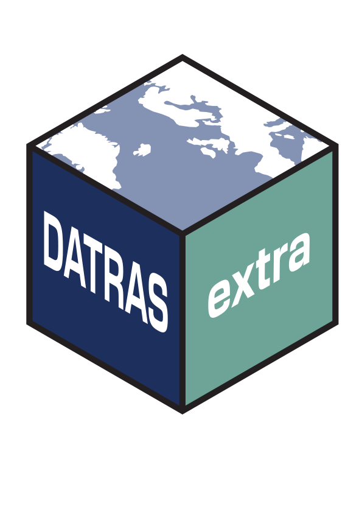

<!-- badges: start -->
  [](https://github.com/tokami/DATRASextra/actions/workflows/R-CMD-check.yaml)
  [](https://codecov.io/gh/tokami/DATRASextra)
  [](https://www.gnu.org/licenses/gpl-3.0)
<!-- badges: end -->

<h1 style="border-bottom:none;">DATRASextra <a href='https://github.com/tokami/DATRASextra'></a></h1>

Makes working with ICES **DATRAS** **extra** easy.

---

**DATRASextra** is an R package that simplifies working with the [ICES DATRAS
database](https://www.ices.dk/data/data-portals/pages/datras.aspx) by providing
practical functions and detailed documentation.

It builds on [DTU Aqua’s *DATRAS* R package](https://github.com/DTUAqua/DATRAS),
which provides the core functionality to download and modify DATRAS data —
commonly used to prepare abundance indices for ICES stock assessments.


**DATRASextra** adds tools for:
- Estimating spatial distributions and abundance indices across multiple surveys
- Calculating catch rates by custom length classes for single species or
  aggregations
- Streamlining the processing and preparation of *DATRAS* data for analysis

---


## Table of contents

- [Installation](#installation)
- [Overview](#overview)
- [Getting started](#getting-started)
- [Getting help](#getting-help)
- [Citation](#citation)
- [Related software](#related-software)
- [Funding](#funding)

<!-- README.md is generated from README.Rmd. Please edit that file -->

# Installation

The current version of the package allows to follow recommended data
processing protocols, reproduce the FishGlobe data set, estimate swept
area indices, and plot results. *DATRASextra* can be installed from
GitHub:

``` r
## Install the package
remotes::install_github("tokami/DATRASextra")
```

# Overview

*DATRASextra* provides a small set of functions that guide you through a
typical workflow with the ICES DATRAS database: from discovering
available surveys, to downloading, cleaning and checking the data, and
finally making quick plots of survey coverage and hauls. The table below
summarises the main user-facing functions.

| Function | Description |
|----|----|
| `listSurveys()` | List available surveys in the ICES DATRAS database. |
| `downloadDATRAS()` | Download the full DATRAS database or a filtered subset of it. |
| `readDATRAS()` | Read DATRAS data into R. |
| `clean()` | Clean and harmonise DATRAS data. |
| `check()` | Run general checks and flag potential outliers in DATRAS. |
| `prune()` | Prune DATRAS data by removing or filtering problematic records. |
| `addSweptAreaSimple()` | Calculate swept area per haul using gear-specific median values by gear type. |
| `checkLength()` | Check length information and identify suspicious length distributions. |
| `checkWeight()` | Check weight information and length–weight consistency. |
| `plotHauls()` | Plot haul locations. |
| `plotHaulsBySurvey()` | Plot haul locations by survey. |
| `plotSurveys()` | Plot survey coverage and footprint. |

# Getting started

A good way to start working with *DATRASextra* is the tutorial vignette.
You can access it with:

``` r
vignette("tutorial")
```

The tutorial and other vignettes guide you through the full workflow:
from downloading the complete DATRAS database (or selected subsets),
through processing and cleaning the data following recommended
good-practice guidelines, to calculating swept-area indices and biomass
estimates per species and haul.

# Getting help

All functions in *DATRASextra* are documented and include example code.
You can access the help pages with `help(function_name)` or
`?function_name`, for example:

``` r
?checkLength
```

The package also includes several vignettes and articles that
demonstrate common workflows and show how to use DATRAS data for your
own research questions. To see all available vignettes, use:

``` r
browseVignettes("DATRASextra")
```

An overview of pkgdown articles is available at:
<https://tokami.github.io/DATRASextra/>

If your question is not answered by the package documentation or the
pkgdown site, you are welcome to contact the maintainer, [Tobias
Mildenberger](mailto:t.k.mildenberger@gmail.com). If you find a bug or
would like to request a feature, please open an issue on GitHub:
<https://github.com/tokami/DATRASextra/issues>

# Citation

To see how to cite *DATRASextra* in your work, run:

``` r
citation("DATRASextra")
```

# Related software

The foundation of *DATRASextra* is the R package
[*DATRAS*](https://github.com/DTUAqua/DATRAS), which provides the core
tools for downloading and pre-processing DATRAS data.

An alternative R package for working with the DATRAS database is
[*icesDatras*](https://github.com/ices-tools-prod/icesDatras),
maintained by ICES.

# Funding

The development of *DATRASextra* was funded by the European Maritime and
Fisheries Fund (EMFF) through the project: *FISHMAP - FISH distribution
and its role in fisheries Management Advice and marine spatial Planning*
(EFMVB-23-0031), which is co-financed by the EU through the Danish
Maritime, Fisheries and Aquaculture Fund.

------------------------------------------------------------------------

<figure>

<figcaption aria-hidden="true">Logo: Co-funded by the EU</figcaption>
</figure>
