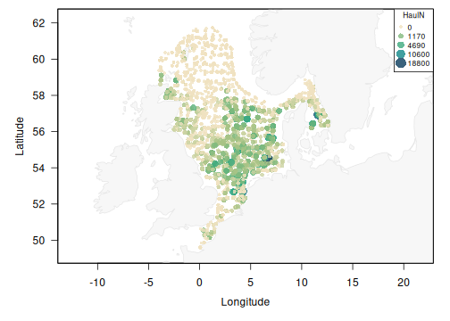

<!-- README.md is generated from README.Rmd. Please edit that file -->

# DATRASextra 

<!-- badges: start -->

[](https://github.com/tokami/DATRASextra/actions/workflows/R-CMD-check.yaml)
[](https://www.gnu.org/licenses/gpl-3.0)
<!-- badges: end -->

Makes working with ICES **DATRAS** **extra** easy!

**DATRASextra** is an R package that extends the functionality of the
[ICES DATRAS
database](https://www.ices.dk/data/data-portals/pages/datras.aspx) and
the [DTU Aqua *DATRAS* R package](https://github.com/DTUAqua/DATRAS),
providing practical tools for downloading, cleaning, standardising,
analysing, and visualising bottom-trawl survey data.

Key features include:

- Streamlined workflows for downloading, cleaning, and preparing DATRAS
  data
- Calculation and visualisation of swept area, catch rates, biomass, and
  numbers-at-length for custom length classes
- Support for reproducing key components of the FishGlob data-processing
  workflow
- Tools for species harmonisation, taxonomic standardisation, and
  exploratory diagnostics

# Installation

*DATRASextra* can be installed from GitHub:

``` r
## Install the package
remotes::install_github("tokami/DATRASextra")
```

Or the development version:

``` r
## Install the package
remotes::install_github("tokami/DATRASextra", ref = "dev")
```

Note that if you want to install vignettes locally, you have to use an
extra argument:

``` r
## Install the package with vignettes
remotes::install_github("tokami/DATRASextra", build_vignettes = TRUE)
```

# Getting started

A minimal end-to-end example using the bundled `dab` dataset (common
dab, *Limanda limanda*, from the North Sea IBTS survey, 2020-2023). No
download is required:

``` r
library(DATRASextra)

## Bundled example survey data
data("dab")

## Clean and harmonise the data, then derive total numbers per haul
dab <- clean_datras(dab)
dab <- add_total_numbers_by_haul(dab)

## Map haul-level catch rates in space
plot_datras_overview(dab, metric = "mean", value_var = "HaulN", transform = "sqrt")
```



The same workflow scales from this small example to the full database:
replace `data("dab")` with a call to `download_datras()` to pull data
directly from ICES DATRAS.

See the tutorial vignette for a complete walk-through: downloading data
from the DATRAS database, performing recommended quality checks and data
processing steps, and transforming survey observations into standardised
numbers and biomass by species, haul, and length class for use in
abundance and biomass index calculations.

The tutorial is available on the package website under **Articles →
Getting started**:
<https://tokami.github.io/DATRASextra/articles/datrasextra-tutorial.html>

If you installed the package with `build_vignettes = TRUE`, you can also
open the tutorial directly from R:

``` r
vignette("datrasextra-tutorial")
```

# Overview

*DATRASextra* provides a set of functions that guide you through a
typical workflow with the ICES DATRAS database: from discovering
available surveys, to downloading, cleaning, checking, and enriching the
data, to deriving standardised survey products and making quick plots.
The main user-facing functions are grouped below by workflow stage.

**Discover & access**

| Function                           | Description                                                    |
|------------------------------------|----------------------------------------------------------------|
| `list_surveys()`                   | List available surveys in the ICES DATRAS database.            |
| `download_datras()`                | Download the full or a filtered subset of the DATRAS database. |
| `read_datras()` / `write_datras()` | Read and write DATRAS exchange files.                          |

**Clean & prune**

| Function         | Description                                       |
|------------------|---------------------------------------------------|
| `clean_datras()` | Clean and harmonise DATRAS data.                  |
| `prune_datras()` | Reduce the data by removing or filtering records. |

**Derive haul-level variables**

| Function                      | Description                                      |
|-------------------------------|--------------------------------------------------|
| `add_swept_area()`            | Calculate swept area per haul by gear type.      |
| `add_numbers_at_length()`     | Numbers at custom length classes.                |
| `add_weight_at_length()`      | Weight at custom length classes.                 |
| `add_total_numbers_by_haul()` | Total numbers per haul.                          |
| `add_total_weight_by_haul()`  | Total weight (biomass) per haul.                 |
| `add_species_info()`          | Add taxonomic and species reference information. |

**Quality control**

| Function           | Description                                                 |
|--------------------|-------------------------------------------------------------|
| `check_lengths()`  | Check length information and flag suspicious distributions. |
| `check_weights()`  | Check weight information and length-weight consistency.     |
| `check_outliers()` | Flag (and optionally remove) hauls with extreme values.     |

**Analyse, visualise & export**

| Function                    | Description                                                              |
|-----------------------------|--------------------------------------------------------------------------|
| `calc_stratified_index()`   | Design-based stratified mean abundance/biomass indices.                  |
| `calc_spatial_indicators()` | Spatial distribution indicators.                                         |
| `plot_datras_overview()`    | Map haul locations and quantities (catch rates, species richness, etc.). |
| `plot_stratified_index()`   | Plot stratified survey indices.                                          |
| `as_table()`                | Standardised long-format haul x species x length records.                |
| `as_fishglob()`             | FishGlob-compatible output format.                                       |

For the complete list of exported functions, see the package reference
index: <https://tokami.github.io/DATRASextra/reference/>

# Getting help

All functions in *DATRASextra* are documented and include examples. Help
pages can be accessed using `help()` or `?`, for example:

``` r
?check_lengths
```

Additional tutorials and worked examples are available on the package
website, demonstrating common workflows and applications of DATRAS
survey data: <https://tokami.github.io/DATRASextra/>

If your question is not answered by the package documentation or the
`pkgdown` site, you are welcome to contact the maintainer, [Tobias
Mildenberger](mailto:t.k.mildenberger@gmail.com). If you find a bug or
would like to request a feature, please open an issue on GitHub with:
<https://github.com/tokami/DATRASextra/issues/new/choose>

# Citation

To see how to cite *DATRASextra* in your work, run:

``` r
citation("DATRASextra")
```

# Related software

*DATRASextra* was originally developed to extend the functionality of
the R package *DATRAS*, which provides tools for accessing and working
with ICES DATRAS survey data. While *DATRASextra* continues to build on
some of this functionality, it has evolved into a broader framework for
downloading, managing, processing, and analysing DATRAS data, with an
increasing share of functionality implemented directly within the
package.

An alternative R package for accessing DATRAS data is *icesDatras*,
which is maintained by ICES and provides a direct interface to the
DATRAS database.

For other regions, the
[*surveyjoin*](https://github.com/DFO-NOAA-Pacific/surveyjoin) package
provides standardised access to multiple scientific bottom-trawl surveys
in the Northeast Pacific, with similar goals of harmonising survey data
across sources.

# Funding

The development of *DATRASextra* was funded by the European Maritime and
Fisheries Fund (EMFF) through the project: *FISHMAP - FISH distribution
and its role in fisheries Management Advice and marine spatial Planning*
(EFMVB-23-0031), which is co-financed by the EU through the Danish
Maritime, Fisheries and Aquaculture Fund.

------------------------------------------------------------------------

<figure>

<figcaption aria-hidden="true">Logo: Co-funded by the EU</figcaption>
</figure>
