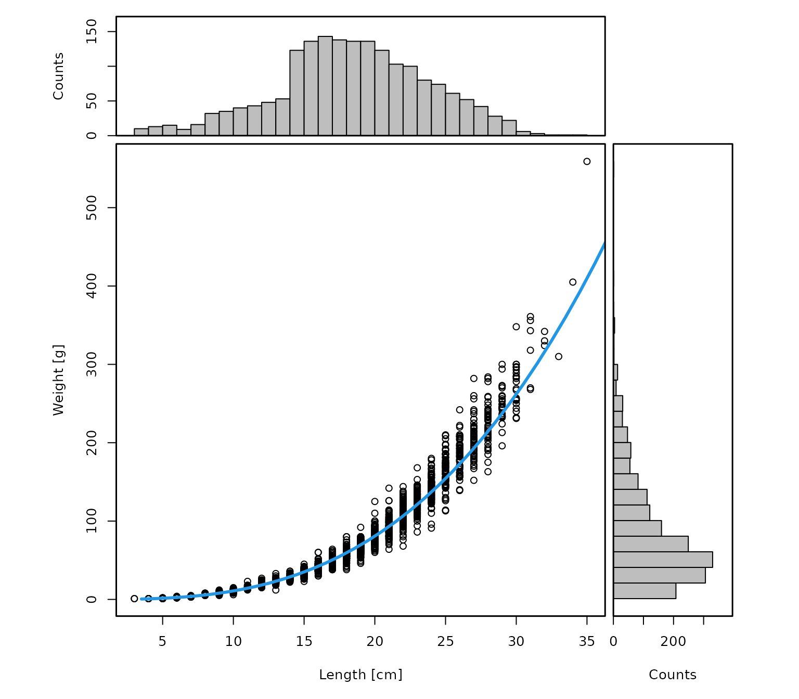
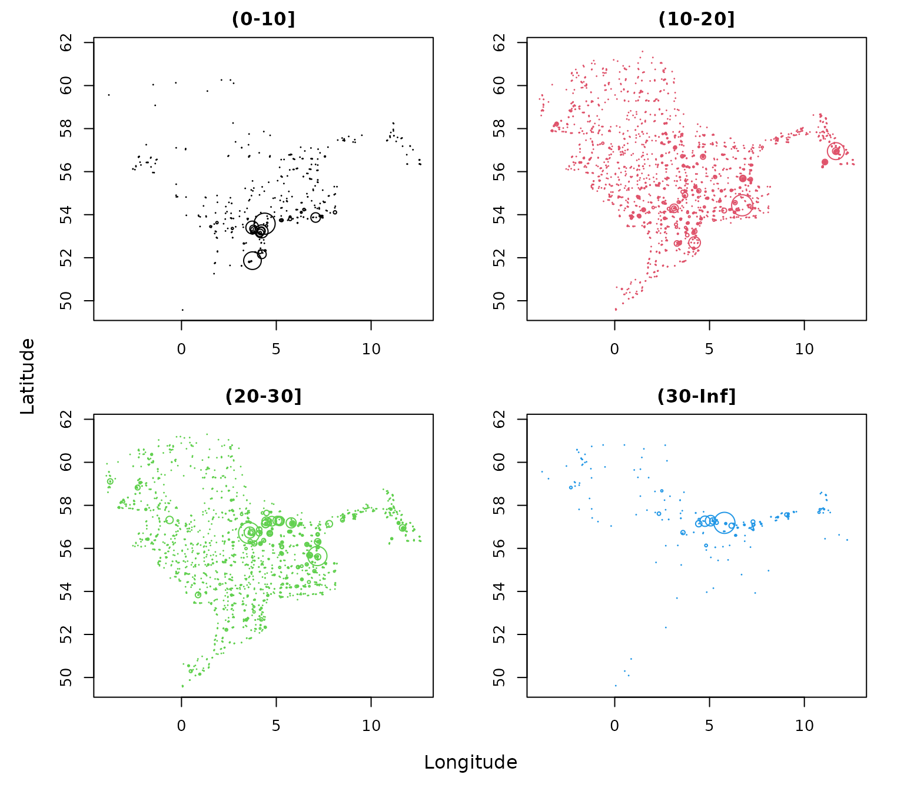

# Numbers and weight by haul and length classes

The goal of this vignette is to demonstrate how to derive numbers and
weight by haul and length classes based on the DATRAS database. This
requires following steps:

**Outline:**

1.  Create length spectrum
2.  Create weight spectrum
3.  Aggregated length classes
4.  Summary
5.  References

The vignette uses the the *DATRASextra* package:

``` r
library(DATRASextra)
```

and assumes that a cleaned *DATRAS* database is available (see tutorial
vignette) for information on how to get a cleaned *DATRAS* file. Here,
we use the

``` r
data("dab")
```

## *Create length spectrum*

``` r
lpars <- checkLength(dab)
#> [1] "Length statistics:"
#>          min  mean median maxObs maxEmp perc
#> 99.9999%   3 17.36   17.5     43     40 37.5
#> [1] "Observations above:"
#>         maxLEmp percL
#> Numbers   1e+00 1e+00
#> Percent   1e-04 1e-04
```


``` r
dab <- addSpectrum(dab)
```

Alternatively, custom length breaks with e.g. maximum length threshold:

``` r
l.cut.off <- lpars$lPars$median * 5  ## find good cut-off
## or l.cut.off <- lpars$lPars$perc
cm.breaks <- attr(lpars$N,"cm.breaks")
nbyl <- colSums(lpars$N)[which(cm.breaks <= l.cut.off)]
threshold <- cm.breaks[max(which(nbyl != 0))]
```

``` r
## add length data with custom breaks
by <- DATRAS:::getAccuracyCM(dab)
cm.breaks <- seq(lpars$lPars$min, threshold + by, by = by)
LngtCode2cm <- c(. = 0.1, `0` = 0.5, `1` = 1, `2` = 2, `5` = 5)
while (length(cm.breaks) > 100 && which(by == LngtCode2cm) != length(LngtCode2cm)) {
    by <- LngtCode2cm[which(by == LngtCode2cm) + 1]
    cm.breaks <- seq(lpars$lPars$min, threshold + by, by = by)
}

dab <- addSpectrum(dab, cm.breaks = cm.breaks, by = by)
```

## *Create weight spectrum*

``` r
wpars <- checkWeight(dab)
#> [1] "Length statistics:"
#>   min  mean median max
#> 1   3 18.94     19  35
#> [1] "Weight statistics:"
#>   min  mean median max
#> 1   1 85.93     66 559
#> [1] "Estimated LW parameters:"
#> [1] "a = 0.014 b = 2.903"
#> [1] "Empirical LW parameters:"
#> [1] "a = 0.007 b = 3.14"
```



``` r
dab <- addWeight(dab, maxL = threshold)
```

Alteratively, …

``` r
# dab <- addWeightEmpirical(dab)
```

## *Aggregated length classes*

If for example only 2 or 3 length classes: ….

``` r
cuts <- c(0, 10, 20, 30, Inf)
by <- diff(attr(dab, "cm.breaks"))
midL <- attr(dab, "cm.breaks")[-length(attr(dab, "cm.breaks"))] + by/2
ind <- as.integer(cut(midL, cuts, right = TRUE, include.lowest = TRUE))
nbins <- length(cuts) - 1
nNew <- wNew <- matrix(0, nrow = nrow(dab$N), ncol = nbins)
for (j in seq_len(nbins)) {
    cols.in.bin <- which(ind == j)
    if (length(cols.in.bin) > 0) {
        nNew[, j] <- rowSums(dab$N[, cols.in.bin, drop = FALSE])
        wNew[, j] <- rowSums(dab$Wgt[, cols.in.bin, drop = FALSE])
    }
}
colnames(nNew) <- colnames(wNew) <- paste0("(",cuts[-length(cuts)], "-", cuts[-1],"]")

dab$HaulN <- nNew
dab$HaulWgt <- wNew
```

Plot:

``` r
par(mfrow = n2mfrow(ncol(nNew), asp = 2),
    mar = c(3,3,2,2), oma = c(2,2,0,0))
for (i in 1:ncol(nNew)) {
    plot(dab[[2]]$lon, dab[[2]]$lat,
         ty = "n",
         xlab = "", ylab = "",
         main = colnames(dab[[2]]$HaulN)[i])
    ind <- which(dab[[2]]$HaulN[,i] > 0)
    points(dab[[2]]$lon[ind], dab[[2]]$lat[ind],
           cex = dab[[2]]$HaulN[,i][ind] /
               max(dab[[2]]$HaulN[,i][ind]) * 3,
           col = i)
}
mtext("Longitude", 1, outer = TRUE)
mtext("Latitude", 2, outer = TRUE)
```



## *Summary*

This vignette introduced the main features and workflow of the
*DATRASextra* package for …

## *References*
