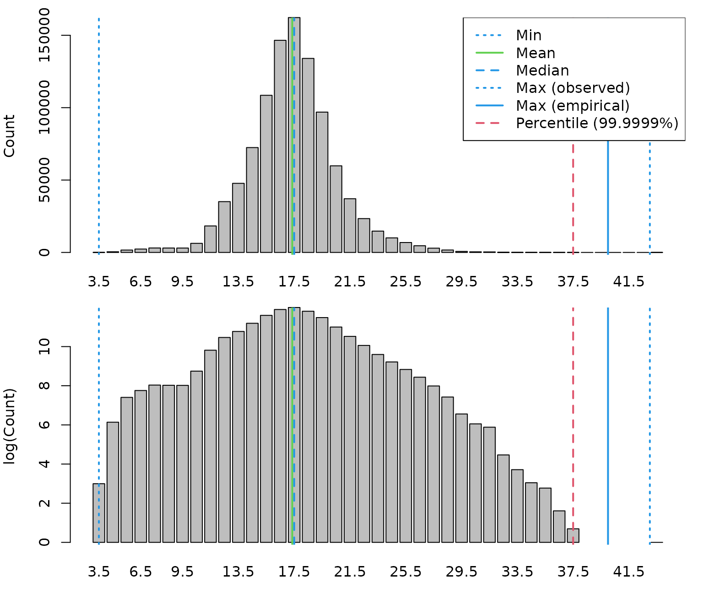

# Numbers and weight by haul and length classes

The goal of this vignette is to demonstrate how to derive numbers and
weight by haul and length classes based on the DATRAS database. This
requires following steps:

**Outline:**

1.  Create length spectrum
2.  Create weight spectrum
3.  Aggregated length classes
4.  Summary
5.  References

The vignette uses the the *DATRASextra* package:

``` r
library(DATRASextra)
```

and assumes that a cleaned *DATRAS* database is available (see tutorial
vignette) for information on how to get a cleaned *DATRAS* file. Here,
we use the dab data set included in the package.

## *Create length spectrum*

``` r
lpars <- check_lengths(dab)
#> [1] "Length statistics:"
#>          min  mean median maxObs maxEmp perc
#> 99.9999%   3 17.36   17.5     43     40 37.5
#> [1] "Observations above:"
#>         maxLEmp percL
#> Numbers   1e+00 1e+00
#> Percent   1e-04 1e-04
```



``` r
dab <- add_numbers_at_length(dab)
```

Alternatively, custom length breaks with e.g. maximum length threshold:

``` r

## TODO: ugly code, can this be improved with some helper functions?

l.cut.off <- lpars$lPars$median * 5  ## find good cut-off
## or l.cut.off <- lpars$lPars$perc
cm.breaks <- attr(lpars$N,"cm.breaks")
nbyl <- colSums(lpars$N)[which(cm.breaks <= l.cut.off)]
threshold <- cm.breaks[max(which(nbyl != 0))]
```

``` r

## TODO: ugly code, can this be improved with some helper functions?

## add length data with custom breaks
by <- get_accuracy_cm(dab)
cm_breaks <- seq(lpars$lPars$min, threshold + by, by = by)
LngtCode2cm <- c(. = 0.1, `0` = 0.5, `1` = 1, `2` = 2, `5` = 5)
while (length(cm_breaks) > 100 && which(by == LngtCode2cm) != length(LngtCode2cm)) {
    by <- LngtCode2cm[which(by == LngtCode2cm) + 1]
    cm_breaks <- seq(lpars$lPars$min, threshold + by, by = by)
}

dab <- add_numbers_at_length(dab, cm_breaks = cm_breaks, by = by)
```

## *Convert numbers at length into weight at length*

``` r
wpars <- check_weights(dab)
#> [1] "Length statistics:"
#>   min  mean median max
#> 1   3 18.94     19  35
#> [1] "Weight statistics:"
#>   min  mean median max
#> 1   1 85.93     66 559
#> [1] "Estimated LW parameters:"
#> [1] "a = 0.014 b = 2.903"
#> [1] "Empirical LW parameters:"
#> [1] "a = 0.007 b = 3.14"
```


``` r
dab <- add_weight_at_length(dab, max_length = threshold)
```

Alteratively, …

``` r
# dab <- add_weight_at_length(dab, empirical = TRUE)
```

## *Aggregated length classes*

If for example only 2 or 3 length classes: ….

``` r
## TODO: function to get length and weight ranges from datras_raw object

length_cuts <- c(0, 10, 20, 30, 100)

dab <- add_total_numbers_by_haul(dab, length_cuts = length_cuts)
dab <- add_total_weight_by_haul(dab, length_cuts = length_cuts)
```

HaulN and HaulWgt are now provided as matrices with numbers and weight
over the specified length classes, respectively.

Plot:

``` r
ncols <- ncol(dab[["HH"]][["HaulWgt"]])
par(mfrow = n2mfrow(ncols, asp = 2),
    mar = c(3,3,2,2), oma = c(2,2,0,0))
for (i in 1:ncols) {
    plot(dab[["HH"]]$lon, dab[["HH"]]$lat,
         ty = "n",
         xlab = "", ylab = "",
         main = colnames(dab[["HH"]]$HaulN)[i])
    ind <- which(dab[["HH"]]$HaulN[,i] > 0)
    points(dab[["HH"]]$lon[ind], dab[["HH"]]$lat[ind],
           cex = dab[["HH"]]$HaulN[,i][ind] /
               max(dab[["HH"]]$HaulN[,i][ind]) * 3,
           col = i)
}
mtext("Longitude", 1, outer = TRUE)
mtext("Latitude", 2, outer = TRUE)
```


## *Summary*

This vignette introduced the main features and workflow of the
*DATRASextra* package for …

## *References*
