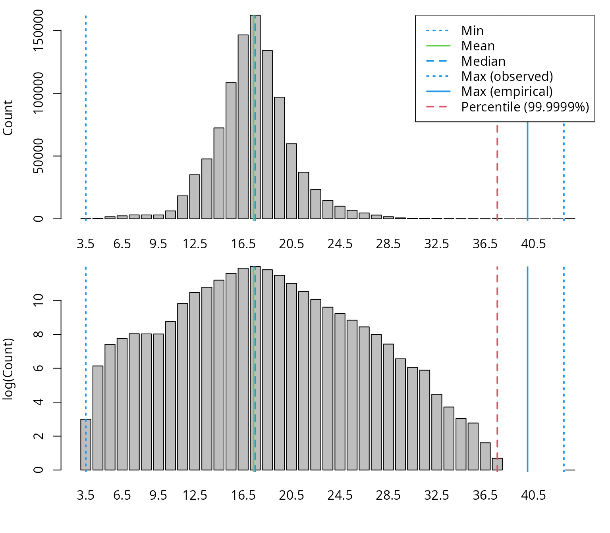
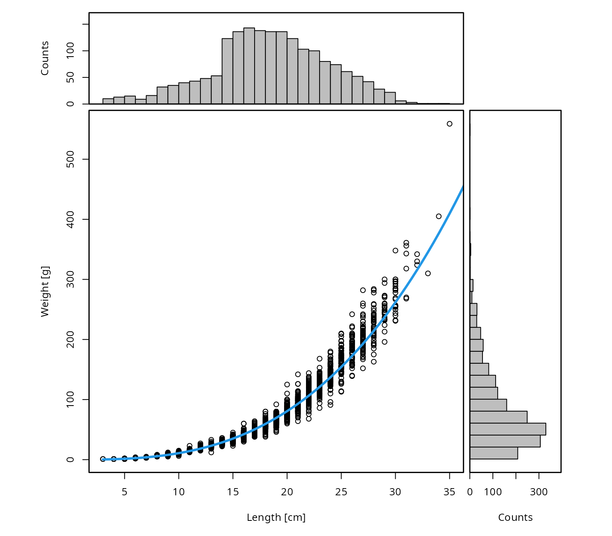
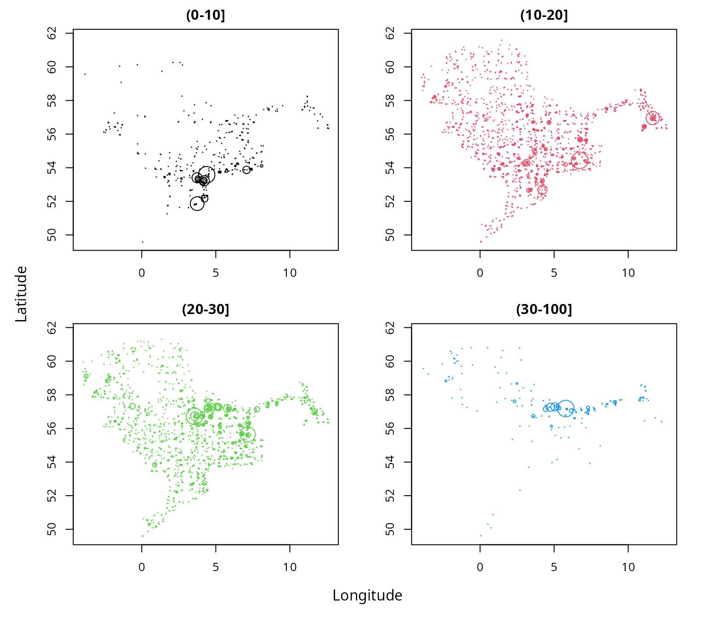

# Deriving numbers and weight by haul and custom length classes

This vignette demonstrates how to derive numbers and weight by haul from
ICES DATRAS survey data using **DATRASextra**. It shows how to

- create a haul-by-length matrix of numbers,
- convert numbers at length to weight at length,
- aggregate these quantities over custom length classes, and
- derive haul-level summaries for all fish combined or for user-defined
  length groups such as juveniles and adults.

These summaries are useful for survey standardisation, indicator
development, biodiversity analyses, and stock-assessment workflows.

### Outline

1.  Load **DATRASextra**
2.  Create numbers at length
3.  Convert numbers at length to weight at length
4.  Aggregate numbers and weight over custom length classes
5.  Summary
6.  References

## Load DATRASextra

Load the package with:

``` r
library(DATRASextra)
```

This vignette assumes that a cleaned `DATRAS` data set is already
available. For a full workflow covering download, reading, and cleaning
of survey data, see
[`vignette("datrasextra-tutorial")`](https://tokami.github.io/DATRASextra/articles/datrasextra-tutorial.md).

Here, we use the example data set `dab` included in the package and
apply a standard cleaning step first:

``` r
dab <- clean_datras(dab)
```

## Create numbers at length

Catch-at-length information is stored in the `HL` component of a
`DATRAS` object. Before aggregating these data, it is useful to inspect
the available length measurements:

``` r
lpars <- check_lengths(dab)
#> [1] "Length statistics:"
#>          min  mean median maxObs maxEmp perc
#> 99.9999%   3 17.36   17.5     43     40 37.5
#> [1] "Observations above:"
#>         maxLEmp percL
#> Numbers   1e+00 1e+00
#> Percent   1e-04 1e-04
```



This function provides summary statistics and diagnostic plots of the
recorded lengths. It can help identify potential data issues such as
implausible values or unusual length distributions. If the data look
reasonable, the next step is to aggregate the `HL` observations to
numbers at length by haul and add the result to the `HH` component:

``` r
dab <- add_numbers_at_length(dab)
```

This creates a matrix `HH$N`, with one row per haul and one column per
length class:

``` r
dab[["HH"]][["N"]][1:5, 1:5]
#>                                      sizeGroup
#> haul.id                               [3,4) [4,5) [5,6) [6,7) [7,8)
#>   NS-IBTS:2020:1:NO:58G2:GOV:60055:55     0     0     0     0     0
#>   NS-IBTS:2020:1:NO:58G2:GOV:60054:54     0     0     0     0     0
#>   NS-IBTS:2020:1:NO:58G2:GOV:60053:53     0     0     0     0     0
#>   NS-IBTS:2020:1:NO:58G2:GOV:60052:52     0     0     0     0     0
#>   NS-IBTS:2020:1:NO:58G2:GOV:60051:51     0     0     0     0     0
```

By default,
[`add_numbers_at_length()`](https://tokami.github.io/DATRASextra/reference/add_numbers_at_length.md)
defines length classes from the minimum and maximum observed lengths,
using the coarsest length recording resolution present in the data (see
[`?get_accuracy_cm`](https://tokami.github.io/DATRASextra/reference/get_accuracy_cm.md)).
In most cases, this is a sensible default.

If a different resolution or range is needed, custom breaks can be
supplied via `cm_breaks` and `by`. In general, it is recommended to keep
the numbers-at- length matrix as fine as possible, because these length
classes are also used to derive weights at length in the next step.
Coarser groupings can then be obtained later with
[`add_total_numbers_by_haul()`](https://tokami.github.io/DATRASextra/reference/add_total_numbers_by_haul.md)
or
[`add_total_weight_by_haul()`](https://tokami.github.io/DATRASextra/reference/add_total_weight_by_haul.md).

For example, the following code creates numbers at length using 0.5 cm
bins:

``` r
## Define custom resolution of length bins
by <- 0.5

## Define custom length bins
cm_breaks <- seq(lpars$lPars$min, lpars$lPars$maxEmp, by = by)

## Recalculate numbers at length using custom bins
dab <- add_numbers_at_length(dab, cm_breaks = cm_breaks, by = by)
```

The resulting matrix now has a finer length resolution:

``` r
dab[["HH"]][["N"]][1:5, 1:5]
#>                                      sizeGroup
#> haul.id                               [3,3.5) [3.5,4) [4,4.5) [4.5,5) [5,5.5)
#>   NS-IBTS:2020:1:NO:58G2:GOV:60055:55       0       0       0       0       0
#>   NS-IBTS:2020:1:NO:58G2:GOV:60054:54       0       0       0       0       0
#>   NS-IBTS:2020:1:NO:58G2:GOV:60053:53       0       0       0       0       0
#>   NS-IBTS:2020:1:NO:58G2:GOV:60052:52       0       0       0       0       0
#>   NS-IBTS:2020:1:NO:58G2:GOV:60051:51       0       0       0       0       0
```

## Convert numbers at length to weight at length

Numbers at length are sufficient for some applications, but many
analyses also require biomass or weight by length class or by haul. For
example, biomass-based survey indices are often used in stock assessment
or ecosystem analyses.

To derive weights, **DATRASextra** uses the individual length and weight
records stored in the `CA` component to estimate a length-weight
relationship. Before doing so, it is useful to inspect the available
weight data:

``` r
wpars <- check_weights(dab)
#> [1] "Length statistics:"
#>   min  mean median max
#> 1   3 18.94     19  35
#> [1] "Weight statistics:"
#>   min  mean median max
#> 1   1 85.93     66 559
#> [1] "Estimated LW parameters:"
#> [1] "a = 0.014 b = 2.903"
#> [1] "Lookup LW parameters in the species_info table:"
#> [1] "a = 0.007 b = 3.119"
```



This function provides summary statistics and diagnostic plots for the
weight data and the fitted length-weight relationship. If the
information looks reasonable, the numbers-at-length matrix in `HH$N` can
be converted to weight at length with:

``` r
dab <- add_weight_at_length(dab)
```

This adds a matrix `HH$Wgt`, containing the estimated weight in each
length class for each haul.

The function uses the midpoints of the existing length bins in `HH$N`
(stored in `attr(dab, "cm.breaks")`) and converts these lengths to
weights using the fitted length-weight relationship from the `CA` data.

One important caveat concerns the largest length class. If the final bin
is a plus group with a very large upper limit, such as `Inf`, or extends
far beyond the observed size range, the midpoint of that bin may imply
an unrealistically large weight. In such cases, it may be preferable to
use the `plus_group` argument.

If the `CA` component does not contain enough information to estimate a
reliable length-weight relationship, lookup parameters can instead be
taken from the `species_info` table by setting `lw_source = "lookup"`.
Before doing so, it is good practice to inspect the stored parameters:

``` r
species_info[
  which(species_info$ScientificName_WoRMS == "Limanda limanda"),
  c("a", "b")
]
#>          a     b
#> 1017 0.007 3.119
```

If these values appear appropriate, the lookup relationship in the
species_info table can be used with:

``` r
dab <- add_weight_at_length(dab, lw_source = "lookup")
```

## Aggregate numbers and weight over custom length classes

By default,
[`add_total_numbers_by_haul()`](https://tokami.github.io/DATRASextra/reference/add_total_numbers_by_haul.md)
and
[`add_total_weight_by_haul()`](https://tokami.github.io/DATRASextra/reference/add_total_weight_by_haul.md)
sum over all available length classes and return one total value per
haul. In many applications, however, it is useful to retain separate
haul-level summaries for custom length groups, for example juveniles and
adults.

For dab, one biologically meaningful split is the approximate length at
50% maturity, available in `species_info`:

``` r
(lm <- species_info[
  which(species_info$ScientificName_WoRMS == "Limanda limanda"),
  "Lm"
])
#> [1] 17.75
```

We can use this value to define two custom groups, below and above `Lm`:

``` r
length_cuts <- c(0, lm, Inf)

dab <- add_total_numbers_by_haul(dab, length_cuts = length_cuts)
dab <- add_total_weight_by_haul(dab, length_cuts = length_cuts)
```

This returns haul-level summaries for juveniles and adults separately:

``` r
head(dab[["HH"]][["HaulN"]])
#>                                     (0-17.75] (17.75-Inf]
#> NS-IBTS:2020:1:NO:58G2:GOV:60055:55         0           0
#> NS-IBTS:2020:1:NO:58G2:GOV:60054:54         0           0
#> NS-IBTS:2020:1:NO:58G2:GOV:60053:53        82         221
#> NS-IBTS:2020:1:NO:58G2:GOV:60052:52       523         543
#> NS-IBTS:2020:1:NO:58G2:GOV:60051:51        42         144
#> NS-IBTS:2020:1:NO:58G2:GOV:60050:50         0           0
```

``` r
head(dab[["HH"]][["HaulWgt"]])
#>                                     (0-17.75] (17.75-Inf]
#> NS-IBTS:2020:1:NO:58G2:GOV:60055:55     0.000        0.00
#> NS-IBTS:2020:1:NO:58G2:GOV:60054:54     0.000        0.00
#> NS-IBTS:2020:1:NO:58G2:GOV:60053:53  4256.383    25914.94
#> NS-IBTS:2020:1:NO:58G2:GOV:60052:52 24487.167    48769.12
#> NS-IBTS:2020:1:NO:58G2:GOV:60051:51  1989.542    15829.06
#> NS-IBTS:2020:1:NO:58G2:GOV:60050:50     0.000        0.00
```

By default, the column names reflect the chosen cut points, but they can
be renamed as needed:

``` r
colnames(dab[["HH"]][["HaulN"]]) <- c("juveniles", "adults")
colnames(dab[["HH"]][["HaulWgt"]]) <- c("juveniles", "adults")
```

This makes the result easier to interpret:

``` r
head(dab[["HH"]][["HaulN"]])
#>                                     juveniles adults
#> NS-IBTS:2020:1:NO:58G2:GOV:60055:55         0      0
#> NS-IBTS:2020:1:NO:58G2:GOV:60054:54         0      0
#> NS-IBTS:2020:1:NO:58G2:GOV:60053:53        82    221
#> NS-IBTS:2020:1:NO:58G2:GOV:60052:52       523    543
#> NS-IBTS:2020:1:NO:58G2:GOV:60051:51        42    144
#> NS-IBTS:2020:1:NO:58G2:GOV:60050:50         0      0
```

Of course, any number of custom length groups can be defined. For
example:

``` r
length_cuts <- c(0, 10, 20, 30, 100)

dab <- add_total_numbers_by_haul(dab, length_cuts = length_cuts)
dab <- add_total_weight_by_haul(dab, length_cuts = length_cuts)
```

This gives haul-level numbers and weights for four user-defined length
groups:

``` r
head(dab[["HH"]][["HaulN"]])
#>                                     (0-10] (10-20] (20-30] (30-100]
#> NS-IBTS:2020:1:NO:58G2:GOV:60055:55      0       0       0        0
#> NS-IBTS:2020:1:NO:58G2:GOV:60054:54      0       0       0        0
#> NS-IBTS:2020:1:NO:58G2:GOV:60053:53      0     186     105       12
#> NS-IBTS:2020:1:NO:58G2:GOV:60052:52      0     853     213        0
#> NS-IBTS:2020:1:NO:58G2:GOV:60051:51      0      99      85        2
#> NS-IBTS:2020:1:NO:58G2:GOV:60050:50      0       0       0        0
head(dab[["HH"]][["HaulWgt"]])
#>                                     (0-10]   (10-20]  (20-30] (30-100]
#> NS-IBTS:2020:1:NO:58G2:GOV:60055:55      0     0.000     0.00    0.000
#> NS-IBTS:2020:1:NO:58G2:GOV:60054:54      0     0.000     0.00    0.000
#> NS-IBTS:2020:1:NO:58G2:GOV:60053:53      0 11691.009 14499.36 3980.953
#> NS-IBTS:2020:1:NO:58G2:GOV:60052:52      0 48278.947 24977.34    0.000
#> NS-IBTS:2020:1:NO:58G2:GOV:60051:51      0  6120.161 10719.41  979.030
#> NS-IBTS:2020:1:NO:58G2:GOV:60050:50      0     0.000     0.00    0.000
```

These summaries can then be used to explore whether the spatial
distribution differs among size groups. For example, the following plot
shows where hauls with positive catches occurred for each length class,
with point size scaled by haul-level abundance:

``` r
ncols <- ncol(dab[["HH"]][["HaulWgt"]])

par(mfrow = n2mfrow(ncols, asp = 2),
    mar = c(3, 3, 2, 2),
    oma = c(2, 2, 0, 0))

for (i in seq_len(ncols)) {
  plot(dab[["HH"]]$lon, dab[["HH"]]$lat,
       type = "n",
       xlab = "", ylab = "",
       main = colnames(dab[["HH"]]$HaulN)[i])

  ind <- which(dab[["HH"]]$HaulN[, i] > 0)

  points(dab[["HH"]]$lon[ind], dab[["HH"]]$lat[ind],
         cex = dab[["HH"]]$HaulN[, i][ind] /
           max(dab[["HH"]]$HaulN[, i][ind]) * 3,
         col = i)
}

mtext("Longitude", 1, outer = TRUE)
mtext("Latitude", 2, outer = TRUE)
```



## Summary

This vignette showed how to derive haul-level abundance and biomass
summaries from DATRAS data using **DATRASextra**. Starting from a
cleaned survey data set, it demonstrated how to inspect the available
length and weight information, construct a numbers-at-length matrix,
convert numbers at length to weight at length, and aggregate both
quantities over custom length classes.

These tools make it straightforward to generate biologically meaningful
haul- level summaries, either for the full size range or for selected
groups such as juveniles and adults. The resulting variables can be used
directly in further analyses, for example when building survey indices,
comparing size-structured spatial patterns, or deriving indicators based
on abundance or biomass.

## References
