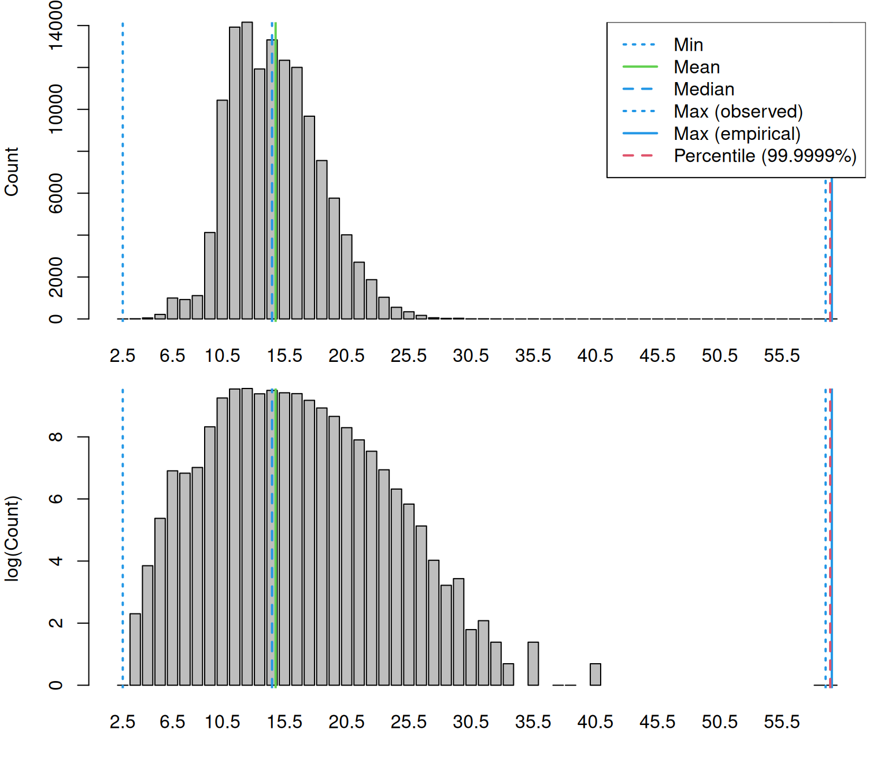
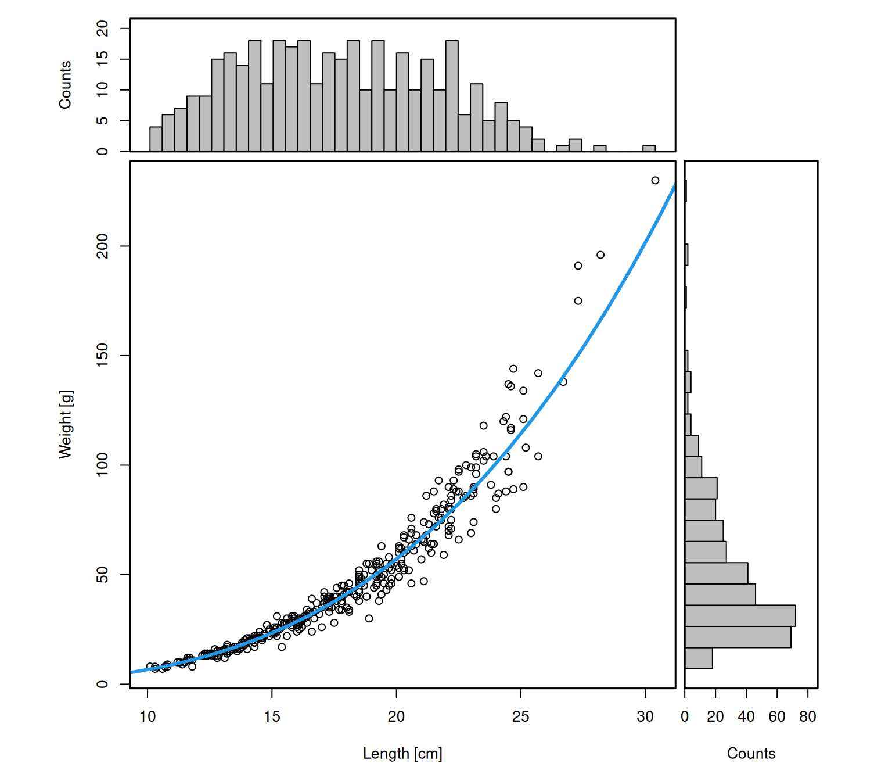
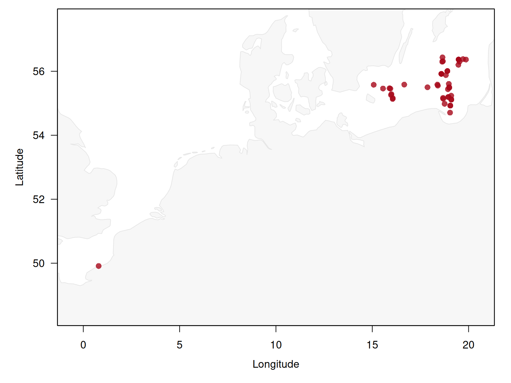
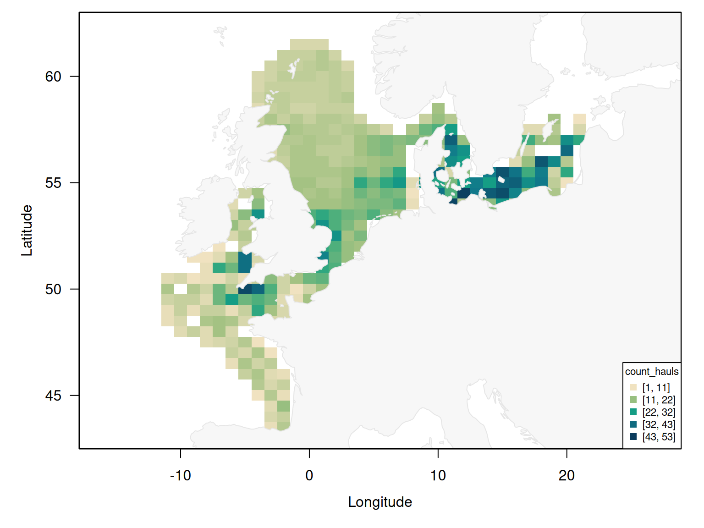
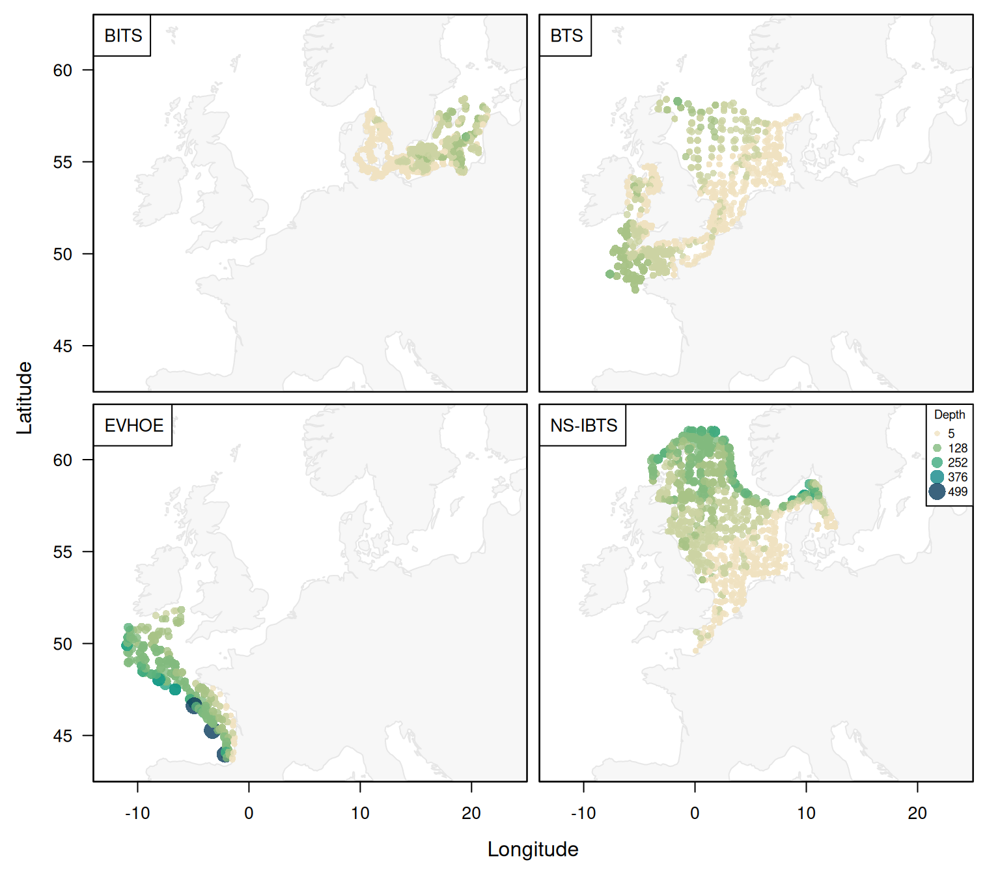
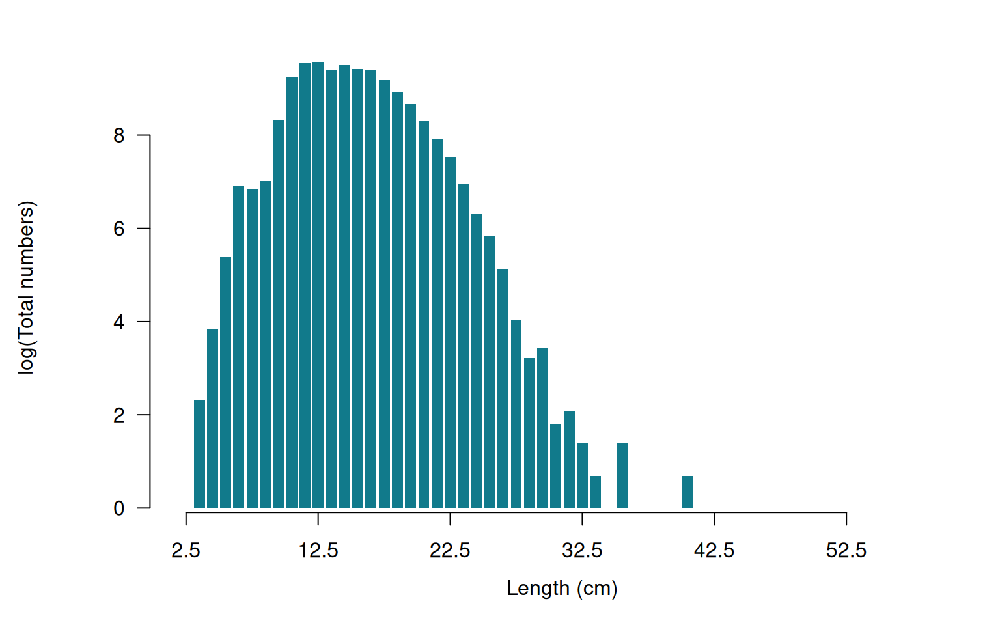
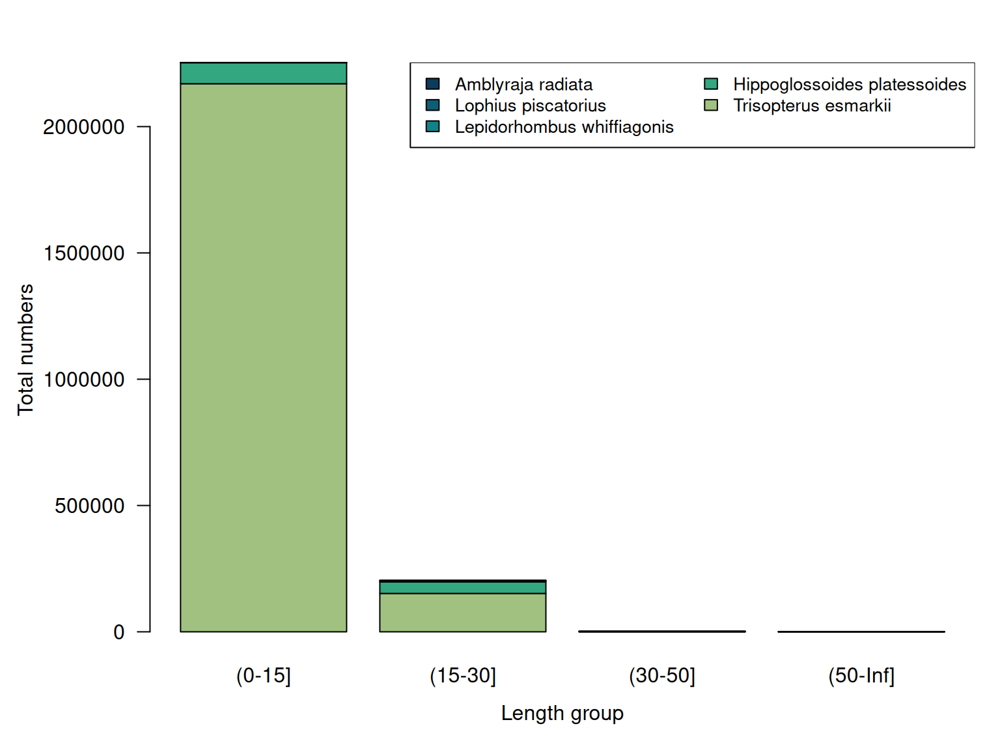

# Data processing and quality control

``` r

library(DATRASextra)
```

Every DATRAS analysis rests on a chain of processing decisions: which
hauls count as valid, how sub-sampled catches are raised, what a missing
value looks like, and which records are dropped along the way. Most of
those decisions are made before a user writes a single line of analysis
code.

This vignette documents that chain end to end. For each step it states
what is done, whether it happens automatically or on request, how to
inspect its effect, and how to change or switch it off. It also lists
checks that **DATRASextra** deliberately leaves to the user, because the
right answer depends on the analysis.

Two principles guide the design:

- **Nothing is silently discarded.** The mandatory filters in
  [`clean_datras()`](https://tokami.github.io/DATRASextra/reference/clean_datras.md)
  are the DATRAS-recommended minimum, and the function prints what will
  be removed *before* removing it.
- **Checks report, they do not delete.**
  [`check_outliers()`](https://tokami.github.io/DATRASextra/reference/check_outliers.md),
  [`check_lengths()`](https://tokami.github.io/DATRASextra/reference/check_lengths.md)
  and
  [`check_weights()`](https://tokami.github.io/DATRASextra/reference/check_weights.md)
  are opt-in, and
  [`check_outliers()`](https://tokami.github.io/DATRASextra/reference/check_outliers.md)
  returns the object unchanged unless explicitly asked to remove hauls.

## Overview of the pipeline

| Stage | Function | What happens | Automatic? |
|----|----|----|----|
| 1\. Download | [`download_datras()`](https://tokami.github.io/DATRASextra/reference/download_datras.md) (via [`DATRAS::getDatrasExchange()`](https://rdrr.io/pkg/DATRAS/man/getDatrasExchange.html)) | Query ICES web service, harmonise column names, convert the `-9` sentinel to `NA`, match orphan `CA` records, archive as exchange zip | automatic |
| 2\. Read | [`read_datras()`](https://tokami.github.io/DATRASextra/reference/read_datras.md) (via [`DATRAS::readICES()`](https://rdrr.io/pkg/DATRAS/man/DATRAS-internal.html)) | Parse exchange CSV, drop truncated files, match orphan `CA` records, drop duplicated hauls, combine survey-years | automatic |
| 3\. Derived variables | [`DATRAS::addExtraVariables()`](https://rdrr.io/pkg/DATRAS/man/DATRAS-internal.html) | Create `haul.id`, `LngtCm`, `Species`, `Count`, `lon`/`lat`, `abstime`, `Roundfish`; treat hauls without `HL` records as zero-catch | automatic |
| 4\. Cleaning | [`clean_datras()`](https://tokami.github.io/DATRASextra/reference/clean_datras.md) | Filter on `HaulVal` and `StdSpecRecCode`, optionally impute depth and harmonise species, optionally subset | automatic filters, optional extras |
| 5\. Checks | [`check_outliers()`](https://tokami.github.io/DATRASextra/reference/check_outliers.md), [`check_lengths()`](https://tokami.github.io/DATRASextra/reference/check_lengths.md), [`check_weights()`](https://tokami.github.io/DATRASextra/reference/check_weights.md), [`add_swept_area()`](https://tokami.github.io/DATRASextra/reference/add_swept_area.md) | Flag implausible values, summarise length and weight distributions, report swept-area missingness | opt-in |
| 6\. Inspection | [`print()`](https://rdrr.io/r/base/print.html), [`summary()`](https://rdrr.io/r/base/summary.html), [`plot_datras_overview()`](https://tokami.github.io/DATRASextra/reference/plot_datras_overview.md), [`plot_length_distribution()`](https://tokami.github.io/DATRASextra/reference/plot_length_distribution.md), [`plot_species_composition()`](https://tokami.github.io/DATRASextra/reference/plot_species_composition.md) | Tabular and visual review | opt-in |
| 7\. Extraction record | [`extraction()`](https://tokami.github.io/DATRASextra/reference/extraction.md), [`write_manifest()`](https://tokami.github.io/DATRASextra/reference/write_manifest.md), [`verify_extraction()`](https://tokami.github.io/DATRASextra/reference/verify_extraction.md) | Record where the data came from and detect upstream revisions | automatic record, opt-in verification |

Throughout we use the bundled example data set `mini`: four surveys,
seven gears, five species, 2022-2023. Unlike the `dab` example, `mini`
has not been pre-cleaned, so every filter described below actually does
something.

``` r

mini
#> Object of class 'datras_raw'
#> ===========================
#> Number of hauls: 3939 
#> Number of species: 5 
#> Number of surveys: 4 [BITS, BTS, EVHOE, NS-IBTS]
#> Number of gears: 9 
#> Number of countries: 13 
#> Years: 2022 - 2023 
#> Quarters: 1 3 4 
#> Longitude range: -10.96 - 21.65 deg
#> Latitude range: 43.69 - 61.59 deg
#> Depth range: 5 - 499 m
#> Haul duration: 0 - 62 minutes
#> Valid hauls: 3756 (183 invalid)
#> Hauls with catch: 1681 (zero catch: 2258)
#> Extraction: 14 source(s), extracted 2026-09-15, ICES calculation 2023-03-22 to 2026-06-25
```

## Stage 1: Download

[`download_datras()`](https://tokami.github.io/DATRASextra/reference/download_datras.md)
wraps
[`DATRAS::getDatrasExchange()`](https://rdrr.io/pkg/DATRAS/man/getDatrasExchange.html),
which in turn queries the ICES DATRAS web service. Several things happen
before anything reaches disk.

``` r

## One survey, selected years, archived under <path>/NS-IBTS/
x <- download_datras(path = "data/datras", surveys = "NS-IBTS", years = 2020:2023)
```

### Which surveys and years are requested

Available surveys, years and quarters are read from the ICES web
service. If the server does not answer within `timeout` seconds (default
10), the function falls back to a cached survey list and, for years, to
whatever zip files are already present locally. This keeps a partially
completed download resumable when the connection is unreliable, but it
also means that an offline session may silently work from a stale survey
list.

Two surveys are skipped by default because they are test entries or do
not contain the full set of required tables: `Test-DATRAS` and
`NS-IBTS_UNIFtest`. Set `include_flagged = TRUE` to download them
anyway.

The `download_hl` and `download_ca` arguments control whether the
length-frequency and biological tables are fetched at all. Omitting
whichever table an analysis does not need reduces both download time and
memory use; `CA` is the usual candidate, since many analyses need only
catch-at-length.

### Harmonisation applied on download

[`DATRAS::getDatrasExchange()`](https://rdrr.io/pkg/DATRAS/man/getDatrasExchange.html)
applies the following, in order:

1.  **Column renaming**
    ([`DATRAS::renameDATRAS()`](https://rdrr.io/pkg/DATRAS/man/renameDATRAS.html)).
    Names are capitalised, and the web-service names are mapped onto the
    exchange-format names: `ValidAphiaID` becomes `Valid_Aphia`,
    `LngtClass` becomes `LngtClas`, `AgeRings` becomes `Age`, and
    `CANoAtLngt` / `NoAtLngt` become `NoAtALK`. This is why the same
    variable has different names in the ICES documentation and in an R
    object.
2.  **Missing-value conversion**
    ([`DATRAS::minus9toNA()`](https://rdrr.io/pkg/DATRAS/man/minus9toNA.html)).
    DATRAS encodes missing numeric values as `-9`. Every numeric column
    is scanned and `-9` is replaced by `NA`. Note that this applies to
    numeric columns only: a `-9` stored as text is left untouched.
3.  **`StatRec` back-fill.** If the `CA` table has no `StatRec` column,
    it is filled from `AreaCode`.
4.  **Derived variables** are added (see Stage 3 below).
5.  **Orphan `CA` records** are matched back to hauls with
    [`DATRAS::fixMissingHaulIds()`](https://rdrr.io/pkg/DATRAS/man/DATRAS-internal.html)
    using `strict = TRUE`, so ambiguous records are left unmatched
    rather than attributed to an arbitrary haul.
6.  **Character columns are converted to factors.**

### What gets archived

Before writing,
[`download_datras()`](https://tokami.github.io/DATRASextra/reference/download_datras.md)
strips the derived columns again and maps the names back to the
exchange-format spelling, so the archived zip is a faithful DATRAS
exchange file rather than an R-specific artefact. Anyone can re-read it,
with **DATRASextra** or with any other tool that understands the
exchange format. Files are named `<survey>_<year>.zip` inside a
per-survey subdirectory.

This separation matters for reproducibility: the archive is the raw
record, and every processing step described in the rest of this vignette
is reapplied from it each time the data are read. Alongside the zip
files,
[`download_datras()`](https://tokami.github.io/DATRASextra/reference/download_datras.md)
maintains `DATRAS_manifest.csv`, recording the extraction date, a
checksum and the ICES calculation date of every survey-year-quarter it
retrieved; see *Recording and verifying the extraction* below.

``` r

## Re-download and replace existing files
download_datras(path = "data/datras", surveys = "NS-IBTS", years = 2020,
                overwrite = TRUE)
```

Worth checking after a download: that a file exists for every year you
expect, and that none of them is suspiciously small.
[`read_datras()`](https://tokami.github.io/DATRASextra/reference/read_datras.md)
performs the size check for you (next section), but an unexpectedly
missing year usually means the survey was not conducted rather than that
the download failed.

## Stage 2: Reading data into R

``` r

x <- read_datras("data/datras", surveys = "NS-IBTS", years = 2020:2023)
```

### Parsing and file-level checks

A DATRAS exchange CSV contains three stacked blocks, each with its own
header line.
[`DATRAS::readICES()`](https://rdrr.io/pkg/DATRAS/man/DATRAS-internal.html)
locates the header lines, reads each block separately, and applies
`na.strings = c("-9", "-9.0", "-9.00", "-9.0000")` so that the
missing-value sentinel is converted on the way in. It then verifies that
the number of data rows plus header lines equals the number of lines in
the file, and aborts with `"csv file appears to be corrupt"` if it does
not.

[`read_datras()`](https://tokami.github.io/DATRASextra/reference/read_datras.md)
adds a guard of its own: files smaller than `min_file_size` (default
`1e4` bytes) are reported and excluded, because a truncated or empty
download would otherwise raise a confusing parse error. A year in which
a survey was not conducted typically produces such an empty file.

### Matching biological records to hauls: the `strict` argument

Records in `CA` frequently lack the station and haul numbers that make
up `haul.id`.
[`DATRAS::fixMissingHaulIds()`](https://rdrr.io/pkg/DATRAS/man/DATRAS-internal.html)
matches them back to a haul using survey, year, quarter, country, ship
and statistical rectangle. When that combination identifies more than
one candidate haul, the two settings diverge:

- `strict = FALSE` assigns the record to **one of the candidate hauls at
  random**.
- `strict = TRUE` leaves the record as `NA`, and it is dropped by any
  subsequent subsetting.

Which behaviour is right depends on the analysis: random assignment
preserves sample size for aggregate age-length keys, while leaving
records unmatched is the honest choice when individual records must be
attributable to a specific haul.

``` r

## Attribute ambiguous CA records to an arbitrary haul
x <- read_datras("data/datras", strict = FALSE)
```

### Combining survey-year files

Files are read one at a time and combined. Two safeguards apply:

- **Duplicated haul identifiers.** The same haul appearing in more than
  one file is reported by `haul.id` and removed. Note that the two code
  paths behave slightly differently: the sequential reader
  (`ncores = 1`) keeps the first copy encountered and drops later ones,
  while the parallel reader removes all copies. If duplicates are
  reported, the underlying archive is worth investigating rather than
  accepting either behaviour.
- **Type-consistent binding.** `c.datras_raw()` guards against a column
  that is a factor in one year and an integer in another. Plain
  [`rbind()`](https://rdrr.io/r/base/cbind.html) would use the factor’s
  level vector as the type and reinterpret the other year’s integers as
  factor codes, silently turning valid values into `NA`.

For large reads, `prune = TRUE`, `drop_hl = TRUE` and `drop_ca = TRUE`
reduce peak memory by trimming columns or dropping whole tables inside
the reader, and `surveys` / `years` restrict which files are opened at
all.

## Stage 3: Variables created while reading

The columns most analyses actually use are not in the exchange file at
all: they are constructed by
[`DATRAS::addExtraVariables()`](https://rdrr.io/pkg/DATRAS/man/DATRAS-internal.html)
during both download and read.

### Haul identifier

    haul.id = Survey:Year:Quarter:Country:Ship:Gear:StNo:HaulNo

This is the key that links `HH`, `HL` and `CA`.

``` r

head(levels(mini[["HH"]]$haul.id), 3)
#> [1] "BITS:2022:1:DE:06SL:TVS:22002:1"  "BITS:2022:1:DE:06SL:TVS:22008:15"
#> [3] "BITS:2022:1:DE:06SL:TVS:22044:2"
```

### Length in centimetres

`LngtClas` is reported in units that depend on `LngtCode`. The
conversion to `LngtCm` uses:

| `LngtCode` | Multiplier for `LngtClas` | Meaning                        |
|------------|---------------------------|--------------------------------|
| `.`        | 0.1                       | reported in mm                 |
| `0`        | 0.1                       | reported in mm, 0.5 cm classes |
| `1`        | 1                         | reported in cm, 1 cm classes   |
| `2`        | 1                         | reported in cm, 2 cm classes   |
| `5`        | 1                         | reported in cm, 5 cm classes   |

There is a trap here worth stating explicitly. A **second**, different
table with the same codes is used by
[`get_accuracy_cm()`](https://tokami.github.io/DATRASextra/reference/get_accuracy_cm.md)
(and
[`DATRAS::getAccuracyCM()`](https://rdrr.io/pkg/DATRAS/man/DATRAS-internal.html))
to describe the *bin width*: `.` = 0.1, `0` = 0.5, `1` = 1, `2` = 2, `5`
= 5. The first table converts a recorded value to centimetres; the
second says how wide the length class is. They are not interchangeable.

``` r

## Which length codes occur, and what resolution do they imply
table(mini[["HL"]]$LngtCode, useNA = "ifany")
#> 
#>           .     0     1 
#>    82  9736  1505 12681
```

``` r

## The coarsest resolution present is used for automatic length binning
get_accuracy_cm(mini)
#> Warning in get_accuracy_cm(mini): Mixed accuracies found in var[[3]]$LngtCode -
#> worst chosen: 1 cm
#> Warning in get_accuracy_cm(mini): NAs found in var[[3]]$LngtCode - assumed to
#> be 1 cm
#> [1] 1
```

Mixed codes are common when several surveys or countries are combined,
and
[`get_accuracy_cm()`](https://tokami.github.io/DATRASextra/reference/get_accuracy_cm.md)
warns and falls back to the coarsest resolution. Empty `LngtCode` values
are assumed to be 1 cm. If that assumption is wrong for your data, pass
`cm_breaks` or `by` explicitly to the length functions rather than
relying on the automatic choice.

### Species names

`Species` is resolved from `SpecCode` using either an ITIS/TSN lookup
table or a WoRMS lookup table, depending on whether `SpecCodeType` is
`"W"`. Older survey years often use TSN codes while recent years use
WoRMS codes, so both paths can occur in a single combined object.

``` r

table(mini[["HL"]]$SpecCodeType, useNA = "ifany")
#> 
#>     W 
#> 24004
```

### Raised catch numbers

This is the most consequential derived variable:

    Count = HLNoAtLngt * (HaulDur / 60 if DataType == "C", else 1) * SubFactor

Two corrections are folded into one column:

- **Sub-sampling.** `SubFactor` raises the measured sub-sample to the
  whole catch.
- **Standardisation of reporting units.** `DataType == "C"` means
  numbers were reported per hour, so they are converted back to per-haul
  using the haul duration. `DataType == "R"` (raw) and `"P"` are used as
  reported.

A combined object frequently mixes reporting conventions:

``` r

table(mini[["HH"]]$DataType, useNA = "ifany")
#> 
#>    C    R    P 
#>  978 2716  245
```

Anything computed from `Count` therefore already accounts for
sub-sampling and per-hour reporting. Recomputing from `HLNoAtLngt`
without applying both corrections is a common source of error. Note also
that
[`check_lengths()`](https://tokami.github.io/DATRASextra/reference/check_lengths.md)
warns if `DataType == "S"` is present, since those hauls are treated as
`"R"`.

### Time and position

- `lon` and `lat` are copies of `ShootLong` and `ShootLat`, that is the
  position where the gear was shot, **not** the midpoint of the tow.
  `HaulLat` and `HaulLong` hold the end position if a tow midpoint is
  needed.
- `abstime` is a decimal year, `timeOfYear` its fractional part, and
  `TimeShotHour` the time of day in decimal hours. These are convenient
  for smoothers over time or time of day.
- `Roundfish` is the North Sea roundfish area, derived from `StatRec`.

### Hauls without catch records

Any haul present in `HH` that has no rows in `HL` is interpreted as a
**zero-catch haul**. During reading, the upstream code prints a warning
listing the affected hauls. This is the correct treatment for a
species-restricted extract such as `mini`, where most hauls simply did
not catch the five target species, but it means a haul missing from `HL`
for a data-handling reason is indistinguishable from a genuine zero.

The split is reported by [`print()`](https://rdrr.io/r/base/print.html):

``` r

mini
#> Object of class 'datras_raw'
#> ===========================
#> Number of hauls: 3939 
#> Number of species: 5 
#> Number of surveys: 4 [BITS, BTS, EVHOE, NS-IBTS]
#> Number of gears: 9 
#> Number of countries: 13 
#> Years: 2022 - 2023 
#> Quarters: 1 3 4 
#> Longitude range: -10.96 - 21.65 deg
#> Latitude range: 43.69 - 61.59 deg
#> Depth range: 5 - 499 m
#> Haul duration: 0 - 62 minutes
#> Valid hauls: 3756 (183 invalid)
#> Hauls with catch: 1681 (zero catch: 2258)
#> Extraction: 14 source(s), extracted 2026-09-15, ICES calculation 2023-03-22 to 2026-06-25
```

### The ICES calculation date

One column is neither derived nor really part of the survey data:
`DateofCalculation`, the date on which ICES last recalculated the
records. It is constant per survey, year and quarter, and it is the only
field that reveals that the database has been revised since a download.
It is discussed in *Recording and verifying the extraction* below.

``` r

with(mini[["HH"]], table(Survey, DateofCalculation))
#>          DateofCalculation
#> Survey    20230322 20230425 20231207 20240301 20240326 20240409 20240507
#>   BITS           0        0        0        0      308        0        0
#>   BTS          312        0      133      199        0        0        0
#>   EVHOE          0      125        0        0        0        0      143
#>   NS-IBTS        0        0        0        0        0      348        0
#>          DateofCalculation
#> Survey    20240806 20240814 20250118 20250212 20250404 20260625
#>   BITS         322      343      333        0        0        0
#>   BTS            0        0        0      444        0        0
#>   EVHOE          0        0        0        0        0        0
#>   NS-IBTS        0        0        0        0      355      574
```

### Type coercions to be aware of

- `Year` and `Quarter` are converted to **factors**.
  `mini[["HH"]]$Year + 1` does not do what it looks like; use
  `as.integer(as.character(Year))`.
- All character columns become factors.
- `haul.id` in `HL` and `CA` is re-levelled to the levels present in
  `HH`, so records that do not correspond to a haul in `HH` become `NA`
  and are dropped by later subsetting.
- Duplicated rows in `HH` abort the read entirely with
  `"Duplicated rows found in HH data - data file is corrupt"`.

## Stage 4: Cleaning with `clean_datras()`

[`clean_datras()`](https://tokami.github.io/DATRASextra/reference/clean_datras.md)
applies the standard DATRAS cleaning filters. With `verbose = TRUE` (the
default) it prints a full account of the data *before* filtering, and
`explain_codes = TRUE` adds the meaning of each code.

``` r

surv <- clean_datras(mini, explain_codes = TRUE)
#> HaulVal (3939 hauls before cleaning):
#> Code     n  Description                                              
#>    A    16  Additional valid stations not used for index calculations
#>    I    75  Invalid haul                                             
#>    N    92  No oxygen (BITS only)                                    
#>    V  3756  Valid haul
#> 
#> StdSpecRecCode:
#> Code     n  Description                         
#>    0    10  No standard species recorded        
#>    1  3917  All standard species recorded       
#>    4    12  Individual standard species recorded
#> 
#> BySpecRecCode:
#> Code     n  Description                 
#>    0    22  No bycatch species recorded 
#>    1  3917  All bycatch species recorded
#> 
#> Hauls with missing lon: 0
#> Hauls with missing lat: 0
#> Hauls with missing Year: 0
#> Hauls with missing Depth: 3
#> Hauls with missing HaulDur: 0
#> Hauls with missing Distance: 101
#> Hauls with missing GroundSpeed: 830
#> Hauls with missing WingSpread: 2319
#> Hauls with missing DoorSpread: 1593
#> 
#> Hauls removed by HaulVal filter: 91
#> Hauls removed by StdSpecRecCode filter: 12
#> Hauls remaining: 3836
#> 
#> Note: 92 retained haul(s) have HaulVal = "N" (no oxygen, BITS only) and may have unusually short HaulDur.
```

The report has three parts: the distribution of the three recording
codes, the missing-value counts for the variables that later steps
depend on, and the number of hauls removed by each filter.

### Filter 1: haul validity

Only hauls with `HaulVal` in `c("V", "N")` are retained.

| Code | Meaning                                                   | Kept |
|------|-----------------------------------------------------------|------|
| `V`  | Valid haul                                                | yes  |
| `N`  | No oxygen (BITS only)                                     | yes  |
| `S`  | Standard haul                                             | no   |
| `A`  | Additional valid station, not used for index calculations | no   |
| `C`  | Calibrated (BITS only)                                    | no   |
| `I`  | Invalid haul                                              | no   |
| `M`  | Pelagic midwater trawl (BITS only)                        | no   |
| `P`  | Partly valid haul (sensor problems)                       | no   |

`"N"` hauls are Baltic stations aborted because of oxygen depletion.
They are retained because the catch is valid for the duration fished,
but they often have an unusually short `HaulDur`, and
[`clean_datras()`](https://tokami.github.io/DATRASextra/reference/clean_datras.md)
says so when any are kept. Whether to keep them is an analysis decision:
they are legitimate observations, but a swept-area index that does not
account for the shorter tow will be biased.

### Filter 2: standard species recording

Only records with `StdSpecRecCode == 1` (“all standard species
recorded”) are retained. Codes `2`, `3` and `4` mean that only pelagic,
roundfish or individual standard species were recorded, and `0` means
none were. Keeping them would mix hauls with different species coverage,
which biases community-level and multi-species analyses.

Note what is **not** filtered. `BySpecRecCode` is reported but never
used as a filter: bycatch recording protocols differ by survey, and
which species are usable under each code is an analysis-specific
judgement. The relevant per-code species lists exist in the source of
[`correct_species()`](https://tokami.github.io/DATRASextra/reference/correct_species.md)
as reference material but are deliberately inactive.

### Optional: imputing missing depths

Disabled by default. When enabled, missing `Depth` values are predicted
from a GAM of `log(Depth)` on a two-dimensional smooth of longitude and
latitude, using the hauls that do have a recorded depth. This requires
the R package **mgcv**.

``` r

surv_dep <- clean_datras(mini, impute_missing_depth = TRUE, verbose = FALSE)

## Missing depths before and after
c(before = sum(is.na(mini[["HH"]]$Depth)),
  after = sum(is.na(surv_dep[["HH"]]$Depth)))
#> before  after 
#>      3      0
```

The imputed values replace `NA` in place, and there is no flag
distinguishing them afterwards. If that distinction matters, record the
affected haul identifiers before cleaning:

``` r

imputed_ids <- as.character(mini[["HH"]]$haul.id[is.na(mini[["HH"]]$Depth)])
imputed_ids
#> [1] "BITS:2022:1:DK:26HF:TVS:85:43" "BTS:2023:3:BE:11BU:BT4A:98:51"
#> [3] "BTS:2023:3:BE:11BU:BT4A:83:52"
```

Spatial interpolation of depth is reasonable on a continental shelf and
poor across a shelf break. Inspect the result before relying on it.

### Optional: harmonising species

`correct_species = TRUE` (the default) calls
[`correct_species()`](https://tokami.github.io/DATRASextra/reference/correct_species.md),
which does two things.

First, it collapses taxa that are not reliably identified to species in
the field down to genus level, updating `Species`, `Valid_Aphia` and
`Rank`: *Dipturus*, *Liparis*, *Chelon*, *Mustelus*, *Alosa*,
*Argentina*, *Callionymus*, *Ciliata*, *Gaidropsarus*, *Sebastes*,
*Syngnatus*, *Pomatoschistus* and *Gobius*. Records identified as
*Nerophis ophidion*, *Leusueurigobius*, *Neogobius* and *Argentinidae*
are folded into the corresponding genus.

Second, it corrects outdated or misspelled names: *Synaphobranchus
kaupi* becomes *Synaphobranchus kaupii*, and *Dipturus linteus* becomes
*Rajella lintea* with the current AphiaID.

The `Rank` column it adds makes the outcome visible:

``` r

table(surv[["HL"]]$Rank, useNA = "ifany")
#> 
#> species 
#>   23827
```

Set `correct_species = FALSE` to keep the original species assignments,
for example when reproducing an earlier analysis or when comparing
against the raw ICES extract.

### Optional: subsetting

`aphias`, `years`, `quarters` and `gears` are applied **after** the
filters, as a convenience:

``` r

surv_sub <- clean_datras(mini, years = 2023, quarters = 1,
                         aphias = 127137, verbose = FALSE)
surv_sub
#> Object of class 'datras_raw'
#> ===========================
#> Number of hauls: 840 
#> Number of species: 1 [Hippoglossoides platessoides (127137)]
#> Number of surveys: 3 [BITS, BTS, NS-IBTS]
#> Number of gears: 5 
#> Number of countries: 11 
#> Years: 2023 - 2023 
#> Quarters: 1 
#> Longitude range: -7.64 - 21.43 deg
#> Latitude range: 48.04 - 61.59 deg
#> Depth range: 7 - 257 m
#> Haul duration: 0 - 34 minutes
#> Valid hauls: 818 (22 invalid)
#> Hauls with catch: 247 (zero catch: 593)
#> Extraction: 3 source(s), extracted 2026-09-15, ICES calculation 2024-03-01 to 2026-06-25
```

### Modifying or omitting steps

| Step | Argument | Default | Effect of changing |
|----|----|----|----|
| Pre-cleaning report | `verbose` | `TRUE` | `FALSE` silences it, for scripts |
| Code descriptions | `explain_codes` | `FALSE` | `TRUE` annotates each code |
| Haul validity filter | none | always applied | reproduce manually with [`subset()`](https://rdrr.io/r/base/subset.html) |
| Standard species filter | none | always applied | reproduce manually with [`subset()`](https://rdrr.io/r/base/subset.html) |
| Depth imputation | `impute_missing_depth` | `FALSE` | `TRUE` fills missing depths by GAM |
| Species harmonisation | `correct_species` | `TRUE` | `FALSE` leaves names untouched |
| Subsetting | `aphias`, `years`, `quarters`, `gears` | `NULL` | applied after filtering |
| Alternative pipeline | `do_fishglob` | `FALSE` | `TRUE` delegates to [`clean_fishglob()`](https://tokami.github.io/DATRASextra/reference/clean_fishglob.md) |

The two mandatory filters have no on/off switch, but they are ordinary
[`subset()`](https://rdrr.io/r/base/subset.html) calls and are trivially
replaced when a different rule is wanted:

``` r

## Keep additional valid stations as well as valid and no-oxygen hauls
custom <- subset(mini, HaulVal %in% c("V", "N", "A"))

## Accept hauls where only individual standard species were recorded
custom <- subset(custom, StdSpecRecCode %in% c(1, 4))

## Then apply the optional steps only
custom <- correct_species(custom)
custom
#> Object of class 'datras_raw'
#> ===========================
#> Number of hauls: 3864 
#> Number of species: 5 
#> Number of surveys: 4 [BITS, BTS, EVHOE, NS-IBTS]
#> Number of gears: 9 
#> Number of countries: 13 
#> Years: 2022 - 2023 
#> Quarters: 1 3 4 
#> Longitude range: -10.96 - 21.65 deg
#> Latitude range: 43.69 - 61.59 deg
#> Depth range: 5 - 499 m
#> Haul duration: 0 - 43 minutes
#> Valid hauls: 3756 (108 invalid)
#> Hauls with catch: 1673 (zero catch: 2191)
#> Extraction: 14 source(s), extracted 2026-09-15, ICES calculation 2023-03-22 to 2026-06-25
```

Compare the haul count with `surv` above to see what the relaxed rule
buys, and decide whether the extra stations are usable for your purpose.

For the FishGlob workflow, `do_fishglob = TRUE` replaces the whole
cleaning stage with
[`clean_fishglob()`](https://tokami.github.io/DATRASextra/reference/clean_fishglob.md);
see
[`vignette("articles/fishglob")`](https://tokami.github.io/DATRASextra/articles/fishglob.md).

## Stage 5: Quality-control checks

These functions are deliberately not called by
[`clean_datras()`](https://tokami.github.io/DATRASextra/reference/clean_datras.md).
They flag values that are implausible rather than formally invalid, and
whether a flagged record should be excluded is a decision the analyst
has to make.

### `check_outliers()`

Two independent mechanisms, both optional to act on.

#### Rule-based checks

Fixed, physically motivated bounds. `strict = TRUE` is the default;
`FALSE` relaxes the upper bounds.

| Table | Variable | Rule (`strict = TRUE`) | Rule (`strict = FALSE`) |
|----|----|----|----|
| `HH` | `Quarter` | outside 1-4 | same |
| `HH` | `Year` | before 1965 or in the future | same |
| `HH` | `TimeShot` | not a valid HHMM time | same |
| `HH` | `HaulDur` | outside 0-240 min | outside 0-360 min |
| `HH` | `ShootLat` | outside -90 to 90 | same |
| `HH` | `ShootLong` | outside -180 to 180 | same |
| `HH` | `Depth` | outside 0-2000 m | outside 0-3000 m |
| `HH` | `GroundSpeed` | outside 0-6 knots | outside 0-8 knots |
| `HH` | `DoorSpread` | outside 0-250 m | outside 0-300 m |
| `HH` | `WingSpread` | outside 0-80 m | outside 0-120 m |
| `HH` | `WingSpread`, `DoorSpread` | wing spread exceeds door spread | same |
| `HL` | `LngtCm` | outside 0-200 cm | outside 0-300 cm |
| `CA` | `Sex` | not in `""`, `F`, `M`, `U` | same |
| `CA` | `Age` | outside 0-50, or non-integer | outside 0-80 |
| `CA` | `NoAtALK` | negative or non-integer | same |
| `CA` | `IndWgt` | outside 0-1e5 g | outside 0-3e5 g |
| `CA` | `LngtCode` | not in `""`, `.`, `0`, `1` | same |
| `CA` | `LngtClas` | outside 0-2000, or non-integer | outside 0-3000 |

Rule violations get severity `"invalid"`.

#### Percentile checks

Enabled with `pct = TRUE`. Within groups, values outside the requested
percentiles are flagged with severity `"extreme"`. Defaults:

- `pct_probs = c(0.01, 0.99)`
- `pct_by`: `HH` grouped by survey, quarter, gear and ship; `HL` and
  `CA` by survey, quarter, gear and species
- `pct_vars`: `HaulDur`, `Depth`, `DoorSpread`, `WingSpread` in `HH`;
  `LngtCm` in `HL`; `Age`, `IndWgt`, `LngtClas` in `CA`
- `pct_min_n = 50`: groups with fewer observations are skipped rather
  than producing unstable thresholds
- `pct_log_vars`: `IndWgt` percentiles are computed on the log scale

Grouping matters. Comparing a beam trawl against a GOV trawl on the same
threshold produces nonsense; the defaults compare like with like.

#### Running the checks

``` r

surv <- check_outliers(surv, pct = TRUE)
#> Detected 1161 flagged row(s) in 604 haul(s). (includes percentile checks)
#>    table         var severity one
#> 1     CA         Age  extreme  27
#> 2     HH       Depth  extreme  84
#> 3     HH  DoorSpread  extreme  56
#> 4     HH     HaulDur  extreme  45
#> 5     CA      IndWgt  extreme 149
#> 6     CA    LngtClas  extreme 337
#> 7     HL      LngtCm  extreme 382
#> 8     HH  WingSpread  extreme  37
#> 9     HH  DoorSpread  invalid   1
#> 10    HH GroundSpeed  invalid  10
#> 11    HH     HaulDur  invalid  33
```

By default nothing is removed: the object comes back unchanged, with
four attributes attached.

``` r

## Every flagged record, one row each
report <- attr(surv, "outlier_report")
dim(report)
#> [1] 1161   13
head(report[report$severity == "invalid", c("table", "var", "value", "reason")])
#>   table     var value                    reason
#> 1    HH HaulDur     0 HaulDur outside 0-240 min
#> 2    HH HaulDur     0 HaulDur outside 0-240 min
#> 3    HH HaulDur     0 HaulDur outside 0-240 min
#> 4    HH HaulDur     0 HaulDur outside 0-240 min
#> 5    HH HaulDur     0 HaulDur outside 0-240 min
#> 6    HH HaulDur     0 HaulDur outside 0-240 min
```

The report columns are: `table`, `var`, `row`, `haul.id`, `value`,
`reason`, `method` (`"rule"` or `"percentile"`), `severity` (`"invalid"`
or `"extreme"`), `p_lo` / `p_hi` (the percentiles used), `thr_lo` /
`thr_hi` (the resulting thresholds) and `group` (the grouping key).

Three further attributes hold the affected haul identifiers:

``` r

c(all = length(attr(surv, "outlier_hauls")),
  invalid = length(attr(surv, "outlier_hauls_invalid")),
  extreme = length(attr(surv, "outlier_hauls_extreme")))
#>     all invalid extreme 
#>     604      44     565
```

Which variables drive the flags:

``` r

with(report, table(var, severity))
#>              severity
#> var           extreme invalid
#>   Age              27       0
#>   Depth            84       0
#>   DoorSpread       56       1
#>   GroundSpeed       0      10
#>   HaulDur          45      33
#>   IndWgt          149       0
#>   LngtClas        337       0
#>   LngtCm          382       0
#>   WingSpread       37       0
```

#### Acting on the results

``` r

## Remove only the rule-based failures; percentile flags are kept
cleaned <- check_outliers(surv, action = "remove", verbose = FALSE)
nrow(cleaned[["HH"]])
#> [1] 3792
```

`remove_extremes = TRUE` additionally removes the percentile-flagged
hauls, but that is rarely appropriate: with `pct_probs = c(0.01, 0.99)`,
roughly two per cent of the data is flagged by construction, whether or
not anything is wrong. The flags are a place to start looking, not a
verdict.

Narrower or stricter runs:

``` r

## Only check the variables that feed the swept-area calculation
sa_check <- check_outliers(surv, vars = c("HaulDur", "Distance", "GroundSpeed",
                                          "DoorSpread", "WingSpread"),
                           pct = TRUE, pct_probs = c(0.005, 0.995),
                           verbose = FALSE)
nrow(attr(sa_check, "outlier_report"))
#> [1] 131
```

A threshold of your own is usually easier to apply to the report than to
express as a new rule. The report gives you the haul identifiers, so any
selection can be turned into a subset:

``` r

## Hauls flagged for haul duration, by method
subset(report, var == "HaulDur")[c("value", "method", "thr_lo", "thr_hi")][1:5, ]
#>   value method thr_lo thr_hi
#> 1     0   rule     NA     NA
#> 2     0   rule     NA     NA
#> 3     0   rule     NA     NA
#> 4     0   rule     NA     NA
#> 5     0   rule     NA     NA

## Your own threshold: hauls shorter than 15 minutes
short_ids <- unique(report$haul.id[report$var == "HaulDur" &
                                   as.numeric(report$value) < 15])
length(short_ids)
#> [1] 39

## Drop them if you decide they are unusable
nrow(subset(surv, !haul.id %in% short_ids)[["HH"]])
#> [1] 3797
```

### `check_lengths()`

Summarises the pooled length distribution of a single species and
compares the observed range with the empirical maximum length from the
bundled `species_info` table.

``` r

plaice <- subset(surv, Valid_Aphia == 127137)
plaice <- check_lengths(plaice)
#> [1] "Length statistics:"
#>          min  mean median maxObs maxEmp  perc
#> 99.9999%   2 14.79   14.5     59   82.6 59.37
#> [1] "Observations above:"
#>         maxLEmp percL
#> Numbers       0 1e+00
#> Percent       0 8e-04
```



``` r

attr(plaice, "length_check")$lPars
#>          min     mean median maxObs maxEmp     perc
#> 99.9999%   2 14.78736   14.5     59   82.6 59.37062
attr(plaice, "length_check")$nAbove
#>         maxLEmp        percL
#> Numbers       0 1.0000000000
#> Percent       0 0.0007728991
```

`maxEmp` is the published maximum length for the species (from
FishBase); `perc` is the requested upper percentile of the observed
distribution (`length_percentile`, default `99.9999`). `nAbove` gives
the number and percentage of observations above each. A non-trivial
count above `maxEmp` points at length-unit errors or misidentification.
Use `cm_breaks` or `by` to control the binning, and `plot = FALSE` to
skip the figure.

### `check_weights()`

Fits a log-log length-weight relationship to the individual weights in
`CA` and compares it with the lookup parameters in `species_info`.

``` r

plaice <- add_numbers_at_length(plaice)
plaice <- check_weights(plaice)
#> [1] "Length statistics:"
#>    min mean median  max
#> 1 10.1 17.7   17.5 30.4
#> [1] "Weight statistics:"
#>   min mean median max
#> 1   7 46.3     38 230
#> [1] "Estimated LW parameters:"
#> [1] "a = 0.005 b = 3.109"
#> [1] "Lookup LW parameters in the species_info table:"
#> [1] "a = 0.004 b = 3.245"
```



``` r

rbind(fitted = attr(plaice, "weight_check")$parEst,
      lookup = attr(plaice, "weight_check")$parEmp)
#>                  a        b
#> fitted 0.005151637 3.108955
#> lookup 0.003900000 3.244550
```

A fitted exponent *b* far from 3, or a large discrepancy against the
lookup values, usually indicates unit errors or contaminated records.
`max_length` and `max_weight` exclude implausible observations before
fitting:

``` r

plaice2 <- check_weights(plaice, max_length = 60, max_weight = 5000)
#> [1] "Length statistics:"
#>    min mean median  max
#> 1 10.1 17.7   17.5 30.4
#> [1] "Weight statistics:"
#>   min mean median max
#> 1   7 46.3     38 230
#> [1] "Estimated LW parameters:"
#> [1] "a = 0.005 b = 3.109"
#> [1] "Lookup LW parameters in the species_info table:"
#> [1] "a = 0.004 b = 3.245"
attr(plaice2, "weight_check")$parEst
#>             a        b
#> 1 0.005151637 3.108955
```

### `add_swept_area()`

Swept area is where survey data are at their most incomplete, so the
function reports what it had to invent.

``` r

surv_sa <- add_swept_area(surv, full_report = TRUE)
#> Swept-area missingness and imputation by survey and gear:
#>   survey  gear n_records n_imputed prop_imputed n_NA prop_NA na_DoorSpread
#>     BITS   TVL       751       423        0.563    0       0           410
#>     BITS   TVS       513         0        0.000  513       1            65
#>      BTS  BT4A       197         5        0.025    0       0           197
#>      BTS BT4AI       198         0        0.000    0       0           198
#>      BTS  BT4P       164         0        0.000    0       0           164
#>      BTS  BT4S       165         0        0.000    0       0           165
#>      BTS   BT7        78         0        0.000    0       0            78
#>      BTS   BT8       266         0        0.000    0       0           266
#>    EVHOE   GOV       262         0        0.000    0       0             0
#>  NS-IBTS   GOV      1242       274        0.221    0       0             5
#>  na_WingSpread na_Distance na_HaulDur na_GroundSpeed
#>            420          92          0             40
#>            513           0          0              0
#>            197           0          0              7
#>            198           0          0              0
#>            164           0          0              0
#>            165           0          0              0
#>             78           0          0              0
#>            266           0          0            266
#>              0           0          0            262
#>            272           2          0            214
```

The summary is attached as an attribute and also gives a per-haul flag:

``` r

head(attr(surv_sa, "swept_area_summary"))
#>   survey  gear n_records n_imputed prop_imputed n_NA prop_NA na_DoorSpread
#> 1   BITS   TVL       751       423        0.563    0       0           410
#> 2   BITS   TVS       513         0        0.000  513       1            65
#> 3    BTS  BT4A       197         5        0.025    0       0           197
#> 4    BTS BT4AI       198         0        0.000    0       0           198
#> 5    BTS  BT4P       164         0        0.000    0       0           164
#> 6    BTS  BT4S       165         0        0.000    0       0           165
#>   na_WingSpread na_Distance na_HaulDur na_GroundSpeed
#> 1           420          92          0             40
#> 2           513           0          0              0
#> 3           197           0          0              7
#> 4           198           0          0              0
#> 5           164           0          0              0
#> 6           165           0          0              0

## Share of hauls whose spread or distance was imputed
mean(surv_sa[["HH"]]$SweptArea_imputed)
#> [1] 0.1830031
```

Read the table by survey and gear rather than in aggregate. A gear with
`prop_NA` of 1 records neither of the required fields and cannot be
given a swept area at all; a gear with a high `prop_imputed` has swept
areas built from gear-level medians rather than haul-specific
measurements. Both are legitimate, but an abundance index computed over
them carries very different uncertainty than the haul count suggests.

The plausibility filters are adjustable: `min_speed` (default 1 knot),
`min_dist` (default 0) and `max_dist_dev` (default 0.2, the tolerated
relative difference between recorded distance and distance reconstructed
from duration and speed). `width = "DoorSpread"` switches the width
source for surveys that record door spread but not wing spread.
`method = "fishglob"` uses the survey-specific spread models of the
FishGlob workflow instead.

## Stage 6: Inspecting the result

### Tabular summaries

[`print()`](https://rdrr.io/r/base/print.html) and
[`summary()`](https://rdrr.io/r/base/summary.html) double as QC reports.
[`summary()`](https://rdrr.io/r/base/summary.html) picks up the outlier
attributes automatically:

``` r

summary(surv)
#> Object of class 'datras_raw'
#> ===========================
#> Number of hauls: 3836 
#> Number of species: 5 
#> Number of surveys: 4 [BITS, BTS, EVHOE, NS-IBTS]
#> Number of gears: 9 
#> Number of countries: 12 
#> Years: 2022 - 2023 
#> Quarters: 1 3 4 
#> Longitude range: -10.96 - 21.43 deg
#> Latitude range: 43.69 - 61.59 deg
#> Depth range: 5 - 499 m
#> Haul duration: 0 - 43 minutes
#> Valid hauls: 3744 (92 invalid)
#> Hauls with catch: 1669 (zero catch: 2167)
#> Outlier check: 604 flagged haul(s) -- see summary() for details.
#> Extraction: 14 source(s), extracted 2026-09-15, ICES calculation 2023-03-22 to 2026-06-25
#> Number of hauls by year and quarter:
#>       Quarter
#> Year     1   3   4
#>   2022 700 650 430
#>   2023 840 777 439
#> Haul duration:
#>    Min. 1st Qu.  Median    Mean 3rd Qu.    Max. 
#>    0.00   30.00   30.00   27.57   30.00   43.00 
#> Species:
#>   Amblyraja radiata (AphiaID 105865)
#>   Trisopterus esmarkii (AphiaID 126444)
#>   Lophius piscatorius (AphiaID 126555)
#>   Hippoglossoides platessoides (AphiaID 127137)
#>   Lepidorhombus whiffiagonis (AphiaID 127146) 
#> ---
#> Outlier report:
#>   Flagged hauls: 604 (44 rule-based, 565 percentile-based)
#>  table         var severity   n
#>     CA         Age  extreme  27
#>     HH       Depth  extreme  84
#>     HH  DoorSpread  extreme  56
#>     HH     HaulDur  extreme  45
#>     CA      IndWgt  extreme 149
#>     CA    LngtClas  extreme 337
#>     HL      LngtCm  extreme 382
#>     HH  WingSpread  extreme  37
#>     HH  DoorSpread  invalid   1
#>     HH GroundSpeed  invalid  10
#>     HH     HaulDur  invalid  33
#> ---
#> Extraction:
#>   survey year quarter date_of_calculation           extracted source
#>     BITS 2022       1          2024-08-14 2026-09-15 10:47:57    api
#>     BITS 2022       4          2024-08-06 2026-09-15 10:47:57    api
#>     BITS 2023       1          2025-01-18 2026-09-15 10:48:23    api
#>     BITS 2023       4          2024-03-26 2026-09-15 10:48:23    api
#>      BTS 2022       1          2023-12-07 2026-09-15 10:47:06    api
#>      BTS 2022       3          2023-03-22 2026-09-15 10:47:06    api
#>      BTS 2023       1          2024-03-01 2026-09-15 10:47:21    api
#>      BTS 2023       3          2025-02-12 2026-09-15 10:47:21    api
#>    EVHOE 2022       4          2023-04-25 2026-09-15 10:47:42    api
#>    EVHOE 2023       4          2024-05-07 2026-09-15 10:47:48    api
#>  NS-IBTS 2022       1          2026-06-25 2026-09-15 10:45:54    api
#>  NS-IBTS 2022       3          2025-04-04 2026-09-15 10:45:54    api
#>   ... and 2 further source(s); see extraction() for the full record.
```

Things worth reading off this output: whether any year is missing from
the series, whether the coordinate and depth ranges are plausible for
the surveys included, the ratio of zero-catch to positive hauls, and the
outlier breakdown.

### Mapping the flagged hauls

The most efficient way to decide whether flagged records are a data
problem or a real feature is to look at where they are.

``` r

bad <- subset(surv, haul.id %in% attr(surv, "outlier_hauls_invalid"))
plot_datras_overview(bad, col = "#A6081A", cex = 1.2)
```



Flags concentrated in one survey, one ship or one year point at a
recording convention rather than at individual bad hauls.

### Spatial and temporal coverage

``` r

plot_datras_overview(surv, mode = "grid", metric = "count_hauls",
                     spatial_basis = "statrec")
```



``` r

plot_datras_overview(surv, value_var = "Depth", by_survey = TRUE,
                     multi_panels = TRUE)
```



Mapping a covariate such as depth by survey exposes both spatial gaps
and values that are locally implausible even though they pass a global
range check.

### Length and composition sanity

``` r

plot_length_distribution(plaice, log_scale = TRUE)
```



A spectrum with isolated spikes at round numbers, or a long thin tail
beyond the empirical maximum length, indicates unit or transcription
problems.

``` r

comp <- add_numbers_at_length(surv)
comp <- add_total_numbers_by_haul(comp, length_cuts = c(0, 15, 30, 50, Inf))
plot_species_composition(comp, beside = FALSE, legend_ncol = 2)
```



Composition by length group exposes problems a total does not: a species
that appears only in one length group, or a length group dominated by a
single species across every survey, is usually a binning or
identification artefact rather than ecology.

### Spatial attribution

``` r

surv_area <- add_ices_areas(surv)
#> Matched 3836 of 3836 hauls to ICES areas.

## Adds Area_Full, Area_27 and Ecoregion to HH
head(sort(table(surv_area[["HH"]]$Area_27), decreasing = TRUE))
#> 
#>    4.b    4.a 3.d.25    4.c 3.d.26    7.e 
#>    813    413    308    232    221    212

## Hauls that could not be attributed
sum(is.na(surv_area[["HH"]]$Area_27))
#> [1] 414
```

The function reports how many hauls it matched. Hauls that cannot be
matched to an ICES area usually have a coordinate problem that range
checks alone will not catch.

## Recording and verifying the extraction

DATRAS is revised continuously. ICES does not only append new
observations, it also corrects haul metadata, re-ages samples and
reclassifies species, so a script that is unchanged can produce
different numbers a year later. Nothing in the exchange file carries a
version number, which makes this hard to notice.

### The ICES calculation date

There is, however, one field that acts as an upstream version stamp:
`DateofCalculation`, recording when ICES last recalculated a block of
records. It is constant per survey, year and quarter and identical
across `HH`, `HL` and `CA`. Because it is set by ICES rather than by us,
it can be compared between two extractions made at any time.

Coverage is good but not complete. In a full local copy of DATRAS, 918
of 970 survey-year-quarters carry a date. Most of the gaps are
historical, but a handful are not: `SP-NORTH` quarter 3 and `SP-PORC`
quarter 4 are missing the field for several years in the 2000s. Where
the date is absent, an upstream revision cannot be detected this way,
and only the file checksum will show that something changed.

[`extraction()`](https://tokami.github.io/DATRASextra/reference/extraction.md)
reads it out, together with everything else known about where the data
came from:

``` r

extraction(mini)[c("survey", "year", "quarter", "date_of_calculation")]
#>     survey year quarter date_of_calculation
#> 1     BITS 2022       1          2024-08-14
#> 2     BITS 2022       4          2024-08-06
#> 3     BITS 2023       1          2025-01-18
#> 4     BITS 2023       4          2024-03-26
#> 5      BTS 2022       1          2023-12-07
#> 6      BTS 2022       3          2023-03-22
#> 7      BTS 2023       1          2024-03-01
#> 8      BTS 2023       3          2025-02-12
#> 9    EVHOE 2022       4          2023-04-25
#> 10   EVHOE 2023       4          2024-05-07
#> 11 NS-IBTS 2022       1          2026-06-25
#> 12 NS-IBTS 2022       3          2025-04-04
#> 13 NS-IBTS 2023       1          2026-06-25
#> 14 NS-IBTS 2023       3          2024-04-09
```

The bundled `mini` data set was created long before this information was
recorded, yet the table is still populated: the survey, year, quarter
and calculation date are reconstructed from the data themselves whenever
no explicit record is available. The same is true of any archive
downloaded with an earlier version of the package.

Reading this table is already informative. Above, NS-IBTS 2022 quarter 3
was last recalculated well after the other blocks, so results using it
may differ from an analysis run before that date.

### What else is recorded

When data are downloaded with
[`download_datras()`](https://tokami.github.io/DATRASextra/reference/download_datras.md),
the remaining columns are filled in as well:

- `extracted`, `source` and `endpoint`: when the data were retrieved and
  from where,
- `file`, `payload_hash`, `zip_hash` and `algo`: which archive file the
  records came from and its checksum,
- `read`: when the archive was read into R,
- `datrasextra`, `datras`, `icesdatras` and `r_version`: the software
  that produced the object.

The record follows the object through the pipeline, so a derived product
can always be traced back to the extraction it came from:

``` r

nrow(extraction(check_outliers(clean_datras(mini, verbose = FALSE),
                               action = "remove", verbose = FALSE)))
#> [1] 14
```

It is also reconciled with the data actually present, so subsetting
narrows it rather than leaving stale entries behind:

``` r

extraction(subset(mini, Year == 2023 & Quarter == 1))[1:4]
#>    survey year quarter date_of_calculation
#> 1    BITS 2023       1          2025-01-18
#> 2     BTS 2023       1          2024-03-01
#> 3 NS-IBTS 2023       1          2026-06-25
```

`survey` and `extracted` are exactly the two fields the ICES citation
format requires, so the record can be formatted straight into a data
citation:

``` r

e <- extraction(x)
sprintf("ICES Database of Trawl Surveys (DATRAS), Extraction %s of %s. ICES, Copenhagen",
        format(max(e$extracted), "%d %B %Y"),
        paste(unique(e$survey), collapse = ", "))
```

### Verifying a snapshot

[`write_manifest()`](https://tokami.github.io/DATRASextra/reference/write_manifest.md)
describes a whole archive in one file, `DATRAS_manifest.csv`, holding a
checksum and calculation date for every survey-year-quarter it contains.
[`download_datras()`](https://tokami.github.io/DATRASextra/reference/download_datras.md)
maintains it automatically, and it can be built for any directory of
exchange files, including one a colleague sent you:

``` r

write_manifest("data/datras")
```

[`verify_extraction()`](https://tokami.github.io/DATRASextra/reference/verify_extraction.md)
then re-reads the archive and compares:

``` r

verify_extraction("data/datras")
```

Each entry comes back as `ok`, `changed`, `revised`, `missing` or `new`.
The distinction between the middle two is the point of the exercise:

- **`changed`** means the file contents differ but the ICES calculation
  date is the same. That is a local problem, typically a partial
  download or a corrupted copy.
- **`revised`** means ICES has recalculated the data since the manifest
  was written. Results derived from the old copy will not reproduce
  against the new one, and this is otherwise invisible.

Two people can also compare manifests directly to confirm they hold
identical data without either of them hosting anything.

Note that the checksum is taken over the exchange file *inside* the zip
archive, not over the archive itself.
[`utils::zip()`](https://rdrr.io/r/utils/zip.html) stores the
modification time of the file it compresses, so writing identical data
twice produces different archives but the same payload checksum. Only
the payload checksum answers “is this the same data”.

### How old are the bundled lookup tables?

The same question applies to the reference data the package ships with.
`species_info`, `survey_info` and the internal ICES-area lookup are
snapshots of external sources – WoRMS, FishBase, the ICES web services –
taken at a particular time, so an analysis can depend on how old they
are.
[`reference_tables()`](https://tokami.github.io/DATRASextra/reference/reference_tables.md)
says:

``` r

reference_tables()[c("table", "kind", "rows", "generated", "status")]
#>                  table     kind   rows  generated status
#> 1        spawning_info exported   1023 2026-09-15     ok
#> 2         species_info exported   2064 2026-09-15     ok
#> 3          survey_info exported     28 2026-09-15     ok
#> 4 survey_info_full_raw exported 144401 2026-09-15     ok
#> 5     ices_area_lookup internal   6758 2026-09-15     ok
#> 6        spread_models internal     12 2026-09-15     ok
```

`generated` is when each table entered the package, and `status`
compares the table against the hash recorded in the package registry, so
`changed` means a table was regenerated without its metadata being
updated. The `source` column records what each was built from:

``` r

r <- reference_tables(check = FALSE)
r$source[r$table == "species_info"]
#> [1] "WoRMS via the worrms package; FishBase via rfishbase; DATRAS length-weight table (August 2023); functional groups from Walker et al. (2017), van Denderen et al. (2020) and Mildenberger et al. (2025)"
```

Taxonomy is the case where this matters most.
[`get_aphia()`](https://tokami.github.io/DATRASextra/reference/get_aphia.md)
and
[`get_latin()`](https://tokami.github.io/DATRASextra/reference/get_latin.md)
resolve names against `species_info` by default, so they reflect WoRMS
as of the date above rather than WoRMS today. Pass `use_worrms = TRUE`
to query WoRMS live instead.

### What this does and does not give you

This records and verifies; it does not preserve. A reader who has the
extraction date and checksum still cannot obtain that exact snapshot
from ICES, because the web service always serves the current state of
the database. The archive written by
[`download_datras()`](https://tokami.github.io/DATRASextra/reference/download_datras.md)
remains the only fixed point in the workflow, so keep it, and keep its
manifest alongside it.

Between them,
[`extraction()`](https://tokami.github.io/DATRASextra/reference/extraction.md)
and
[`reference_tables()`](https://tokami.github.io/DATRASextra/reference/reference_tables.md)
cover both halves of the question: how old the survey data are, and how
old the lookup tables applied to them are.

## Further checks worth considering

The following are not built into **DATRASextra**, because the right
treatment depends on the analysis. They are common sources of trouble.

**Survey design changes over time.** Gear, ship and sweep length changes
create step changes in catchability that look like population signal.

``` r

with(surv[["HH"]], table(Year, Gear))
#>       Gear
#> Year   TVL TVS BT4A BT4AI BT4P BT4S BT7 BT8 GOV
#>   2022 374 263   56    90   66   66  15 140 710
#>   2023 377 250  141   108   98   99  63 126 794
```

**Species validity codes.** `SpecVal` in `HL` marks how a species record
should be used, and
[`clean_datras()`](https://tokami.github.io/DATRASextra/reference/clean_datras.md)
does not filter on it. Code `1` is fully valid; others indicate partial
or unusable records.

``` r

table(mini[["HL"]]$SpecVal, useNA = "ifany")
#> 
#>     0     1     4     7 
#>   180 23765    55     4
```

**Mixed reporting conventions.** Check `DataType` per survey and year,
not just overall (see Stage 3).

**Day and night composition.** Catchability of many species differs
strongly between day and night, and the day/night ratio can drift across
years.

``` r

with(surv[["HH"]], table(Year, DayNight))
#>       DayNight
#> Year      D    N
#>   2022 1689   91
#>   2023 2032   24
```

**Seasonal drift.** A survey nominally in quarter 1 may drift by several
weeks over a time series; `timeOfYear` makes that visible.

``` r

tapply(surv[["HH"]]$timeOfYear, surv[["HH"]]$Year, function(z)
  round(range(z, na.rm = TRUE), 3))
#> $`2022`
#> [1] 0.047 0.969
#> 
#> $`2023`
#> [1] 0.058 0.961
```

**Depth against bathymetry.** Recorded depth can be cross-checked
against an external bathymetry raster. Systematic offsets usually
indicate a unit or datum problem.

**Internal catch consistency.** `TotalNo` and `CatCatchWgt` in `HL`
should be consistent with the summed `HLNoAtLngt` for the same haul,
species and category. Large discrepancies indicate sub-sampling
information that has not been applied consistently.

**Age data plausibility.** Length-at-age should be monotone on average
and its spread should not collapse or explode at the oldest ages. Also
check ALK coverage: ages sampled in too few hauls give unstable keys.

**Duplicate biological records.** Exact duplicate rows within a haul and
species in `HL` or `CA` are worth counting, since they inflate abundance
without tripping any range check.

**Reference data coverage.**
[`add_species_info()`](https://tokami.github.io/DATRASextra/reference/add_species_info.md)
joins the bundled species table; check which species come back without
length-weight parameters or maximum length, because those silently
degrade any weight-based calculation.

``` r

info <- add_species_info(surv, vars = c("maxL", "a", "b"), verbose = FALSE)

## TRUE means the species has no length-weight parameters in species_info
with(info[["HL"]], tapply(is.na(a), Species, all))
#>            Amblyraja radiata Hippoglossoides platessoides 
#>                        FALSE                        FALSE 
#>   Lepidorhombus whiffiagonis          Lophius piscatorius 
#>                        FALSE                        FALSE 
#>         Trisopterus esmarkii 
#>                        FALSE
```

All five species in `mini` are covered. In a full survey extract, with
several hundred taxa, a handful typically are not.

## A reproducible recipe

Putting the stages together:

``` r

## 1-2. Download once, then read from the archive
download_datras(path = "data/datras", surveys = "NS-IBTS", years = 2015:2023)
verify_extraction("data/datras")                    # confirm the snapshot
x <- read_datras("data/datras", surveys = "NS-IBTS", years = 2015:2023)

## Audit the read before anything is filtered
extraction(x)
sum(is.na(x[["CA"]]$haul.id))
table(x[["HH"]]$DataType)
get_accuracy_cm(x)

## 3. Clean, with a full account of what is removed
x <- clean_datras(x, explain_codes = TRUE)

## 4. Check, without removing anything yet
x <- check_outliers(x, pct = TRUE)
report <- attr(x, "outlier_report")

## 5. Look at the flags before deciding
plot_datras_overview(subset(x, haul.id %in% attr(x, "outlier_hauls_invalid")))

## 6. Remove only what you have decided is wrong
x <- check_outliers(x, action = "remove", verbose = FALSE)

## 7. Derived variables, with their own diagnostics
x <- add_swept_area(x, full_report = TRUE)
x <- add_numbers_at_length(x)
x <- add_total_numbers_by_haul(x)

summary(x)
```

Keep `extraction(x)` with the results. It is what lets you, or someone
else, establish later whether a difference in the numbers comes from the
code or from the data.

## Summary

| Stage | Automatic steps | Under your control |
|----|----|----|
| Download | code renaming, `-9` to `NA`, strict haul matching, exchange archiving | `surveys`, `years`, `download_hl`, `download_ca`, `include_flagged`, `overwrite`, `timeout` |
| Read | corrupt-file check, small-file exclusion, duplicate haul removal, type-safe combining | `strict`, `min_file_size`, `prune`, `drop_hl`, `drop_ca`, `surveys`, `years`, `ncores` |
| Derived variables | `haul.id`, `LngtCm`, `Species`, `Count`, `lon`/`lat`, `abstime`, `Roundfish`, zero-catch treatment | length binning via `cm_breaks` / `by` |
| Cleaning | `HaulVal` and `StdSpecRecCode` filters | `verbose`, `explain_codes`, `impute_missing_depth`, `correct_species`, `aphias`, `years`, `quarters`, `gears`, `do_fishglob` |
| Checks | none by default | [`check_outliers()`](https://tokami.github.io/DATRASextra/reference/check_outliers.md) (`strict`, `pct`, `pct_*`, `vars`, `action`, `remove_extremes`), [`check_lengths()`](https://tokami.github.io/DATRASextra/reference/check_lengths.md), [`check_weights()`](https://tokami.github.io/DATRASextra/reference/check_weights.md), [`add_swept_area()`](https://tokami.github.io/DATRASextra/reference/add_swept_area.md) |
| Extraction record | attached on read, propagated through the pipeline, reconciled with the data present | [`extraction()`](https://tokami.github.io/DATRASextra/reference/extraction.md), [`write_manifest()`](https://tokami.github.io/DATRASextra/reference/write_manifest.md), [`read_manifest()`](https://tokami.github.io/DATRASextra/reference/read_manifest.md), [`verify_extraction()`](https://tokami.github.io/DATRASextra/reference/verify_extraction.md) |

Nothing in the automatic column is hidden: the download and read stages
print what they do,
[`clean_datras()`](https://tokami.github.io/DATRASextra/reference/clean_datras.md)
reports the data before filtering, and every check writes its findings
to an attribute you can inspect. Where a step cannot be switched off by
argument, it is a plain [`subset()`](https://rdrr.io/r/base/subset.html)
call that can be replaced with a rule of your own.

## References

- ICES DATRAS database: <https://datras.ices.dk>
- ICES vocabularies for `HaulVal`, `StdSpecRecCode` and `BySpecRecCode`:
  <https://vocab.ices.dk>
- [`vignette("datrasextra-tutorial")`](https://tokami.github.io/DATRASextra/articles/datrasextra-tutorial.md)
  for the basic workflow
- [`vignette("articles/fishglob")`](https://tokami.github.io/DATRASextra/articles/fishglob.md)
  for the FishGlob pipeline
