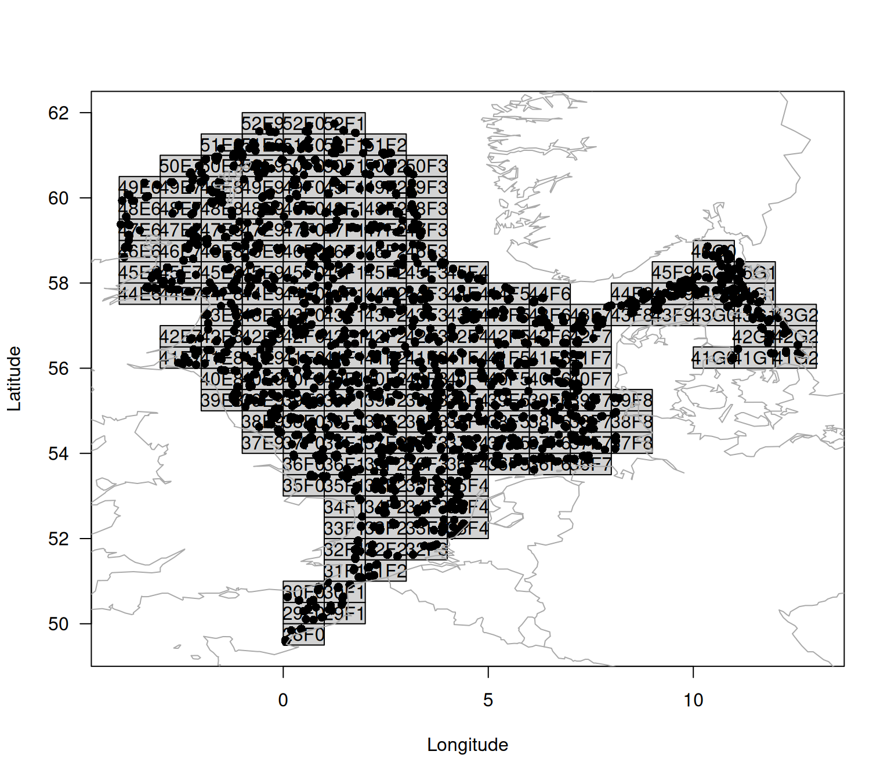

# A Step-by-step guide to working with the ICES DATRAS database using DATRASextra

The goal of the **DATRASextra** is to make it easier to work with the
[ICES DATRAS
database](https://www.ices.dk/data/data-portals/pages/datras.aspx) in R.
The package provides user-friendly, well-document functions, detailed
vignettes, and functionality that extends the powerful core tools of the
[**DATRAS** R package](https://github.com/DTUAqua/DATRAS).

This vignette introduces a typical workflow for working with ICES DATRAS
survey data, from installing **DATRASextra** and downloading survey
information to reading, cleaning, summarising, and plotting the data.

### Outline

1.  Install **DATRASextra**
2.  Download ICES DATRAS survey data
3.  Read downloaded data into R
4.  Clean and inspect the data
5.  Calculate total numbers and weight by haul
6.  Summary
7.  References

### Install DATRASextra

To get started, install the latest development version of
**DATRASextra** from GitHub:

``` r

## Install the package
remotes::install_github("tokami/DATRASextra")
```

Then load the package into your R session:

``` r

## Load the package
library(DATRASextra)
```

## Download DATRAS survey data

The DATRAS database is a large compilation of scientific bottom-trawl
survey data from across the Northeast Atlantic. You can get an overview
of the available surveys with:

``` r

## List available DATRAS surveys
list_surveys()
#>       survey     years                  quarters
#> 1       BITS 1991-2025 1(35), 2(10), 3(6), 4(34)
#> 2        BTS 1985-2024              1(19), 3(40)
#> 3  BTS-GSA17 2016-2023                      4(8)
#> 4   BTS-VIII 2007-2024                     4(15)
#> 5    Can-Mar 1970-2021         1(9), 3(52), 4(8)
#> 6        DWS 2006-2009                3(3), 4(1)
#> 7       DYFS 1985-2024              3(40), 4(40)
#> 8      EVHOE 1997-2024                     4(28)
#> 9    FR-CGFS 1988-2024                     4(37)
#> 10  FR-WCGFS 2018-2024                      3(7)
#> 11   IE-IAMS 2016-2024                1(9), 2(8)
#> 12   IE-IGFS 2003-2024                     4(22)
#> 13   IS-IDPS 2009-2009                      3(1)
#> 14     NIGFS 2005-2024              1(20), 4(18)
#> 15   NL-BSAS 2019-2024                3(6), 4(5)
#> 16   NS-IBTS 1965-2025 1(61), 2(14), 3(34), 4(9)
#> 17   NS-IDPS 2009-2016                1(1), 3(3)
#> 18      NSSS 2008-2024                     4(17)
#> 19   PT-IBTS 2002-2023                     4(19)
#> 20   ROCKALL 1999-2009                      3(9)
#> 21    SCOROC 2011-2024                     3(14)
#> 22  SCOWCGFS 2011-2025              1(14), 4(14)
#> 23  SE-SOUND 2011-2023         1(13), 3(7), 4(6)
#> 24       SNS 1985-2024              3(36), 4(16)
#> 25   SP-ARSA 1996-2024              1(22), 4(21)
#> 26  SP-NORTH 1990-2024               3(9), 4(35)
#> 27   SP-PORC 2001-2024               3(24), 4(5)
#> 28  SWC-IBTS 1985-2010        1(26), 2(1), 4(20)
#>                                               description
#> 1                       Baltic International Trawl Survey
#> 2                                       Beam Trawl Survey
#> 3  Beam Trawl Survey - SoleMon (Adriatic survey) - GSA17 
#> 4                Beam Trawl Survey - Bay of Biscay (VIII)
#> 5                         Canadian Maritimes trawl survey
#> 6                                       Deepwater Surveys
#> 7                               Inshore Beam Trawl Survey
#> 8            French Southern Atlantic Bottom Trawl Survey
#> 9                       French Channel Ground Fish Survey
#> 10      French Western English Channel Ground Fish Survey
#> 11                     Irish Anglerfish and Megrim Survey
#> 12                               Irish Ground Fish Survey
#> 13         Irminger Sea International Deep Pelagic Survey
#> 14                    Northern Ireland Ground Fish Survey
#> 15        Netherlands Industry survey on Turbot and Brill
#> 16            North Sea International Bottom Trawl Survey
#> 17        Norwegian Sea International Deep Pelagic Survey
#> 18                               North Sea Sandeel Survey
#> 19           Portuguese International Bottom Trawl Survey
#> 20             Scottish Rockall Survey - old (until 2010)
#> 21              Scottish Rockall Survey - new (from 2011)
#> 22      Scottish West Coast Groundfish Survey (from 2011)
#> 23                                    Sweden Sound Survey
#> 24                                        Sole Net Survey
#> 25              Spanish Gulf of Cadiz Bottom Trawl Survey
#> 26                Spanish North Coast Bottom Trawl Survey
#> 27                  Spanish Porcupine Bottom Trawl Survey
#> 28   Scottish West Coast Bottom Trawl Survey (up to 2010)
```

Or visually with:

``` r

## Plot available DATRAS surveys
plot_datras_overview(by_survey = TRUE, multi_panels = TRUE)
```


The
[`download_datras()`](https://tokami.github.io/DATRASextra/reference/download_datras.md)
function can be used to download data for one or more surveys. If both
`surveys` and `years` are left as `NULL`, all available surveys and
years are downloaded. Because the database is large, a full download can
take some time.

In many cases, however, only a subset of the database is needed. The
`surveys` and `years` arguments allow you to restrict the download to
selected surveys and years. For example, the 2023 `SNS` survey can be
downloaded into a temporary directory with:

``` r

## Select survey
survey <- "SNS"

## Create temporary directory
tmp <- tempdir()

## Download SNS data for 2023
download_datras(surveys = survey, years = 2023, dir = tmp)
```

Note that
[`download_datras()`](https://tokami.github.io/DATRASextra/reference/download_datras.md)
does not load the data directly into R. Instead, it downloads,
compresses, and stores the files on disk. If no directory is specified
via `dir`, the files are saved to the current working directory, which
you can inspect with [`getwd()`](https://rdrr.io/r/base/getwd.html).

Downloaded files are stored as zipped DATRAS exchange files. If a year
is requested for which a survey was not conducted, an empty file may be
created. The reading functions described below automatically ignore
empty files.

DATRAS typically contains three main data tables:

- `HH`: haul- or station-level metadata, such as position, time, gear,
  and environmental information
- `HL`: species-level catch-at-length and subsampling data
- `CA`: individual-level biological data, such as length, weight, sex,
  maturity, and age

The `CA` table can be large and may not be needed for all analyses. In
such cases, setting `download_ca = FALSE` can reduce download time and
memory use. Similarly, when the focus is on individual biological data
rather than catch-at-length information, `HL` can be omitted by setting
`download_hl = FALSE`. See the
[`vignette("articles/exploring-length-at-age")`](https://tokami.github.io/DATRASextra/articles/exploring-length-at-age.md)
for an example when working only with CA might be useful.

## Read DATRAS data into R

The downloaded survey files can then be read into R with
[`read_datras()`](https://tokami.github.io/DATRASextra/reference/read_datras.md):

``` r

surv0 <- read_datras(file.path(tmp, survey))
```

The path can point either to a single file or to an entire directory
containing multiple survey-year files.

To avoid relying on an internet connection for the remainder of this
vignette, we use the example data set `dab` included in **DATRASextra**:

``` r

surv0 <- dab
```

## Clean and inspect DATRAS data

The object returned by
[`read_datras()`](https://tokami.github.io/DATRASextra/reference/read_datras.md)
has class `datras_raw` and is intentionally kept close to the original
DATRAS exchange format. In many analyses it is useful to clean the data
first, for example by restricting the data set to valid hauls only.

This can be done manually with
[`subset()`](https://rdrr.io/r/base/subset.html), but **DATRASextra**
also provides the convenience function
[`clean_datras()`](https://tokami.github.io/DATRASextra/reference/clean_datras.md)
for applying common cleaning steps and creating relevant subsets:

``` r

surv <- clean_datras(surv0)
```

Another useful feature of
[`clean_datras()`](https://tokami.github.io/DATRASextra/reference/clean_datras.md)
is that it can impute missing depth information where appropriate.

After cleaning, it is often sensible to check for invalid or unusual
values. This can be done with
[`check_outliers()`](https://tokami.github.io/DATRASextra/reference/check_outliers.md):

``` r

surv <- check_outliers(surv, pct = TRUE)
```

The function returns a summary of hauls with invalid values and, when
`pct = TRUE`, also flags unusually extreme values in selected variables.

More detailed information is available in the attributes added by the
function:

``` r

head(attr(surv, "outlier_report"))
#>   table     var row                              haul.id value
#> 1    HH HaulDur  20   NS-IBTS:2020:1:NO:58G2:GOV:60009:9    15
#> 2    HH HaulDur 127     NS-IBTS:2020:1:DE:26D4:GOV:40:12    31
#> 3    HH HaulDur 140    NS-IBTS:2020:1:DE:26D4:GOV:238:60    31
#> 4    HH HaulDur 150    NS-IBTS:2020:1:DE:26D4:GOV:209:52    31
#> 5    HH HaulDur 226 NS-IBTS:2020:1:GB-SCT:748S:GOV:23:23    31
#> 6    HH HaulDur 236  NS-IBTS:2020:1:FR:35HT:GOV:Y0184:59    16
#>                                                      reason     method severity
#> 1 outside 0.01-0.99 percentiles by Survey+Quarter+Gear+Ship percentile  extreme
#> 2 outside 0.01-0.99 percentiles by Survey+Quarter+Gear+Ship percentile  extreme
#> 3 outside 0.01-0.99 percentiles by Survey+Quarter+Gear+Ship percentile  extreme
#> 4 outside 0.01-0.99 percentiles by Survey+Quarter+Gear+Ship percentile  extreme
#> 5 outside 0.01-0.99 percentiles by Survey+Quarter+Gear+Ship percentile  extreme
#> 6 outside 0.01-0.99 percentiles by Survey+Quarter+Gear+Ship percentile  extreme
#>   p_lo p_hi thr_lo thr_hi                 group
#> 1 0.01 0.99  17.00  31.00 NS-IBTS\r1\rGOV\r58G2
#> 2 0.01 0.99  20.00  30.87 NS-IBTS\r1\rGOV\r26D4
#> 3 0.01 0.99  20.00  30.87 NS-IBTS\r1\rGOV\r26D4
#> 4 0.01 0.99  20.00  30.87 NS-IBTS\r1\rGOV\r26D4
#> 5 0.01 0.99  16.00  30.00 NS-IBTS\r1\rGOV\r748S
#> 6 0.01 0.99  17.36  31.00 NS-IBTS\r1\rGOV\r35HT
```

A shorter list of affected hauls can be obtained with:

``` r

head(attr(surv, "outlier_hauls"))
#> [1] "NS-IBTS:2020:1:NO:58G2:GOV:60009:9"  
#> [2] "NS-IBTS:2020:1:DE:26D4:GOV:40:12"    
#> [3] "NS-IBTS:2020:1:DE:26D4:GOV:238:60"   
#> [4] "NS-IBTS:2020:1:DE:26D4:GOV:209:52"   
#> [5] "NS-IBTS:2020:1:GB-SCT:748S:GOV:23:23"
#> [6] "NS-IBTS:2020:1:FR:35HT:GOV:Y0184:59"
```

For the example data set used here, no clearly invalid values were
detected, so we proceed without further filtering.

A quick overview of the cleaned survey data can be obtained with:

``` r

plot(surv)
#> NULL
```



## Calculate total numbers and weight by haul

A commonly used quantity in survey analysis is the total abundance or
biomass per haul. These values are often used to derive survey indices,
community indicators, or biodiversity metrics.

To calculate total numbers and weight by haul, the information in the
`HL` table first needs to be raised to the haul level. A convenient
first step is to add numbers-at-length:

``` r

surv <- add_numbers_at_length(surv)
```

This adds a matrix `N` to the `HH` table, containing the estimated
numbers in each length class for each haul. The length classes can be
modified with the `cm_breaks` or `by` arguments.

The total number by haul can then be obtained by summing over length
classes:

``` r

surv <- add_total_numbers_by_haul(surv)
```

By default, this adds a single column `HaulN` to the `HH` table. More
generally, custom bins can be specified via `length_cuts`. In that case,
the result may contain separate totals for broader user-defined length
groups.

If species-specific length and weight information are available in `CA`,
or suitable length-weight relationships are available in the
`species_info` table, the numbers can also be converted to weight:

``` r

surv <- add_total_weight_by_haul(surv)
```

This adds `HaulWgt` to the `HH` table, containing the total estimated
weight by haul. As for abundance, custom length-group summaries can be
generated when `length_cuts` is used.

## Summary

This vignette introduced a basic workflow for working with ICES DATRAS
survey data in **DATRASextra**. It showed how to

- install and load the package,
- inspect available DATRAS surveys,
- download selected survey data,
- read DATRAS exchange files into R,
- clean and check the data,
- visualise the resulting survey information, and
- derive haul-level abundance and biomass summaries.

These functions provide a practical starting point for exploratory
analyses, survey summaries, and the preparation of DATRAS data for
downstream applications such as indicator development, biodiversity
analyses, and stock assessment.

## References
