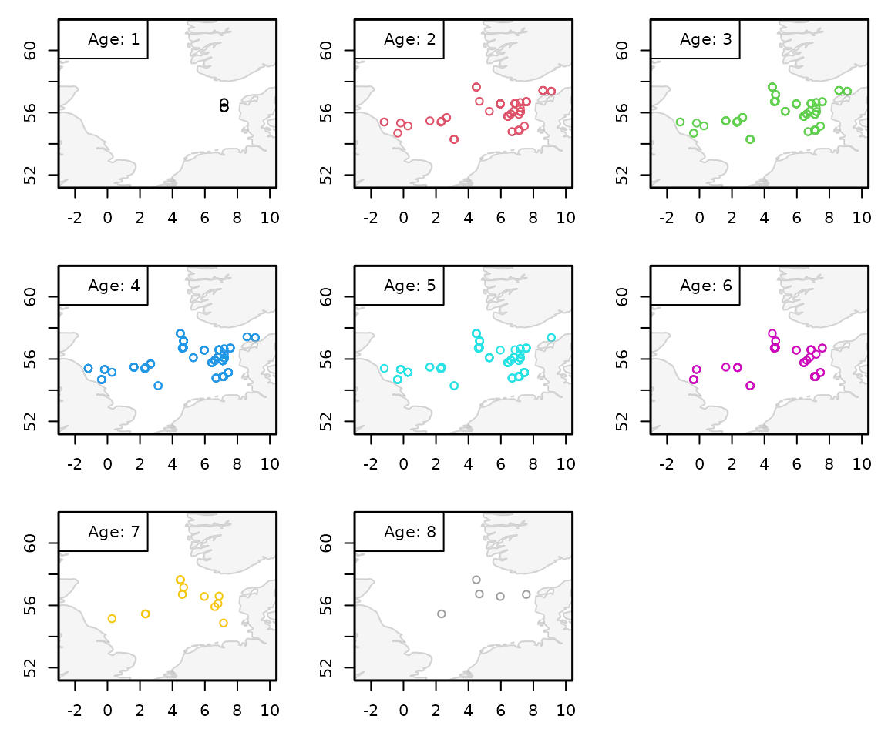

# Extracting Length-at-Age (LAA) from DATRAS

This vignette demonstrates how to extract and explore length-at-age
(LAA) data from a cleaned `DATRAS` object and how to estimate stochastic
age-length keys (ALKs) using **DATRASextra**.

Length-at-age information is useful in its own right, for example for
exploring temporal, spatial, or seasonal patterns in growth and
population structure. However, it is also central to many
stock-assessment workflows because the individual biological
observations in `CA` are typically *not* catch-representative on their
own. In contrast, the `HL` table contains the representative
catch-at-length information. ALKs are therefore used to convert
representative catch-at-length data into representative catch-at-age
estimates.

In other words:

- `HL` tells us how many fish were caught at each length,
- `CA` tells us how age relates to length for the aged fish,
- ALKs combine both sources of information to infer catch at age.

### Outline

1.  Load **DATRASextra**
2.  Select years and clean the data
3.  Explore length-at-age data
4.  Estimate age-length keys (ALKs)
5.  Predict catch at age from the fitted ALK
6.  Summary

## Load DATRASextra

Load the package with:

``` r
library(DATRASextra)
```

A typical `DATRAS` object is a list with three core components. We use
the example data set `dab` included in **DATRASextra** to demonstrate
the workflow:

``` r
str(dab, max.level = 1)
#> Class 'DATRASraw'  hidden list of 3
#>  $ CA:'data.frame':  8034 obs. of  39 variables:
#>  $ HH:'data.frame':  2651 obs. of  76 variables:
#>  $ HL:'data.frame':  26737 obs. of  36 variables:
```

The three main tables are:

- `CA`: individual-level biological data, such as length, weight, sex,
  maturity, and age
- `HH`: haul- or station-level metadata, such as position, time, gear,
  and environmental information
- `HL`: catch-at-length and subsampling information

When a species appears in `CA`, a corresponding record should also exist
in `HL`, even if some values are missing or represented by special codes
such as `-9`.

## Select years and clean the data

In many applications, it is useful to restrict the data to a selected
time period before exploring LAA patterns or fitting an ALK. Here, we
focus on the years 2020 to 2024:

``` r
years <- 2020:2024
```

We then apply a standard cleaning step with
[`clean_datras()`](https://tokami.github.io/DATRASextra/reference/clean_datras.md):

``` r
dab <- clean_datras(dab, years = years)
```

This function applies a number of common filters and harmonisation
steps. The exact defaults may depend on the package version and
settings, but the general aim is to create a cleaner, more
analysis-ready data set.

Equivalent manual filtering would look like this:

``` r
dab <- subset(
  dab,
  Year %in% years &
    HaulVal == "V" &
    DayNight == "D" &
    StdSpecRecCode == 1
)
```

Using
[`clean_datras()`](https://tokami.github.io/DATRASextra/reference/clean_datras.md)
is generally more convenient and helps keep workflows consistent and
reproducible.

## Explore length-at-age data

We start by extracting the `CA` table:

``` r
ca <- dab[["CA"]]

## Structure of CA data
str(ca, max.level = 1)
#> 'data.frame':    8034 obs. of  39 variables:
#>  $ RecordType       : Factor w/ 1 level "CA": 1 1 1 1 1 1 1 1 1 1 ...
#>  $ Survey           : Factor w/ 1 level "NS-IBTS": 1 1 1 1 1 1 1 1 1 1 ...
#>  $ Quarter          : Factor w/ 2 levels "1","3": 1 1 1 1 1 1 1 1 1 1 ...
#>  $ Country          : Factor w/ 4 levels "DK","GB","GB-SCT",..: 4 4 4 4 4 4 4 4 4 4 ...
#>  $ Ship             : Factor w/ 5 levels "26D4","58G2",..: 2 2 2 2 2 2 2 2 2 2 ...
#>  $ Gear             : Factor w/ 1 level "GOV": 1 1 1 1 1 1 1 1 1 1 ...
#>  $ SweepLngt        : int  110 110 110 110 110 110 110 110 110 110 ...
#>  $ GearEx           : Factor w/ 3 levels "B","S","D": 2 2 2 2 2 2 2 2 2 2 ...
#>  $ DoorType         : Factor w/ 1 level "P": 1 1 1 1 1 1 1 1 1 1 ...
#>  $ StNo             : chr  "60052" "60052" "60052" "60052" ...
#>  $ HaulNo           : int  52 52 52 52 52 52 52 52 52 52 ...
#>  $ Year             : Factor w/ 4 levels "2020","2021",..: 1 1 1 1 1 1 1 1 1 1 ...
#>  $ SpecCodeType     : chr  "W" "W" "W" "W" ...
#>  $ SpecCode         : int  127139 127139 127139 127139 127139 127139 127139 127139 127139 127139 ...
#>  $ AreaType         : int  0 0 0 0 0 0 0 0 0 0 ...
#>  $ AreaCode         : Factor w/ 104 levels "34F2","34F4",..: 71 71 71 71 71 71 71 71 71 71 ...
#>  $ LngtCode         : Factor w/ 3 levels ".","0","1": 3 3 3 3 3 3 3 3 3 3 ...
#>  $ LngtClas         : int  12 13 14 14 14 14 15 15 15 15 ...
#>  $ Sex              : Factor w/ 3 levels "","F","M": 1 1 1 1 1 1 1 1 1 1 ...
#>  $ Maturity         : chr  NA NA NA NA ...
#>  $ PlusGr           : Factor w/ 1 level "": 1 1 1 1 1 1 1 1 1 1 ...
#>  $ Age              : int  NA NA NA NA NA NA NA NA NA NA ...
#>  $ NoAtALK          : int  1 1 1 1 1 1 1 1 1 1 ...
#>  $ IndWgt           : num  NA NA NA NA NA NA NA NA NA NA ...
#>  $ FishID           : int  40 72 100 19 47 57 24 41 83 90 ...
#>  $ GenSamp          : Factor w/ 2 levels "","N": 2 2 2 2 2 2 2 2 2 2 ...
#>  $ StomSamp         : Factor w/ 2 levels "","N": 2 2 2 2 2 2 2 2 2 2 ...
#>  $ AgeSource        : Factor w/ 1 level "": 1 1 1 1 1 1 1 1 1 1 ...
#>  $ AgePrepMet       : Factor w/ 1 level "": 1 1 1 1 1 1 1 1 1 1 ...
#>  $ OtGrading        : int  NA NA NA NA NA NA NA NA NA NA ...
#>  $ ParSamp          : Factor w/ 2 levels "","N": 2 2 2 2 2 2 2 2 2 2 ...
#>  $ MaturityScale    : Factor w/ 3 levels "","M6","SMSF": 2 2 2 2 2 2 2 2 2 2 ...
#>  $ Valid_Aphia      : num  127139 127139 127139 127139 127139 ...
#>  $ DateofCalculation: int  20220125 20220125 20220125 20220125 20220125 20220125 20220125 20220125 20220125 20220125 ...
#>  $ StatRec          : Factor w/ 104 levels "34F2","34F4",..: 71 71 71 71 71 71 71 71 71 71 ...
#>  $ LngtCm           : num  12 13 14 14 14 14 15 15 15 15 ...
#>  $ Species          : Factor w/ 1 level "Limanda limanda": 1 1 1 1 1 1 1 1 1 1 ...
#>  $ haul.id          : Factor w/ 2651 levels "NS-IBTS:2020:1:DE:26D4:GOV:104:25",..: 298 298 298 298 298 298 298 298 298 298 ...
#>  $ Rank             : chr  "species" "species" "species" "species" ...
```

The `CA` component contains the individual-level biological
observations, including age where available. This is the main source of
information for estimating age-length relationships.

### Sample size by year

A first useful check is to inspect how much data are available by year:

``` r
## Number of individual rows per year
xtabs(~ Year, ca)
#> Year
#> 2020 2021 2022 2023 
#> 2911 2757 1595  771

## Number of unique hauls per year
xtabs(~ Year, data = unique(ca[c("Year", "haul.id")]))
#> Year
#> 2020 2021 2022 2023 
#>  118  123  110   94
```

This gives a quick impression of the temporal distribution of the
biological sampling effort. Strong imbalances among years can matter
when interpreting temporal patterns or when fitting more flexible ALK
models.

### Add spatial information from HH

Some useful variables, such as haul position, are stored in `HH` rather
than `CA`. To explore the spatial distribution of aged fish, we merge
this information onto the `CA` table using `haul.id`:

``` r
ca <- merge(
  ca,
  dab[["HH"]][c("haul.id", "lon", "lat")],
  by = "haul.id",
  all.x = TRUE,
  sort = FALSE,
  suffixes = c("", ".HH")
)
```

We can now inspect where age observations were collected. The following
plot shows the haul locations of fish assigned to different ages:

``` r
ages <- sort(unique(ca$Age))
ages <- ages[!is.na(ages)]

xlim <- range(ca$lon, na.rm = TRUE)
ylim <- range(ca$lat, na.rm = TRUE)

par(mfrow = n2mfrow(length(ages)),
    mar = c(3, 3, 1, 1))

for (i in seq_along(ages)) {
  plot(ca$lon[ca$Age == ages[i]],
       ca$lat[ca$Age == ages[i]],
       col = i,
       xlim = xlim,
       ylim = ylim,
       xlab = "", ylab = "")

  plot(sf::st_geometry(DATRASextra:::get_land()), add = TRUE,
       col = grDevices::adjustcolor(grey(0.9), 0.4),
       border = grDevices::adjustcolor(grey(0.6), 0.4))

  legend("topleft", legend = paste0("Age: ", ages[i]),
         pch = NA, bg = "white")
  box(lwd = 1.5)
}
```



This type of plot can be helpful for spotting strong spatial clustering
of age samples. Such patterns may suggest that age data are concentrated
in specific areas, which can motivate the use of spatial terms in the
ALK model.

### Age availability

The next step is to check how many observations actually have age
information:

``` r
table(ca$Age, useNA = "ifany")
#> 
#>    1    2    3    4    5    6    7    8 <NA> 
#>    4   72   99  138  104   47   15    5 7550
```

``` r
sum(is.na(ca$Age))
#> [1] 7550
```

Around 94% of `CA` entries have missing age.

This is expected in many DATRAS data sets: not every measured fish is
aged. That is precisely why ALKs are needed.

For ALK estimation, the variable `NoAtALK` is used as the frequency or
count associated with each age-length observation. Depending on the
survey and data structure, one row in `CA` may therefore represent one
or multiple fish in the age-length sample.

### Explore the age-length relationship directly

Before fitting a model, it is often useful to visualise the observed
age-length relationship:

``` r
plot(ca$LngtCm, ca$Age,
     pch = 16, cex = 0.6,
     xlab = "Length [cm]",
     ylab = "Age")
box(lwd = 1.5)
```


This quick plot can reveal whether age tends to increase smoothly with
length, whether there is substantial overlap among ages, and whether
outliers or unusual records may require further checking.

A year-specific view can also be informative:

``` r
par(mfrow = n2mfrow(length(unique(ca$Year))),
    mar = c(3, 3, 2, 1))

for (yr in sort(unique(ca$Year))) {
  if (any(!is.na(ca$Age[ca$Year == yr]))) {
    plot(ca$LngtCm[ca$Year == yr],
         ca$Age[ca$Year == yr],
         pch = 16, cex = 0.6,
         xlab = "", ylab = "",
         main = yr)
    box(lwd = 1.5)
  }
}
mtext("Length [cm]", side = 1, outer = TRUE)
mtext("Age", side = 2, outer = TRUE)
```


If the relationship changes substantially among years, a model with year
effects may be preferable. As the dab example shows, for some years, age
information might not be available (here: 2020 and 2022).

## Estimate age-length keys (ALKs)

To predict catch at age, we first need representative catch-at-length
information from `HL`. We therefore add the numbers-at-length matrix to
the object:

``` r
dab <- add_numbers_at_length(dab)
```

For stock-assessment applications, ALKs are often estimated separately
by quarter. As a simple example, we restrict the data to quarter 1:

``` r
dab_Q1 <- subset(dab, Quarter == 1)
```

We can now fit a basic stochastic ALK:

``` r
ALK <- fitALK(
  dab_Q1,
  minAge = 3,
  maxAge = 8
)
```

This model estimates the age composition across the specified age range
and links age to length using the aged fish in `CA`.

A more flexible model can include additional structure, for example
random year effects or spatial smooths:

``` r
ALK_spatial <- fitALK(
  dab_Q1,
  minAge = 2,
  maxAge = 8,
  model = "cra ~ LngtCm + s(Year, bs = 're') + s(lon, lat, bs = 'ts')"
)
```

Such extensions can be useful when the age-length relationship varies
over time or space, or when sampling is spatially structured.

### How the stochastic ALK is formulated

[`fitALK()`](https://rdrr.io/pkg/DATRAS/man/fitALK.html) uses a
continuation-ratio formulation. For each age threshold `a`, the data are
restricted to fish with `Age >= a`, and a binary model is fitted for
whether `Age > a`. In other words, for each threshold it estimates

\\ P(\mathrm{Age} \> a \mid \mathrm{Age} \ge a,\\ x) \\

where `x` denotes the covariates, such as length, year, or location.

The full ALK is then constructed by combining these conditional
probabilities across ages. This formulation has two practical
advantages:

- it guarantees that predicted probabilities across age classes sum to
  one, and
- it allows flexible modelling of covariate effects on the age
  distribution.

## Predict catch at age from the fitted ALK

Once the ALK has been fitted, it can be used to convert numbers at
length into numbers at age. Prediction is currently done using the
corresponding prediction method from the **DATRAS** package:

``` r
dab_Q1$Nage <- predict(ALK)
```

This adds a new matrix to the `HH` component with the predicted numbers
by age:

``` r
head(dab_Q1$Nage)
#>               3           4           5           6           7          8+
#> [1,]  42.319884  64.1632166  46.8023136 22.81739329 7.440942296 2.456249953
#> [2,]  61.598467  48.2323893  29.6834661 12.89028120 3.471816098 1.123580681
#> [3,] 181.618371 146.4905106  75.0238389 27.46295412 4.255536098 1.148789129
#> [4,]  41.184964  44.5331180  28.9971735 13.06082336 3.913259324 1.310661305
#> [5,] 188.141721 203.2544627 101.3182744 34.30964641 3.989097706 0.986797851
#> [6,]   0.261138   0.4080437   0.2343069  0.08575212 0.008794538 0.001964819
```

Each row corresponds to a haul, and each column corresponds to an age
class. The values are derived by combining the representative numbers at
length from `HL` with the estimated probabilities from the ALK.

These haul-level age compositions can then be used for a range of
downstream analyses. For example, they can be aggregated to produce
age-based survey indices, compared among years or areas, or used as
input to stock-assessment models.

### Quick inspection of predicted catch at age

A simple first check is to look at the total predicted numbers by age
across all hauls:

``` r
colSums(dab_Q1$Nage, na.rm = TRUE)
#>          3          4          5          6          7         8+ 
#> 150478.338 115774.099  55497.529  19510.320   3490.392   1050.322
```

This gives the overall predicted age composition for the selected subset
of the survey. If desired, age-specific maps or time-series summaries
can be derived in exactly the same way as for other haul-level
quantities stored in `HH`.

## Summary

Length-at-age data provide the link between size-based survey
observations and age-based population dynamics, and are therefore
central to many fisheries applications. Within the broader
**DATRASextra** workflow, this vignette builds on the data access,
cleaning, and length-based summaries introduced in the earlier
vignettes, and extends them toward age-structured analyses. In
particular, stochastic age-length keys make it possible to combine the
catch-representative length information in `HL` with the aged subsample
in `CA`, thereby deriving age-based summaries that are suitable for
stock assessment, survey standardisation, and analyses of temporal or
spatial population structure.

At the same time, the resulting age compositions are only as reliable as
the underlying age data and the assumptions of the ALK model. Age
samples may be sparse, unevenly distributed in space or time, or
unrepresentative of the full length range, and the age-length
relationship itself may vary among years, areas, or survey strata. For
this reason, ALKs should not be treated as a purely technical conversion
step, but as a statistical model whose assumptions and predictive
behaviour deserve careful checking. In practice, this often means
comparing alternative model formulations, examining residual patterns,
and considering whether additional covariates such as year, quarter,
sex, or space should be included.

This vignette therefore provides a starting point rather than an
endpoint. Once age-based haul summaries have been derived, they can be
aggregated into survey indices, used to study shifts in recruitment or
age structure, or linked with the other **DATRASextra** tools for
biomass, length composition, and spatial analyses. A natural next step
is to compare age-based and length-based views of the survey data,
evaluate the stability of ALKs over time, and assess how the choice of
ALK model influences downstream scientific conclusions and fisheries
advice.

## References
