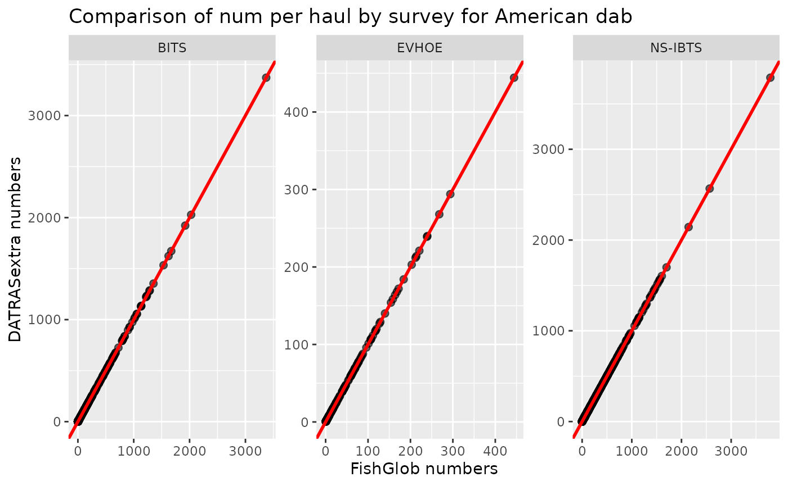
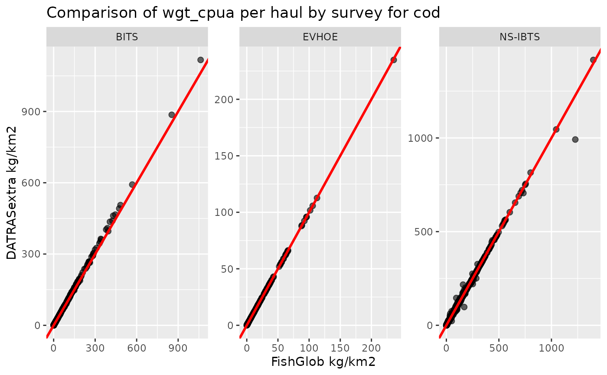

# Processing ICES DATRAS Data for FishGlob

## Background

The **FishGlob** database is a global compilation of standardized
scientific trawl survey data used to study large-scale patterns in
marine fish biodiversity and community structure.

FishGlob harmonizes data from multiple regional monitoring programs by
standardizing:

- taxonomic information
- sampling effort
- catch metrics (abundance and biomass per unit area)

The dataset integrates numerous long-term fisheries-independent surveys,
including several surveys available through the **ICES DATRAS**
database.

**ICES DATRAS** (Database of Trawl Surveys) provides access to
standardized survey data collected in European seas, including
haul-level sampling information (HH), length distributions (HL), and
individual data (CA).

The **`DATRASextra`** package provides tools to process raw DATRAS
survey data and generate outputs that are compatible with the **FishGlob
data structure**.

This vignette demonstrates a workflow to:

- download DATRAS survey data
- harmonize and clean_datras raw survey tables
- standardize species taxonomy
- estimate swept area and biomass
- generate FishGlob-compatible datasets

The workflow can be applied to a single species or to multiple species.
For illustration, this vignette uses `mini`.

``` r
data("mini_fishglob", package = "DATRASextra")
```

an example dataset containing 6 species across 4 surveys (BITS, BTS,
EVHOE, NS-IBTS):

Amblyraja radiata, Hippoglossoides platessoides, Trisopterus esmarkii,
Lophius piscatorius, Lepidorhombus whiffiagonis

## References

Maureaud, A., et al. (2021) FISHGLOB_data: an integrated dataset of fish
biodiversity sampled with scientific bottom-trawl surveys. Sci Data 11,
24 (2024). <https://doi.org/10.1038/s41597-023-02866-w>

ICES Database on Trawl Surveys (DATRAS), ICES, Copenhagen, Denmark.
<https://datras.ices.dk>

## Libraries

``` r
library(DATRASextra)
```

    ## Loading required package: DATRAS

``` r
library(ggplot2)
library(dplyr)
```

    ## 
    ## Attaching package: 'dplyr'

    ## The following objects are masked from 'package:stats':
    ## 
    ##     filter, lag

    ## The following objects are masked from 'package:base':
    ## 
    ##     intersect, setdiff, setequal, union

## Load the dataset

``` r
data(mini_fishglob)
```

## Clean the dataset

The
[`clean_fishglob()`](https://tokami.github.io/DATRASextra/reference/clean_fishglob.md)
function harmonizes the raw DATRAS tables and prepares them for
processing. Species names and identifiers are standardized using WoRMS
taxonomy with
[`correct_species()`](https://tokami.github.io/DATRASextra/reference/correct_species.md)
This step ensures:

- consistent scientific names
- valid **AphiaID identifiers**
- standardized taxonomic classification

``` r
dat <- clean_fishglob(mini_fishglob)
```

## Reduce dataset size

The raw dataset contains many variables that are not required for the
FishGlob output.

The
[`prune_fishglob()`](https://tokami.github.io/DATRASextra/reference/prune_fishglob.md)
function removes unnecessary columns to reduce memory usage and improve
processing speed.

``` r
dat <- prune_fishglob(dat)
```

## Compute swept area

Catch per unit area requires an estimate of the **area swept by each
haul**.

The function below:

- calculates swept area when gear information is available
- imputes missing values when necessary

``` r
dat <- add_swept_area_fishglob(dat)
```

## Estimate biomass

FishGlob reports both **numbers** and **biomass**.

The
[`add_total_weight_by_haul_fishglob()`](https://tokami.github.io/DATRASextra/reference/add_total_weight_by_haul_fishglob.md)
function converts length data to weight using species-specific
**length–weight relationships**.

``` r
dat <- add_total_weight_by_haul_fishglob(dat)
```

## Format the FishGlob output

Finally, the dataset is formatted to match the **FishGlob data
structure**.

``` r
datras <- as_fishglob(dat)

head(datras)
```

    ##     survey      source timestamp                          haul_id
    ## 2     BITS DATRAS ICES   2026-04  BITS:2015:1:DE:06SL:TVS:22004:7
    ## 4     BITS DATRAS ICES   2026-04  BITS:2015:1:DE:06SL:TVS:22007:8
    ## 44    BITS DATRAS ICES   2026-04 BITS:2015:1:DE:06SL:TVS:24212:15
    ## 110   BITS DATRAS ICES   2026-04      BITS:2015:1:DK:26HI:TVS:1:1
    ## 111   BITS DATRAS ICES   2026-04    BITS:2015:1:DK:26HI:TVS:10:10
    ## 112   BITS DATRAS ICES   2026-04    BITS:2015:1:DK:26HI:TVS:10:10
    ##             country sub_area continent stat_rec station stratum year month day
    ## 2   multi-countries     <NA>    europe     37G0    <NA>    <NA> 2015     2  25
    ## 4   multi-countries     <NA>    europe     37G1    <NA>    <NA> 2015     2  26
    ## 44  multi-countries     <NA>    europe     38G3    <NA>    <NA> 2015     2  28
    ## 110 multi-countries     <NA>    europe     43G0    <NA>    <NA> 2015     2  24
    ## 111 multi-countries     <NA>    europe     41G2    <NA>    <NA> 2015     2  27
    ## 112 multi-countries     <NA>    europe     41G2    <NA>    <NA> 2015     2  27
    ##     quarter latitude longitude haul_dur gear depth     num num_cpue   num_cpua
    ## 2         1  54.4427   10.6547      0.5  TVS    19   1.000    2.000   12.99120
    ## 4         1  54.4513   11.3738      0.5  TVS    20   1.000    2.000   11.94887
    ## 44        1  54.9908   13.3447      0.5  TVS    47   1.000    2.000   11.04183
    ## 110       1  57.4721   10.6695      0.5  TVS    26  90.573  181.146 1262.57974
    ## 111       1  56.1206   12.4688      0.5  TVS    26   1.000    2.000   15.36125
    ## 112       1  56.1206   12.4688      0.5  TVS    26 118.635  237.270 1822.38158
    ##            wgt   wgt_cpue   wgt_cpua verbatim_name verbatim_aphia_id
    ## 2   0.01259440  0.0251888  0.1636164          <NA>                NA
    ## 4   0.06313433  0.1262687  0.7543837          <NA>                NA
    ## 44  0.05369922  0.1073984  0.5929377          <NA>                NA
    ## 110 2.06026668  4.1205334 28.7199381          <NA>                NA
    ## 111 2.93347786  5.8669557 45.0618790          <NA>                NA
    ## 112 5.13663026 10.2732605 78.9050479          <NA>                NA
    ##                    accepted_name aphia_id          class             order
    ## 2   Hippoglossoides platessoides   127137      Teleostei Pleuronectiformes
    ## 4   Hippoglossoides platessoides   127137      Teleostei Pleuronectiformes
    ## 44  Hippoglossoides platessoides   127137      Teleostei Pleuronectiformes
    ## 110 Hippoglossoides platessoides   127137      Teleostei Pleuronectiformes
    ## 111            Amblyraja radiata   105865 Elasmobranchii        Rajiformes
    ## 112 Hippoglossoides platessoides   127137      Teleostei Pleuronectiformes
    ##             family           genus    rank survey_unit
    ## 2   Pleuronectidae Hippoglossoides Species      BITS-1
    ## 4   Pleuronectidae Hippoglossoides Species      BITS-1
    ## 44  Pleuronectidae Hippoglossoides Species      BITS-1
    ## 110 Pleuronectidae Hippoglossoides Species      BITS-1
    ## 111        Rajidae       Amblyraja Species      BITS-1
    ## 112 Pleuronectidae Hippoglossoides Species      BITS-1

## Compare it with Fishglob

### Download FishGlob

``` r
# load survey data
fishglob_url <- "https://github.com/AquaAuma/FishGlob_data/raw/d71dfa03c2912b4e9d9cd10412ae2af52ba56ae5/outputs/Compiled_data/FishGlob_public_std_clean.RData" # stick with this version
options(timeout = 300) # increase timeout to 5 minutes
load(url(fishglob_url))
fishglob <- data
```

### Get the surveys in common

``` r
common_surveys <- intersect(fishglob$survey, datras$survey)

fishglob_common <- fishglob[fishglob$survey %in% common_surveys, ]
datras_common <- datras[datras$survey %in% common_surveys, ]

fishglob_common$haul_id <- gsub(" ", ":", fishglob_common$haul_id) # use our haul format

# get common haul ids
common_haul_ids <- intersect(fishglob_common$haul_id, datras_common$haul_id)

# fishglob
fishglob_agg <- fishglob_common %>% filter(haul_id %in% common_haul_ids) %>%
  group_by(haul_id, accepted_name, survey) %>%
  summarise(wgt_cpua = sum(wgt_cpua, na.rm = TRUE), num = sum(num, na.rm = TRUE), .groups = "drop")

# datras_extra
datras_agg <- datras_common %>% filter(haul_id %in% common_haul_ids) %>%
  group_by(haul_id, accepted_name, survey) %>%
  summarise(wgt_cpua = sum(wgt_cpua, na.rm = TRUE), num = sum(num, na.rm = TRUE), .groups = "drop")

merged_agg <- merge(
  fishglob_agg,
  datras_agg,
  by = c("survey","haul_id", "accepted_name"),
  suffixes = c("_fishglob", "_datras")
)

am_dab <- merged_agg %>%
  filter(accepted_name == "Hippoglossoides platessoides") # compare american dab as example
```

### Plot it

``` r
ggplot(am_dab, aes(x = num_fishglob,
                   y = num_datras)) +

  # Points
  geom_point(alpha = 0.6, size = 2) +
  geom_abline(slope = 1, intercept = 0,
              color = "red", linewidth = 1) +
  labs(
    x = "FishGlob numbers",
    y = "DATRASextra numbers",
    title = "Comparison of num per haul by survey for American dab"
  ) +
  facet_wrap(~ survey, scales = "free")
```



``` r
ggplot(am_dab, aes(x = wgt_cpua_fishglob,
                   y = wgt_cpua_datras)) +

  # Points
  geom_point(alpha = 0.6, size = 2) +
  geom_abline(slope = 1, intercept = 0,
              color = "red", linewidth = 1) +
  labs(
    x = "FishGlob kg/km2",
    y = "DATRASextra kg/km2",
    title = "Comparison of wgt_cpua per haul by survey for cod"
  ) +

  facet_wrap(~ survey, scales = "free")
```



As you can see there are small differences in densities due to sligtly
different swept are imputation methods.

## Downloading the FishGlob DATRAS surveys

The previous example used a small dataset to keep the vignette
lightweight. To reproduce the **DATRAS part of the FishGlob dataset**,
the full set of surveys used in FishGlob can be downloaded like this:

``` r
library(DATRASextra)

surveys <- c("NS-IBTS", "EVHOE", "SWC-IBTS", "BITS", "IE-IGFS",
             "FR-CGFS", "NIGFS", "ROCKALL", "PT-IBTS",
             "SP-NORTH", "SP-ARSA", "SP-PORC")

# create temporary directory
tmp <- tempdir()

# download survey data
download_datras(surveys = surveys, dir = tmp)

# read raw DATRAS tables
raw <- read_datras(file.path(tmp, surveys))
```

Downloading and processing these surveys take some time, as they include
multiple decades of trawl survey data.
