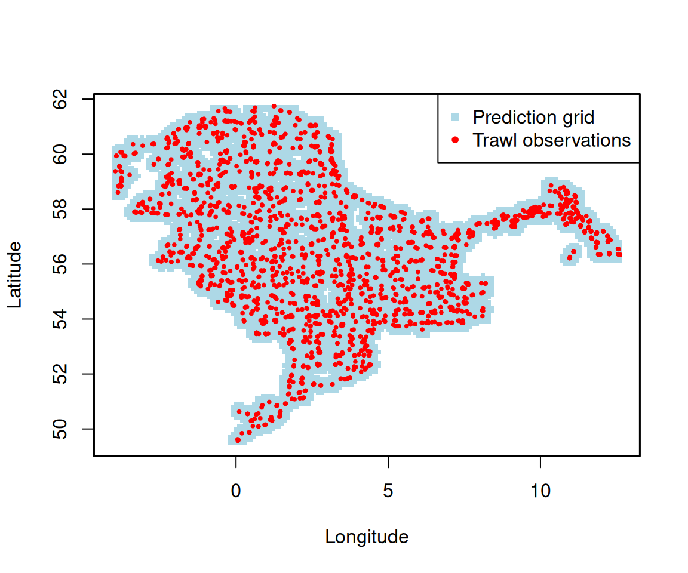

# Building a spatiotemporal prediction grid

This article shows how to build a regular prediction grid over a survey
domain with
[`make_survey_grid()`](https://tokami.github.io/DATRASextra/reference/make_survey_grid.md),
and how to extend it into a *spatiotemporal* grid by repeating it across
years. Such a grid is a common input for spatial and spatiotemporal
species distribution models, where predictions are made on a regular
lattice covering the surveyed area.

We use the example data set `dab` (dab, *Limanda limanda*, from the
[NS-IBTS](https://gis.ices.dk/geonetwork/srv/eng/catalog.search#/metadata/abe375f9-fcf0-4839-a842-1f28650c98d3)
survey, 2020-2023).

``` r

## Load the packages
library(DATRASextra)
library(sf)

## Load the example data
data(dab)
```

## Disclaimer

This is just one way of building a prediction grid. Choices such as the
resolution, the distance threshold, and whether to remove land are
subjective and should be tailored to your own data and objectives.

## Trawl locations

We start from the unique haul positions in the `HH` table.
[`make_survey_grid()`](https://tokami.github.io/DATRASextra/reference/make_survey_grid.md)
works directly on coordinate vectors, so we only need the `lon` and
`lat` columns.

``` r

## Unique trawl locations
trawls <- unique(dab[["HH"]][, c("haul.id", "lon", "lat")])
head(trawls)
#>                               haul.id    lon     lat
#> 1 NS-IBTS:2020:1:NO:58G2:GOV:60055:55 3.2725 59.2533
#> 2 NS-IBTS:2020:1:NO:58G2:GOV:60054:54 3.1695 59.7019
#> 3 NS-IBTS:2020:1:NO:58G2:GOV:60053:53 2.4838 58.6749
#> 4 NS-IBTS:2020:1:NO:58G2:GOV:60052:52 2.7423 58.2584
#> 5 NS-IBTS:2020:1:NO:58G2:GOV:60051:51 3.4483 58.2483
#> 6 NS-IBTS:2020:1:NO:58G2:GOV:60050:50 3.3026 58.8872
```

## A spatial grid

[`make_survey_grid()`](https://tokami.github.io/DATRASextra/reference/make_survey_grid.md)
builds an equally spaced grid covering the range of the coordinates.
`resolution` and `max_dist` are expressed in the **same units** as the
coordinates — here degrees, because the hauls are in lon/lat. We use a
0.1° grid and drop grid nodes that are more than 0.3° from any haul, so
the grid stays close to where the survey actually sampled (this needs
the `RANN` package).

``` r

## Regular grid near the trawl observations
grid <- make_survey_grid(
  x          = trawls$lon,
  y          = trawls$lat,
  resolution = 0.1,
  max_dist   = 0.3
)

nrow(grid)
#> [1] 8326
head(grid)
#>      X    Y
#> 1 -0.2 49.5
#> 2 -0.1 49.5
#> 3  0.0 49.5
#> 4  0.1 49.5
#> 5  0.2 49.5
#> 6  0.3 49.5
```

The result is a data frame with columns `X` and `Y`. A quick plot shows
the grid following the survey footprint:

``` r

## Grid nodes (blue) and trawl observations (red)
plot(grid$X, grid$Y, pch = 15, col = "lightblue", cex = 0.5,
     xlab = "Longitude", ylab = "Latitude")
points(trawls$lon, trawls$lat, col = "red", pch = 20, cex = 0.6)
legend("topright", legend = c("Prediction grid", "Trawl observations"),
       col = c("lightblue", "red"), pch = c(15, 20), bg = "white")
box(lwd = 1.5)
```



For predictions in true distance units, project the coordinates first
(for example to UTM), pass the projected coordinates to
[`make_survey_grid()`](https://tokami.github.io/DATRASextra/reference/make_survey_grid.md),
and set `resolution` and `max_dist` in metres or kilometres.

## Adding the time dimension

To turn the spatial grid into a *spatiotemporal* one, pass a vector of
years to `time`. The spatial grid is then repeated for each year and a
`year` column is added, giving one row per grid node and year.

``` r

## Repeat the grid across survey years
grid_st <- make_survey_grid(
  x          = trawls$lon,
  y          = trawls$lat,
  resolution = 0.1,
  max_dist   = 0.2,
  time       = 2020:2023
)

nrow(grid_st)
#> [1] 27416
head(grid_st)
#>      X    Y year
#> 1 -0.1 49.5 2020
#> 2  0.0 49.5 2020
#> 3  0.1 49.5 2020
#> 4  0.2 49.5 2020
#> 5 -0.1 49.6 2020
#> 6  0.0 49.6 2020
```

``` r

## One spatial grid per year
table(grid_st$year)
#> 
#> 2020 2021 2022 2023 
#> 6854 6854 6854 6854
```

This `grid_st` data frame - with `X`, `Y`, and `year` - can be passed
directly to a spatiotemporal model as the set of locations to predict
on.

## Removing land (optional)

A rectangular grid can include cells that fall on land. If your model
domain is sea only, drop those cells. Here we use coastline polygons
from Natural Earth and keep only grid nodes that fall in the sea.

``` r

library(rnaturalearth)

## Land polygon (WGS84)
land <- st_union(st_make_valid(ne_countries(scale = 10, returnclass = "sf")))

## Keep only grid nodes that are not on land
grid_sf <- st_as_sf(grid, coords = c("X", "Y"), crs = 4326)
on_land <- lengths(st_intersects(grid_sf, land)) > 0
grid_sea <- grid[!on_land, ]
```

Cross `grid_sea` with the survey years (as above) to obtain a sea-only
spatiotemporal grid.
