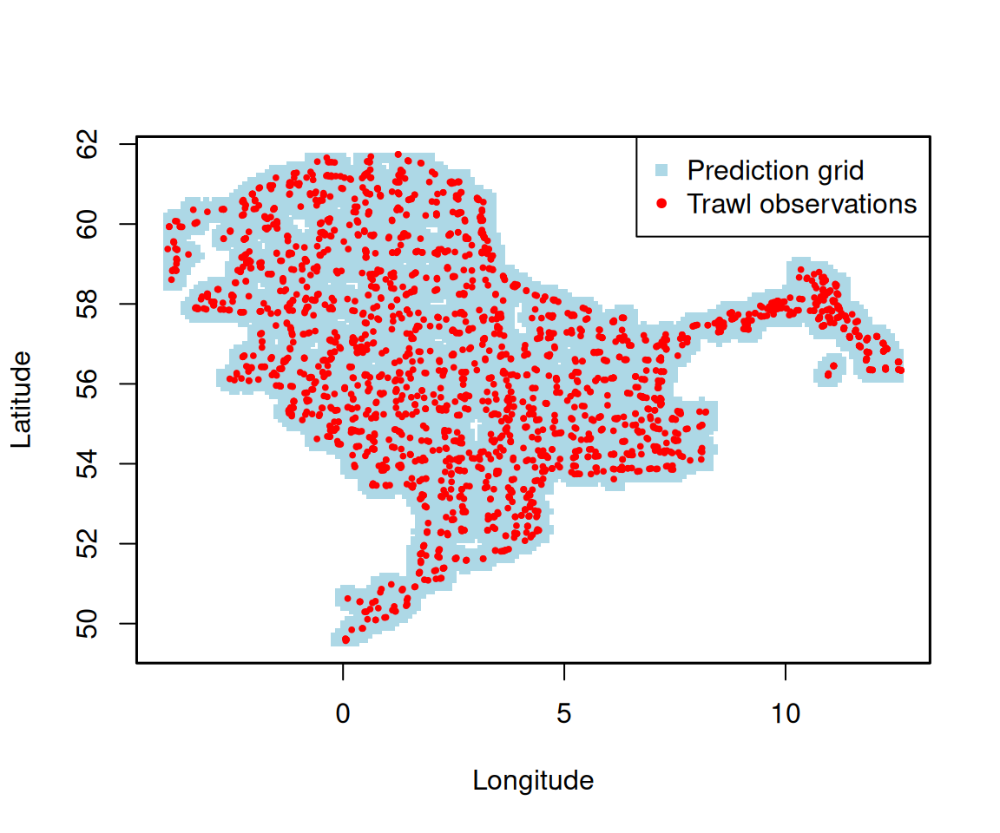
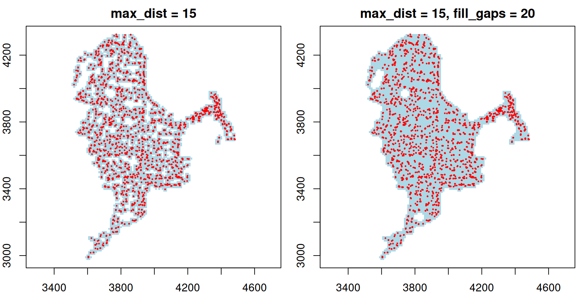

# Building a spatiotemporal prediction grid

This article shows how to build a regular prediction grid over a survey
domain with
[`make_survey_grid()`](https://tokami.github.io/DATRASextra/reference/make_survey_grid.md),
and how to extend it into a *spatiotemporal* grid by repeating it across
years. Such a grid is a common input for spatial and spatiotemporal
species distribution models, where predictions are made on a regular
lattice covering the surveyed area.

We use the example data set `dab` (dab, *Limanda limanda*, from the
[NS-IBTS](https://gis.ices.dk/geonetwork/srv/eng/catalog.search#/metadata/abe375f9-fcf0-4839-a842-1f28650c98d3)
survey, 2020-2023).

``` r

## Load the packages
library(DATRASextra)
library(sf)

## Load the example data
data(dab)
```

## Disclaimer

This is just one way of building a prediction grid. Choices such as the
resolution, the distance threshold, and whether to remove land are
subjective and should be tailored to your own data and objectives.

## Trawl locations

We start from the unique haul positions in the `HH` table.
[`make_survey_grid()`](https://tokami.github.io/DATRASextra/reference/make_survey_grid.md)
works directly on coordinate vectors, so we only need the `lon` and
`lat` columns.

``` r

## Unique trawl locations
trawls <- unique(dab[["HH"]][, c("haul.id", "lon", "lat")])
head(trawls)
#>                           haul.id    lon     lat
#> 1  NS-IBTS:2020:1:DK:26D4:GOV:6:1 7.1445 56.6076
#> 2  NS-IBTS:2020:1:DK:26D4:GOV:8:2 6.8874 56.5951
#> 3 NS-IBTS:2020:1:DK:26D4:GOV:10:3 7.1858 56.3057
#> 4 NS-IBTS:2020:1:DK:26D4:GOV:11:4 6.8544 56.3333
#> 5 NS-IBTS:2020:1:DK:26D4:GOV:19:5 2.4918 56.7180
#> 6 NS-IBTS:2020:1:DK:26D4:GOV:21:6 1.5045 56.7494
```

## A spatial grid

[`make_survey_grid()`](https://tokami.github.io/DATRASextra/reference/make_survey_grid.md)
builds an equally spaced grid covering the range of the coordinates.
`resolution` and `max_dist` are expressed in the **same units** as the
coordinates — here degrees, because the hauls are in lon/lat. We use a
0.1° grid and drop grid nodes that are more than 0.3° from any haul, so
the grid stays close to where the survey actually sampled (this needs
the `RANN` package).

``` r

## Regular grid near the trawl observations
grid <- make_survey_grid(
  x          = trawls$lon,
  y          = trawls$lat,
  resolution = 0.1,
  max_dist   = 0.3
)

nrow(grid)
#> [1] 8326
head(grid)
#>      X    Y
#> 1 -0.2 49.5
#> 2 -0.1 49.5
#> 3  0.0 49.5
#> 4  0.1 49.5
#> 5  0.2 49.5
#> 6  0.3 49.5
```

The result is a data frame with columns `X` and `Y`. A quick plot shows
the grid following the survey footprint:

``` r

## Grid nodes (blue) and trawl observations (red)
plot(grid$X, grid$Y, pch = 15, col = "lightblue", cex = 0.5,
     xlab = "Longitude", ylab = "Latitude")
points(trawls$lon, trawls$lat, col = "red", pch = 20, cex = 0.6)
legend("topright", legend = c("Prediction grid", "Trawl observations"),
       col = c("lightblue", "red"), pch = c(15, 20), bg = "white")
box(lwd = 1.5)
```



For predictions in true distance units, project the coordinates first
(for example to UTM), pass the projected coordinates to
[`make_survey_grid()`](https://tokami.github.io/DATRASextra/reference/make_survey_grid.md),
and set `resolution` and `max_dist` in metres or kilometres.

## Adding the time dimension

To turn the spatial grid into a *spatiotemporal* one, pass a vector of
years to `time`. The spatial grid is then repeated for each year and a
`year` column is added, giving one row per grid node and year.

``` r

## Repeat the grid across survey years
grid_st <- make_survey_grid(
  x          = trawls$lon,
  y          = trawls$lat,
  resolution = 0.1,
  max_dist   = 0.2,
  time       = 2020:2023
)

nrow(grid_st)
#> [1] 27424
head(grid_st)
#>      X    Y year
#> 1 -0.1 49.5 2020
#> 2  0.0 49.5 2020
#> 3  0.1 49.5 2020
#> 4  0.2 49.5 2020
#> 5 -0.1 49.6 2020
#> 6  0.0 49.6 2020
```

``` r

## One spatial grid per year
table(grid_st$year)
#> 
#> 2020 2021 2022 2023 
#> 6856 6856 6856 6856
```

This `grid_st` data frame - with `X`, `Y`, and `year` - can be passed
directly to a spatiotemporal model as the set of locations to predict
on.

## Projected coordinates

Distances in degrees are not equal in all directions: in the North Sea a
degree of longitude is only about 60 % of a degree of latitude. For a
grid in kilometres, project the haul positions first.
[`add_xy()`](https://tokami.github.io/DATRASextra/reference/add_xy.md)
adds the columns `X` and `Y` (by default the European equal-area
projection EPSG:3035, in km) to `HH`, and with `inverse = TRUE` adds
longitude and latitude to a projected grid.

``` r

## Haul positions in km
dab_xy <- add_xy(dab)
hauls <- unique(dab_xy[["HH"]][, c("haul.id", "X", "Y", "Year", "Quarter", "Depth")])
hauls$Year <- as.numeric(as.character(hauls$Year))

## 10 km grid, nodes within 15 km of a haul
grid_km <- make_survey_grid(hauls$X, hauls$Y, resolution = 10, max_dist = 15)

## Longitude and latitude of each node
grid_km <- add_xy(grid_km, inverse = TRUE)
head(grid_km)
#>      X    Y          lon      lat
#> 1 3600 2980  0.014874692 49.49112
#> 2 3610 2980  0.151863840 49.50323
#> 3 3590 2990 -0.140748963 49.56780
#> 4 3600 2990 -0.003577597 49.58010
#> 5 3610 2990  0.133656846 49.59223
#> 6 3620 2990  0.270953566 49.60419
```

## Filling gaps

With `max_dist` alone, a grid node is kept only when a haul lies within
`max_dist`. Where the hauls are farther apart than `2 * max_dist`, this
leaves holes inside the survey area and notches along its edge, although
the survey covers the area between them. A larger `max_dist` would close
the holes, but would also push the outer edge further from the outermost
hauls.

`fill_gaps` closes holes and bays narrower than about `2 * fill_gaps`
and leaves the outer edge where `max_dist` put it. The footprint is
first grown by `max_dist + fill_gaps` around each haul, then shrunk by
`fill_gaps` again.

``` r

grid_filled <- make_survey_grid(hauls$X, hauls$Y, resolution = 10,
                                max_dist = 15, fill_gaps = 20)
c(without = nrow(grid_km), with = nrow(grid_filled))
#> without    with 
#>    4357    5235

grids <- list("max_dist = 15" = grid_km,
              "max_dist = 15, fill_gaps = 20" = grid_filled)
par(mfrow = c(1, 2), mar = c(2, 2, 2, 1))
for (nm in names(grids)) {
  g <- grids[[nm]]
  plot(g$X, g$Y, pch = 15, cex = 0.4, col = "lightblue", asp = 1,
       xlab = "", ylab = "", main = nm)
  points(hauls$X, hauls$Y, pch = 20, cex = 0.3, col = "red")
}
```



## Where the survey sampled each year

A spatiotemporal model predicts into every node in every year, also in
years in which no haul came near a node.
[`add_grid_support()`](https://tokami.github.io/DATRASextra/reference/add_grid_support.md)
flags this. It adds `supported`, which is `TRUE` when the hauls of a
year, or of the years at most `window` away, cover the node, and
`coverage`, the share of years in which a node is covered. Coverage is
checked with the same `max_dist` and `fill_gaps` as the grid.

Surveys often cover different areas in different quarters, so the grid
is built per quarter, here for quarter 1.

``` r

years <- sort(unique(hauls$Year))
q1 <- hauls[hauls$Quarter == "1", ]

grid_q1 <- make_survey_grid(hauls$X, hauls$Y, resolution = 10, max_dist = 15,
                            fill_gaps = 20, time = years)
grid_q1 <- add_grid_support(grid_q1, q1$X, q1$Y, q1$Year,
                            max_dist = 15, fill_gaps = 20, window = 1)

## Keep the nodes covered in at least a quarter of the years
grid_q1 <- grid_q1[grid_q1$coverage >= 0.25, ]

## Share of supported nodes per year
tapply(grid_q1$supported, grid_q1$year, mean)
#>      2020      2021      2022      2023 
#> 0.9677959 0.9797156 0.9454203 0.8322877
```

Predictions for unsupported nodes are extrapolations. They can be
dropped, or kept and marked on the maps.

## Adding depth

Depth is a common covariate in distribution models, and a check that the
grid stays within the depths the survey fishes.
[`add_bathymetry()`](https://tokami.github.io/DATRASextra/reference/add_bathymetry.md)
adds the depth from NOAA’s ETOPO bathymetry (through the `marmap`
package). With `path`, the download is kept and reused. `depth_range`
adds `depth_ok`, whether a node lies within a depth range, here that of
98 % of the hauls.

``` r

grid_q1 <- add_bathymetry(
  grid_q1,
  path = tempdir(),
  depth_range = quantile(q1$Depth, c(0.01, 0.99), na.rm = TRUE)
)

## Drop land, which has no depth
grid_q1 <- grid_q1[!is.na(grid_q1$Depth), ]
table(grid_q1$depth_ok)
```

## Removing land (optional)

A rectangular grid can include cells that fall on land. If your model
domain is sea only, drop those cells. Here we use coastline polygons
from Natural Earth and keep only grid nodes that fall in the sea.

``` r

library(rnaturalearth)

## Land polygon (WGS84)
land <- st_union(st_make_valid(ne_countries(scale = 10, returnclass = "sf")))

## Keep only grid nodes that are not on land
grid_sf <- st_as_sf(grid, coords = c("X", "Y"), crs = 4326)
on_land <- lengths(st_intersects(grid_sf, land)) > 0
grid_sea <- grid[!on_land, ]
```

Cross `grid_sea` with the survey years (as above) to obtain a sea-only
spatiotemporal grid.
