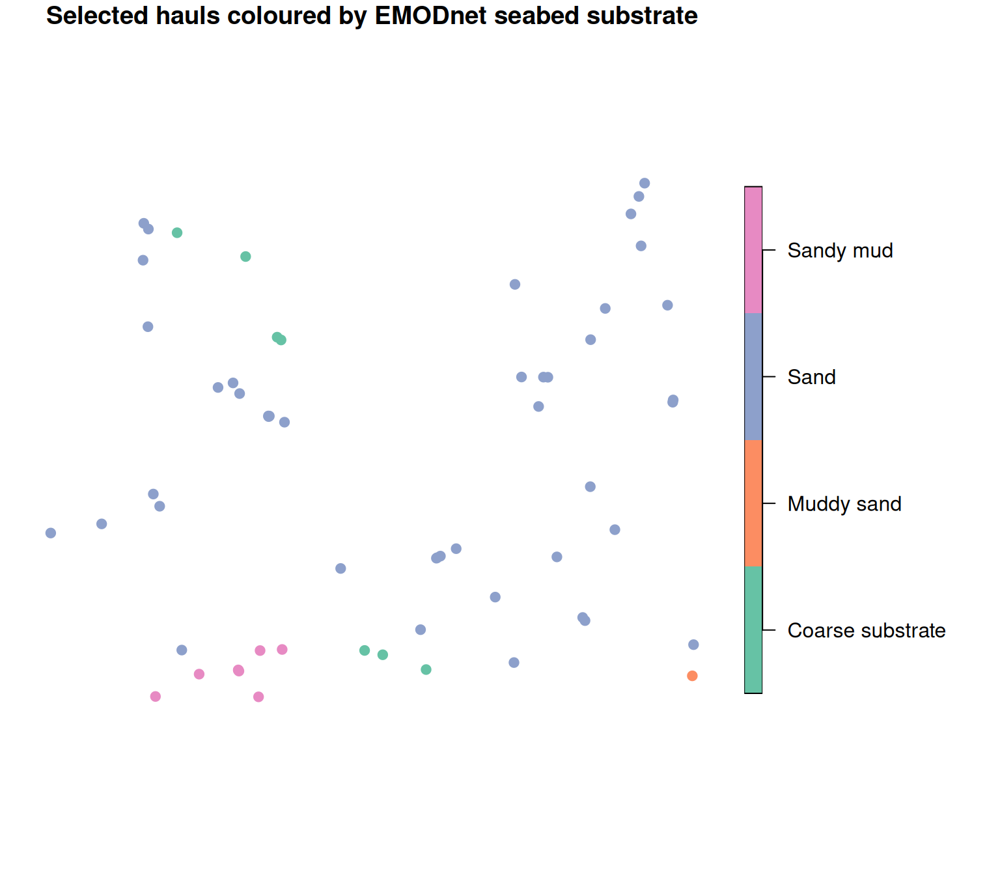

# Matching EMODnet seabed habitats to hauls

This article shows how to attach broad-scale seabed habitat information
from [EMODnet Seabed
Habitats](https://emodnet.ec.europa.eu/en/seabed-habitats) (the EUSeaMap
product) to the `HH` (haul) table of a `datras_raw` object. The habitat
map is a polygon (vector) layer, so the haul positions in `HH` are
turned into points and matched into the habitat polygons with a spatial
join.

EUSeaMap is a large, continental data set. Downloading the polygons for
a whole survey at once is slow, so we work with a small set of hauls in
one area and download only the habitat polygons that cover them. The
same code scales to a full survey if you are prepared for a larger
download (see the note at the end).

We use the example data set `dab` and the **sf** package.

``` r

## Load the packages
library(DATRASextra)
library(sf)

## EMODnet habitat polygons are not always valid under sf's spherical (S2)
## geometry engine, which makes spatial joins fail. Use planar geometry, which
## is appropriate for a regional layer like this.
sf_use_s2(FALSE)

## Load the example data
data(dab)
```

## Haul positions as points

To keep the habitat download small, we first restrict the object to the
hauls from one small area (a box in the central North Sea) with
[`subset()`](https://rdrr.io/r/base/subset.html). Working on this subset
throughout means the habitat we attach later lines up with every haul in
the object, with no unmatched (`NA`) hauls from areas we did not
download.

``` r

## Restrict to a small area (central North Sea)
box <- subset(dab, lon > 2 & lon < 4 & lat > 54 & lat < 55)
nrow(box[["HH"]])
#> [1] 60
```

The `HH` table stores haul positions in the `lon` / `lat` columns
(longitude/latitude, WGS84). We build an `sf` point layer from them,
keeping `haul.id` so the habitat can be matched back to `HH` afterwards.

``` r

## Haul points (EPSG:4326 = WGS84 lon/lat)
hauls <- st_as_sf(
  box[["HH"]][, c("haul.id", "lon", "lat")],
  coords = c("lon", "lat"),
  crs = 4326
)

hauls
#> Simple feature collection with 60 features and 1 field
#> Geometry type: POINT
#> Dimension:     XY
#> Bounding box:  xmin: 2.029 ymin: 54.063 xmax: 3.8461 ymax: 54.9065
#> Geodetic CRS:  WGS 84
#> First 10 features:
#>                                  haul.id               geometry
#> 304 NS-IBTS:2020:1:NL:64T2:GOV:37F345:45 POINT (3.8426 54.0975)
#> 305 NS-IBTS:2020:1:NL:64T2:GOV:37F344:44 POINT (3.4598 54.2928)
#> 306 NS-IBTS:2020:1:NL:64T2:GOV:38F343:43 POINT (3.4081 54.5398)
#> 311 NS-IBTS:2020:1:NL:64T2:GOV:37F238:38 POINT (2.3995 54.1398)
#> 312 NS-IBTS:2020:1:NL:64T2:GOV:37F237:37   POINT (2.173 54.347)
#> 313 NS-IBTS:2020:1:NL:64T2:GOV:38F236:36 POINT (2.3038 54.6708)
#> 314 NS-IBTS:2020:1:NL:64T2:GOV:38F235:35 POINT (2.3051 54.8311)
#> 343  NS-IBTS:2020:1:NL:64T2:GOV:38F306:6 POINT (3.7726 54.7061)
#> 358    NS-IBTS:2020:3:DK:26D4:GOV:175:55 POINT (3.1305 54.2941)
#> 359    NS-IBTS:2020:3:DK:26D4:GOV:173:54  POINT (2.6208 54.139)
```

## Download the EUSeaMap layer

EUSeaMap is served through the EMODnet Seabed Habitats WFS. Requesting
the whole European map would be very large, so we restrict the download
to the bounding box of the hauls.

First, the haul extent (in lon/lat):

``` r

## Bounding box of the hauls
bb <- st_bbox(hauls)
bb
#>    xmin    ymin    xmax    ymax 
#>  2.0290 54.0630  3.8461 54.9065
```

The EMODnet Seabed Habitats WFS endpoint is
`https://ows.emodnet-seabedhabitats.eu/geoserver/emodnet_open/ows`. You
can list the available layers and their attributes from the service
capabilities:

``` r

## Discover available layers (run once, interactively)
#wfs <- "https://ows.emodnet-seabedhabitats.eu/geoserver/emodnet_open/ows"
#st_layers(paste0("WFS:", wfs))
```

Pick the EUSeaMap layer you need. The European broad-scale map
classified with EUNIS 2019 is `emodnet_open:eusm2025_eunis2019_full`.
Download only the haul bounding box by passing a `BBOX` filter in the
WFS `GetFeature` request. The request below asks for GeoJSON within the
haul extent, and
[`st_make_valid()`](https://r-spatial.github.io/sf/reference/valid.html)
repairs the polygons so they can be used in a spatial join:

``` r

## WFS GetFeature request, restricted to the haul bounding box
wfs   <- "https://ows.emodnet-seabedhabitats.eu/geoserver/emodnet_open/ows"
layer <- "emodnet_open:eusm2025_eunis2019_full"

url <- paste0(
  wfs,
  "?service=WFS&version=2.0.0&request=GetFeature",
  "&typeNames=", layer,
  "&srsName=EPSG:4326",
  "&bbox=", paste(bb["ymin"], bb["xmin"], bb["ymax"], bb["xmax"], "urn:ogc:def:crs:EPSG::4326", sep = ","),
  "&outputFormat=application/json"
)

habitat <- st_read(url, quiet = TRUE)
habitat <- st_make_valid(habitat)

## Inspect the attributes and choose the habitat column you want to keep
names(habitat)
#>  [1] "id"         "objectid"   "oxygen"     "salinity"   "energy"    
#>  [6] "biozone"    "substrate"  "eunis2019c" "eunis2019d" "all2019d"  
#> [11] "all2019dl2" "geometry"
```

The key habitat attributes in this layer are `eunis2019c` (EUNIS 2019
code), `eunis2019d` (EUNIS 2019 description), and `all2019d` (full
habitat description), alongside the component descriptors `substrate`,
`energy`, `biozone`, `salinity`, and `oxygen`.

Note that WFS axis order for EPSG:4326 is *lat,lon*, which is why the
`bbox` string above is ordered `ymin,xmin,ymax,xmax`. If you prefer, you
can instead download the layer once from the [EMODnet Seabed Habitats
download portal](https://emodnet.ec.europa.eu/geoviewer/) and read the
local file with
[`st_read()`](https://r-spatial.github.io/sf/reference/st_read.html).

## Spatial join to the hauls

With the habitat polygons in memory, transform the haul points to the
habitat layer’s CRS and join each point to the polygon it falls in. Keep
only the habitat attribute(s) you want (here the seabed `substrate`; use
`eunis2019d` for the full EUNIS habitat description):

``` r

## Name of the habitat attribute to keep (from names(habitat) above)
habitat_col <- "substrate"

## Match points to polygons in the habitat layer's CRS
hauls_m <- st_transform(hauls, st_crs(habitat))
joined  <- st_join(hauls_m, habitat[habitat_col], join = st_intersects)

## One habitat value per haul.id
head(st_drop_geometry(joined))
#>                                  haul.id  substrate
#> 304 NS-IBTS:2020:1:NL:64T2:GOV:37F345:45 Muddy sand
#> 305 NS-IBTS:2020:1:NL:64T2:GOV:37F344:44       Sand
#> 306 NS-IBTS:2020:1:NL:64T2:GOV:38F343:43       Sand
#> 311 NS-IBTS:2020:1:NL:64T2:GOV:37F238:38       Sand
#> 312 NS-IBTS:2020:1:NL:64T2:GOV:37F237:37       Sand
#> 313 NS-IBTS:2020:1:NL:64T2:GOV:38F236:36       Sand
```

Because polygon boundaries can overlap or hauls can sit on a border,
make sure there is exactly one row per haul before writing back (keep
the first match):

``` r

## Collapse to one row per haul.id
joined <- st_drop_geometry(joined)
joined <- joined[!duplicated(joined$haul.id), ]
```

## Attach the habitat to HH

Finally, match the habitat back onto `HH` by `haul.id` and store it as a
new column. Matching by `haul.id` (rather than row order) is robust to
any reordering during the join:

``` r

## Add the habitat column to HH
box[["HH"]]$habitat <- joined[[habitat_col]][
  match(box[["HH"]]$haul.id, joined$haul.id)
]

## Check the result
table(box[["HH"]]$habitat, useNA = "ifany")
#> 
#> Coarse substrate       Muddy sand             Sand        Sandy mud 
#>                7                1               44                8
```

Because we worked on the `box` subset throughout, every haul in it gets
a habitat (apart from any haul that genuinely falls outside the mapped
area, which stays `NA`). The `HH` table now carries a habitat class for
each haul, which can be used as a covariate in downstream analyses or as
a grouping variable when summarising catch by habitat.

## Map the matched hauls

Finally, a quick base-R map of the selected hauls coloured by their
newly matched substrate. We turn the `HH` rows back into an `sf` point
layer and let the `sf` plot method colour the points by the `habitat`
column:

``` r

## Selected hauls as points, carrying the matched substrate
hauls_hab <- st_as_sf(
  box[["HH"]][, c("haul.id", "lon", "lat", "habitat")],
  coords = c("lon", "lat"),
  crs = 4326
)

## Colour each haul by its matched substrate
plot(hauls_hab["habitat"], pch = 19,
     main = "Selected hauls coloured by EMODnet seabed substrate")
```



## Summary

Matching EMODnet seabed habitats to a `datras_raw` object comes down to
three steps: turn `HH$lon` / `HH$lat` into an `sf` point layer, download
the EUSeaMap polygons for the haul bounding box from the EMODnet Seabed
Habitats WFS, and join the points into the polygons with
[`st_join()`](https://r-spatial.github.io/sf/reference/st_join.html).
The same pattern works for other EMODnet vector layers by changing the
WFS layer name.

For a whole survey the bounding box can be large and the single WFS
download slow. In that case, split the hauls into smaller boxes (for
example by ICES rectangle or a coarse lon/lat grid), download and join
each box separately, and combine the results — or download the EUSeaMap
layer once from the [download
portal](https://emodnet.ec.europa.eu/geoviewer/) and read it locally.
