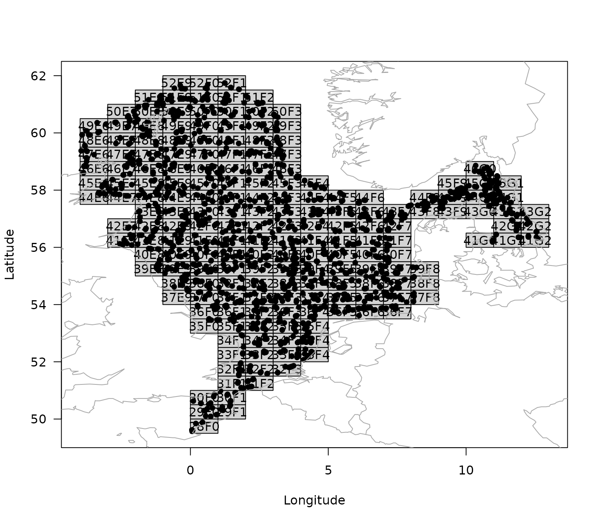

# Step-by-step guide to work with the ICES' DATRAS database

The goal of the **DATRASextra** is to make it easy to work with [ICES’
DATRAS
database](https://www.ices.dk/data/data-portals/pages/datras.aspx) by
providing user-friendly, well-document functions, detailed vignettes,
and building on the powerful [*DATRAS* R
package](https://github.com/DTUAqua/DATRAS).

This vignette sets you up for working with ICES DATRAS data base by
taking you through the whole process from installing *DATRASextra* and
downloading DATRAS, to summarizing and plotting observations from the
scientific surveys.

**Outline:**

1.  Install DATRASextra
2.  Download ICES DATRAS
3.  Read-in DATRAS
4.  Clean DATRAS
5.  Get Weight by haul
6.  Summary
7.  References

## *Install DATRASextra*

To get started, make sure to install the most recent package version
from GitHub:

``` r
## Install the package
remotes::install_github("tokami/DATRASextra")
```

The package can be loaded into the R environment:

``` r
## Load the package into R
library(DATRASextra)
```

## *Download DATRAS*

The DATRAS data base is a large compilation of the majority of
scientific bottom-trawl surveys in the Northeast Atlantic. You can get
an overview of included surveys with:

``` r
## List scientific surveys in DATRAS
list_surveys()
#>       survey     years                  quarters
#> 1       BITS 1991-2025 1(35), 2(10), 3(6), 4(34)
#> 2        BTS 1985-2024              1(19), 3(40)
#> 3  BTS-GSA17 2016-2023                      4(8)
#> 4   BTS-VIII 2007-2024                     4(15)
#> 5    Can-Mar 1970-2021         1(9), 3(52), 4(8)
#> 6        DWS 2006-2009                3(3), 4(1)
#> 7       DYFS 1985-2024              3(40), 4(40)
#> 8      EVHOE 1997-2024                     4(28)
#> 9    FR-CGFS 1988-2024                     4(37)
#> 10  FR-WCGFS 2018-2024                      3(7)
#> 11   IE-IAMS 2016-2024                1(9), 2(8)
#> 12   IE-IGFS 2003-2024                     4(22)
#> 13   IS-IDPS 2009-2009                      3(1)
#> 14     NIGFS 2005-2024              1(20), 4(18)
#> 15   NL-BSAS 2019-2024                3(6), 4(5)
#> 16   NS-IBTS 1965-2025 1(61), 2(14), 3(34), 4(9)
#> 17   NS-IDPS 2009-2016                1(1), 3(3)
#> 18      NSSS 2008-2024                     4(17)
#> 19   PT-IBTS 2002-2023                     4(19)
#> 20   ROCKALL 1999-2009                      3(9)
#> 21    SCOROC 2011-2024                     3(14)
#> 22  SCOWCGFS 2011-2025              1(14), 4(14)
#> 23  SE-SOUND 2011-2023         1(13), 3(7), 4(6)
#> 24       SNS 1985-2024              3(36), 4(16)
#> 25   SP-ARSA 1996-2024              1(22), 4(21)
#> 26  SP-NORTH 1990-2024               3(9), 4(35)
#> 27   SP-PORC 2001-2024               3(24), 4(5)
#> 28  SWC-IBTS 1985-2010        1(26), 2(1), 4(20)
#>                                               description
#> 1                       Baltic International Trawl Survey
#> 2                                       Beam Trawl Survey
#> 3  Beam Trawl Survey - SoleMon (Adriatic survey) - GSA17 
#> 4                Beam Trawl Survey - Bay of Biscay (VIII)
#> 5                         Canadian Maritimes trawl survey
#> 6                                       Deepwater Surveys
#> 7                               Inshore Beam Trawl Survey
#> 8            French Southern Atlantic Bottom Trawl Survey
#> 9                       French Channel Ground Fish Survey
#> 10      French Western English Channel Ground Fish Survey
#> 11                     Irish Anglerfish and Megrim Survey
#> 12                               Irish Ground Fish Survey
#> 13         Irminger Sea International Deep Pelagic Survey
#> 14                    Northern Ireland Ground Fish Survey
#> 15        Netherlands Industry survey on Turbot and Brill
#> 16            North Sea International Bottom Trawl Survey
#> 17        Norwegian Sea International Deep Pelagic Survey
#> 18                               North Sea Sandeel Survey
#> 19           Portuguese International Bottom Trawl Survey
#> 20             Scottish Rockall Survey - old (until 2010)
#> 21              Scottish Rockall Survey - new (from 2011)
#> 22      Scottish West Coast Groundfish Survey (from 2011)
#> 23                                    Sweden Sound Survey
#> 24                                        Sole Net Survey
#> 25              Spanish Gulf of Cadiz Bottom Trawl Survey
#> 26                Spanish North Coast Bottom Trawl Survey
#> 27                  Spanish Porcupine Bottom Trawl Survey
#> 28   Scottish West Coast Bottom Trawl Survey (up to 2010)
```

The `download_datras` function allows you to download information for
any of these surveys. If the arguments `surveys` and `years` are not
specified (i.e., `NULL`), all surveys and years are downloaded, wich can
take a while (~ 30-60min).

If not the whole database is required, the `surveys` and `years`
arguments allow to specify specific surveys and years. For example, the
`Sole Net Survey (SNS)` in 2023 could be downloaded to a temporary
directory with:

``` r
## select survey
survey <- "SNS"
## create temporary directory
tmp <- tempdir()
## download SNS for 2023
download_datras(surveys = survey, years = 2023, dir = tmp)
```

If no directory (argument `dir`) is specified, the data is downloaded
into the current working directory (use
[`getwd()`](https://rdrr.io/r/base/getwd.html) to see your current
working directory). The function compresses downloaded data into “zip”
archives. Note, that if a year is specified in which a specific survey
did not operate, an empty file is created in the specified folder.
However, the next function just reads in non-empty files.

DATRAS includes three main data sets, `HH` with information on haul
level, `HL` with information on species level and the important
information on numbers by length, and `CA` with information on the
individual level, such as individual weight, age readings, or maturity
scores. The third data set with the biological information (`CA`) can be
quite large and might not be required for some projects. In that case,
setting the argument `download.ca = FALSE` allows you to to omit this
data set from the download and save some time and memory.

## *Read-in DATRAS*

Next, we can read the downloaded survey information into R:

``` r
surv0 <- read_datras(file.path(tmp, survey))
```

The path can point to a specific file that you want to read in or to a
whole directory with any number of files.

## *Clean DATRAS*

Now, the `surv0` object contains the survey information in the usual
`datras_raw` format of the *DATRAS* package. (TODO: Link to more
information about this data type or provide more information here.) It
make sense to clean_datras the data and for example only use valid
hauls. This can be done manually with the
[`subset()`](https://rdrr.io/r/base/subset.html) function or by using
some recommended cleaning steps with the
[`clean_datras()`](https://tokami.github.io/DATRASextra/reference/clean_datras.md)
function. This function also allows us to make a relevant subset of the
database based on our needs.

``` r
surv0 <- dab
```

``` r
surv <- clean_datras(surv0)
```

By default, this function also imputes missing depth information.

We can plot the resulting survey information with:

``` r
plot(surv)
#> NULL
```



## *Get total weight by haul*

In order to calculate the total weight by haul, we need to raise the
length frequency information (in HL) to the haul level, we can do that
by adding the numbers by length:

``` r
surv <- add_numbers_at_length(surv)
```

Now, the HH data set contains a matrix called `N` that contains the
numbers at length groups. (See the cm_breaks and by arguments of the
function to modify the length classes). Next, we can convert the numbers
into weight and add them up, with the following function: TODO: does
this still work for multiple species?

``` r
surv <- add_total_weight_by_haul(surv)
```

The HH data set now contains the total weight by haul in the column:
‘HaulWgt’.

## *Summary*

This vignette introduced the main features and workflow of the
*DATRASextra* package for …

## *References*
