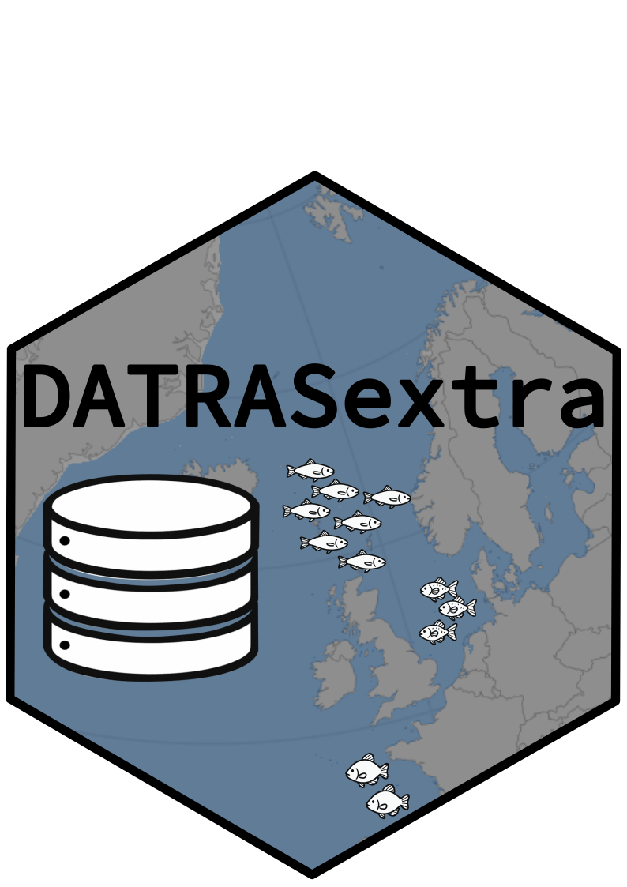

<!-- badges: start -->
  
  
  
<!-- badges: end -->

<h1 style="border-bottom:none;">DATRASextra </h1>

 
Makes working with ICES **DATRAS** **extra** easy.
 

---

**DATRASextra** is an R package that simplifies working with the [ICES DATRAS
database](https://www.ices.dk/data/data-portals/pages/datras.aspx) by providing
practical functions and detailed documentation.

It builds on [DTU Aqua’s *DATRAS* R package](https://github.com/DTUAqua/DATRAS),
which provides the core functionality to download and modify DATRAS data —
commonly used to prepare abundance indices for ICES stock assessments.

**DATRASextra** adds tools for:
- Estimating spatial distributions and abundance indices across multiple surveys
- Calculating catch rates by custom length classes for single species or
  aggregations
- Streamlining the processing and preparation of *DATRAS* data for analysis

---

## Table of contents
